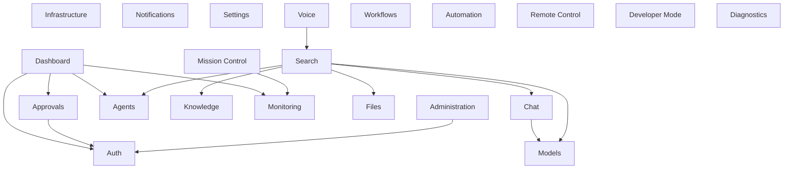

# §4 — Feature Modules

> **Document**: AegisOS Mobile — Feature Module Hierarchy
> **Status**: DRAFT
> **Version**: 1.0.0

---

## 4.1 Module Architecture Principles

1. **Self-Contained**: Each module owns its data sources, domain entities, use cases, and UI pages.
2. **Barrel Exports**: Each module exposes a single barrel file (`<module>.dart`) declaring its public API.
3. **Dependency Inversion**: Modules depend on abstract contracts; never on other modules' internals.
4. **Extension Points**: Every module defines hooks for plugins, enterprise overrides, and feature flags.

---

## 4.2 Module Hierarchy

```
features/
├── auth/                  # Authentication & Device Pairing
├── dashboard/             # Home Dashboard (Quick Glance)
├── mission_control/       # Mission Control Cockpit
├── chat/                  # AI Assistant & Conversations
├── approvals/             # Human-in-the-Loop Queue
├── agents/                # Agent Control Room
├── models/                # Model Registry & Management
├── knowledge/             # Knowledge Base & RAG Browser
├── infrastructure/        # Infrastructure Topology
├── monitoring/            # Telemetry & Performance
├── notifications/         # Notification Center
├── settings/              # App Settings & Configuration
├── files/                 # Remote File Manager
├── search/                # Global Command Palette
├── voice/                 # Voice Input & TTS
├── workflows/             # Workflow Designer & Automation
├── automation/            # Scheduled Tasks & Cron
├── remote_control/        # SSH & Host Remote Access
├── administration/        # Cluster Administration
├── developer_mode/        # Developer Tools & Debug
└── diagnostics/           # App Health & Self-Diagnostics
```

---

## 4.3 Module Definitions

### 1. Authentication (`features/auth/`)

| Attribute | Definition |
|-----------|-----------|
| **Responsibilities** | • QR code scanning for initial workstation pairing • ECDSA keypair generation in Secure Enclave • mTLS client certificate exchange and storage • Biometric gate (FaceID/TouchID/Fingerprint) on app launch and resume • JWT token management (acquisition, refresh, expiry detection) • Session lifecycle (create, validate, destroy) • Multi-device registration and de-registration • Remote logout handling |
| **Public Interfaces** | `AuthStateProvider` (stream of auth states: unauthenticated, paired, biometric_required, authenticated) • `PairWorkstationUseCase` • `BiometricUnlockUseCase` • `LogoutUseCase` • `RefreshTokenUseCase` |
| **Dependencies** | `core/`, `domain/entities/device.dart`, `domain/entities/session.dart`, `platform/biometric/`, `platform/secure_enclave/`, `infrastructure/secure_storage/` |
| **Extension Points** | • Custom auth provider interface (SSO/OIDC for enterprise) • Auth event hooks (for audit logging) • Configurable biometric timeout threshold |

---

### 2. Dashboard (`features/dashboard/`)

| Attribute | Definition |
|-----------|-----------|
| **Responsibilities** | • Aggregate summary view (connection status, host health, active agents, pending approvals) • Quick action widgets (approve/reject top approval, resume last chat, view top alert) • Connection state indicator with host details • Recent activity feed (last 10 events across all modules) |
| **Public Interfaces** | `DashboardSummaryProvider` • `QuickActionProvider` • `ConnectionStatusProvider` |
| **Dependencies** | `core/`, `features/auth/` (connection state), `features/approvals/` (pending count), `features/agents/` (active count), `features/monitoring/` (health summary) |
| **Extension Points** | • Custom widget slots for enterprise dashboards • Configurable quick action set • Plugin-provided dashboard cards |

---

### 3. Mission Control (`features/mission_control/`)

| Attribute | Definition |
|-----------|-----------|
| **Responsibilities** | • Full cockpit view of the entire local AI ecosystem • Real-time GPU/VRAM/CPU/RAM gauges • Active request queue visualization with latency indicators • Service status grid (Ollama, LiteLLM, AegisOS, OmniRoute, PostgreSQL, Redis) • Docker container status listing • Multi-host switching (if multiple workstations are paired) • Thermal alert indicators |
| **Public Interfaces** | `TelemetryStreamProvider` • `ServiceStatusProvider` • `HostSelectorProvider` • `SystemAlertProvider` |
| **Dependencies** | `core/`, `infrastructure/websocket/`, `domain/entities/telemetry.dart`, `domain/entities/service_status.dart` |
| **Extension Points** | • Custom telemetry sources (plugin-provided metrics) • Alert threshold configuration • Multi-host aggregation strategy |

---

### 4. Chat / AI Assistant (`features/chat/`)

| Attribute | Definition |
|-----------|-----------|
| **Responsibilities** | • Streaming token display via SSE/WebSocket • Multi-model selection and mid-conversation model switching • Markdown, code syntax highlighting, LaTeX rendering • Token consumption metrics (input, output, cached, cost) • Conversation history management • Prompt preset injection (system prompts) • File attachment handling • Offline message queuing • Conversation export |
| **Public Interfaces** | `ChatSessionProvider` • `ConversationListProvider` • `ModelSelectorProvider` • `SendMessageUseCase` • `StreamTokensUseCase` |
| **Dependencies** | `core/`, `infrastructure/sse/`, `infrastructure/api/`, `infrastructure/database/`, `domain/entities/conversation.dart`, `domain/entities/message.dart` |
| **Extension Points** | • Custom message renderers (plugin-provided content types) • Prompt template library • Token pricing calculator override |

---

### 5. Approvals / HITL (`features/approvals/`)

| Attribute | Definition |
|-----------|-----------|
| **Responsibilities** | • Display pending HITL approval queue • Approval cards with command hash, target resource, risk rating, and agent context • Approve/reject with swipe gesture + explicit button fallback • Rejection feedback text input (returned to agent reasoning loop) • Cryptographic signing of approvals (ECDSA via Secure Enclave) • Actionable push notification handling (approve/reject from lock screen) • Offline approval queuing • Auto-approval rule engine (configurable low-risk patterns) |
| **Public Interfaces** | `PendingApprovalsProvider` • `ApprovalDetailProvider` • `ApproveRequestUseCase` • `RejectRequestUseCase` • `ApprovalRulesProvider` |
| **Dependencies** | `core/`, `platform/secure_enclave/`, `infrastructure/push/`, `infrastructure/api/`, `domain/entities/approval_request.dart` |
| **Extension Points** | • Custom risk scoring algorithm • Approval delegation (forward to another operator) • Approval audit trail export |

---

### 6. Agents (`features/agents/`)

| Attribute | Definition |
|-----------|-----------|
| **Responsibilities** | • List active and historical agent instances • Live execution node graph visualization • Real-time log streaming per agent • Control actions: pause, resume, throttle, kill • Tool execution history per agent step • Agent memory inspection (context window, injected memories) • Manual Intervention (MINT): inject thoughts into agent memory mid-execution • Workflow template launcher |
| **Public Interfaces** | `AgentListProvider` • `AgentDetailProvider` • `AgentLogStreamProvider` • `AgentControlUseCase` • `InjectThoughtUseCase` |
| **Dependencies** | `core/`, `infrastructure/websocket/`, `infrastructure/api/`, `domain/entities/agent.dart`, `domain/entities/tool_execution.dart` |
| **Extension Points** | • Custom agent visualization renderers • Plugin-provided agent types • Agent performance analytics hooks |

---

### 7. Models (`features/models/`)

| Attribute | Definition |
|-----------|-----------|
| **Responsibilities** | • List available models (local registry) • Model metadata display (size, parameters, quantization, context window) • Pull/download new models from Ollama registry • Delete models • Load/unload models into VRAM • Configure model parameters (temperature, top_p, context length) • View active routing paths (which model serves which endpoint) • Model comparison view |
| **Public Interfaces** | `ModelRegistryProvider` • `ModelDetailProvider` • `PullModelUseCase` • `LoadModelUseCase` • `UnloadModelUseCase` • `DeleteModelUseCase` |
| **Dependencies** | `core/`, `infrastructure/api/`, `domain/entities/model.dart` |
| **Extension Points** | • Custom model source registries • Model benchmarking hooks • GGUF metadata parser |

---

### 8. Knowledge (`features/knowledge/`)

| Attribute | Definition |
|-----------|-----------|
| **Responsibilities** | • Browse semantic vector stores • View indexing status, storage size, chunk details • Trigger manual re-indexing runs • Manage folder sync paths and document sources • Search knowledge base with semantic queries • View document lineage and metadata • Chunk inspection and quality metrics |
| **Public Interfaces** | `KnowledgeStoreProvider` • `IndexStatusProvider` • `SearchKnowledgeUseCase` • `TriggerIndexUseCase` |
| **Dependencies** | `core/`, `infrastructure/api/`, `domain/entities/knowledge_store.dart`, `domain/entities/document.dart` |
| **Extension Points** | • Custom document parsers • Alternative vector store backends • Knowledge graph visualization |

---

### 9. Infrastructure (`features/infrastructure/`)

| Attribute | Definition |
|-----------|-----------|
| **Responsibilities** | • Display host topology (workstations, edge devices) • Container status grid (Docker containers with start/stop/restart) • Service health indicators with ports and uptime • Network topology visualization • Storage utilization metrics • Database connection status |
| **Public Interfaces** | `HostTopologyProvider` • `ContainerListProvider` • `ServiceHealthProvider` • `ContainerControlUseCase` |
| **Dependencies** | `core/`, `infrastructure/api/`, `infrastructure/websocket/`, `domain/entities/host.dart`, `domain/entities/container.dart` |
| **Extension Points** | • Custom infrastructure providers (K8s, Docker Swarm) • Alert threshold configuration • Custom health check definitions |

---

### 10. Monitoring (`features/monitoring/`)

| Attribute | Definition |
|-----------|-----------|
| **Responsibilities** | • Time-series charts (GPU utilization, VRAM, CPU, RAM, temperature) • Request queue depth and latency graphs • Token throughput metrics (tokens/sec, cache hit rate) • Error rate visualization • Log viewer with filtering, search, and severity levels • Prometheus metric queries • Grafana dashboard deep linking • Export metrics data |
| **Public Interfaces** | `MetricsStreamProvider` • `LogStreamProvider` • `MetricsQueryUseCase` • `LogFilterProvider` |
| **Dependencies** | `core/`, `infrastructure/websocket/`, `infrastructure/api/`, `domain/entities/metric.dart`, `domain/entities/log_entry.dart` |
| **Extension Points** | • Custom chart types • Alert rule configuration • Metric export format (CSV, JSON) |

---

### 11. Notifications (`features/notifications/`)

| Attribute | Definition |
|-----------|-----------|
| **Responsibilities** | • Display notification history (system faults, model load failures, task completions) • E2EE push notification decryption and display • Notification preferences and channel configuration • Badge count management • Notification grouping and stacking • Sound and vibration customization • Do-not-disturb schedule |
| **Public Interfaces** | `NotificationListProvider` • `NotificationPreferencesProvider` • `MarkReadUseCase` • `ClearAllUseCase` |
| **Dependencies** | `core/`, `infrastructure/push/`, `infrastructure/database/`, `domain/entities/notification.dart` |
| **Extension Points** | • Custom notification renderers • Notification routing rules • Enterprise notification policy |

---

### 12. Settings (`features/settings/`)

| Attribute | Definition |
|-----------|-----------|
| **Responsibilities** | • Connection configuration (host IP, port, VPN profile) • Security settings (biometric timeout, certificate management, API key rotation) • UI theme customization (dark/light, accent color, density) • Sync interval configuration • Data management (clear cache, export data, wipe device) • About screen (version, license, open-source attributions) • Language and locale selection |
| **Public Interfaces** | `SettingsProvider` • `ThemeProvider` • `UpdateSettingsUseCase` • `ClearCacheUseCase` • `ExportDataUseCase` |
| **Dependencies** | `core/`, `infrastructure/secure_storage/`, `infrastructure/database/`, `platform/device_info/` |
| **Extension Points** | • Enterprise settings policy overlay • Custom theme definitions • Plugin-provided settings panels |

---

### 13. Files (`features/files/`)

| Attribute | Definition |
|-----------|-----------|
| **Responsibilities** | • Browse workspace directories mapped to filesystem MCP server • File preview with syntax highlighting • Upload/download files • View file diffs • Offline file cache with sync queue • Directory tree navigation • File search |
| **Public Interfaces** | `FileTreeProvider` • `FileContentProvider` • `UploadFileUseCase` • `DownloadFileUseCase` |
| **Dependencies** | `core/`, `infrastructure/api/`, `infrastructure/database/`, `domain/entities/file_entry.dart` |
| **Extension Points** | • Custom file previewers (image, PDF, video) • File operation hooks (pre-upload validation) • Enterprise DLP policy enforcement |

---

### 14. Search (`features/search/`)

| Attribute | Definition |
|-----------|-----------|
| **Responsibilities** | • Global command palette (Raycast-like overlay) • Unified search across chats, agents, models, files, knowledge, commands • Smart suggestions based on recent activity • Prefix modifiers (`/chat`, `/load`, `/ssh`, `/kill`) • Semantic search integration via RAG metadata • Keyboard shortcut support for hardware keyboards |
| **Public Interfaces** | `SearchProvider` • `SearchResultsProvider` • `ExecuteCommandUseCase` |
| **Dependencies** | `core/`, `infrastructure/api/`, `infrastructure/database/`, `features/chat/`, `features/agents/`, `features/models/`, `features/files/`, `features/knowledge/` |
| **Extension Points** | • Custom search providers (plugin-registered sources) • Custom command handlers • Search result ranking algorithm |

---

### 15. Voice (`features/voice/`)

| Attribute | Definition |
|-----------|-----------|
| **Responsibilities** | • Speech-to-text via Whisper or platform dictation API • Text-to-speech playback for AI responses • Wake word detection (foreground only) • Voice command routing to search/command palette • Audio recording and attachment • Noise cancellation and VAD (voice activity detection) |
| **Public Interfaces** | `VoiceInputProvider` • `TTSProvider` • `StartListeningUseCase` • `StopListeningUseCase` |
| **Dependencies** | `core/`, `platform/permissions/`, `infrastructure/api/`, `features/search/` |
| **Extension Points** | • Custom STT engines • Custom TTS voices • Voice command grammar extensions |

---

### 16. Workflows (`features/workflows/`)

| Attribute | Definition |
|-----------|-----------|
| **Responsibilities** | • View and manage workflow definitions • Visual workflow editor (node-based graph) • Launch pre-defined workflow templates • View execution history and logs • Workflow version management • Parameter configuration for workflow inputs |
| **Public Interfaces** | `WorkflowListProvider` • `WorkflowDetailProvider` • `LaunchWorkflowUseCase` • `WorkflowExecutionProvider` |
| **Dependencies** | `core/`, `infrastructure/api/`, `domain/entities/workflow.dart`, `domain/entities/workflow_execution.dart` |
| **Extension Points** | • Custom workflow node types • Template marketplace integration • Execution hook middleware |

---

### 17. Automation (`features/automation/`)

| Attribute | Definition |
|-----------|-----------|
| **Responsibilities** | • Schedule recurring automated tasks (nightly backups, codebase audits) • Cron expression builder UI • Task execution history and results • Conditional triggers (on connectivity change, on time, on event) • Task priority and resource allocation settings |
| **Public Interfaces** | `ScheduledTasksProvider` • `TaskHistoryProvider` • `CreateTaskUseCase` • `PauseTaskUseCase` |
| **Dependencies** | `core/`, `infrastructure/api/`, `domain/entities/scheduled_task.dart` |
| **Extension Points** | • Custom trigger types • Task result processors • Integration with external schedulers |

---

### 18. Remote Control (`features/remote_control/`)

| Attribute | Definition |
|-----------|-----------|
| **Responsibilities** | • SSH session management to paired workstations • Remote terminal emulator • Reboot/shutdown commands for host machines • Service start/stop/restart controls • Network tunnel status and management |
| **Public Interfaces** | `RemoteSessionProvider` • `HostControlUseCase` • `SSHConnectionProvider` |
| **Dependencies** | `core/`, `infrastructure/api/`, `platform/connectivity/`, `domain/entities/host.dart` |
| **Extension Points** | • Custom terminal emulator themes • SSH key management • Command history and scripting |

---

### 19. Administration (`features/administration/`)

| Attribute | Definition |
|-----------|-----------|
| **Responsibilities** | • Multi-host cluster management • VPN mesh node administration • Paired device registry management • User role and permission management • Audit log viewer and export • Certificate rotation and renewal • Compliance report generation |
| **Public Interfaces** | `ClusterProvider` • `DeviceRegistryProvider` • `AuditLogProvider` • `RevokeDeviceUseCase` • `RotateCertificateUseCase` |
| **Dependencies** | `core/`, `infrastructure/api/`, `domain/entities/device.dart`, `domain/entities/audit_entry.dart` |
| **Extension Points** | • Enterprise SSO integration (OIDC/SAML) • Custom compliance templates • Organization policy engine |

---

### 20. Developer Mode (`features/developer_mode/`)

| Attribute | Definition |
|-----------|-----------|
| **Responsibilities** | • Network request inspector (HTTP/WS traffic log) • SQLCipher database browser • Provider state inspector (Riverpod provider tree) • Feature flag management • Performance overlay toggle • Mock data injection • API endpoint override • Log level configuration |
| **Public Interfaces** | `DevModeProvider` • `NetworkLogProvider` • `FeatureFlagProvider` |
| **Dependencies** | `core/`, `infrastructure/database/`, `infrastructure/api/` |
| **Extension Points** | • Custom debug panels • Plugin-provided inspectors • Test scenario runners |

---

### 21. Diagnostics (`features/diagnostics/`)

| Attribute | Definition |
|-----------|-----------|
| **Responsibilities** | • App health self-check (DB integrity, certificate validity, sync status) • Connection diagnostics (latency test, mTLS handshake test, VPN tunnel test) • Storage usage breakdown • Battery impact analysis • Crash log viewer • Performance metrics (frame rate, memory usage, DB query times) • Support bundle generation (anonymized diagnostic export) |
| **Public Interfaces** | `DiagnosticsProvider` • `RunDiagnosticsUseCase` • `ExportSupportBundleUseCase` |
| **Dependencies** | `core/`, `infrastructure/database/`, `platform/device_info/`, `platform/connectivity/` |
| **Extension Points** | • Custom diagnostic checks • Health check plugins • Automated remediation actions |

---

## 4.4 Module Dependency Graph



> **Rule**: No circular dependencies between feature modules. If two modules need to communicate, they do so via shared domain events on the event bus or through the application layer's cross-feature coordinators.
