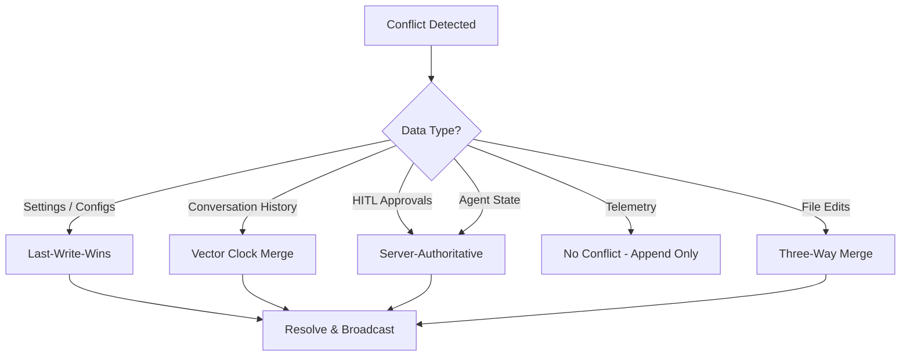

# §6 — Synchronization Architecture

> **Document**: AegisOS Mobile — Synchronization Architecture
> **Status**: DRAFT
> **Version**: 1.0.0

---

## 6.1 Synchronization Philosophy

AegisOS Mobile operates as a **secure, authenticated window** into the workstation — not a full replica. The sync engine maintains a **sliding cache** of active data, governed by retention policies and bandwidth constraints.

**Guiding Principle**: The workstation host is the **single source of truth**. The mobile device holds a time-limited, encrypted projection of host state, plus a local queue of pending actions.

---

## 6.2 Protocol Matrix

| Protocol | Data Type | Direction | Latency | Bandwidth | Battery Impact |
|----------|-----------|-----------|---------|-----------|---------------|
| **WebSocket** | Telemetry frames, agent logs | Host → Mobile (push) | < 150ms | High (5Hz on LAN) | Medium |
| **SSE** | Chat token streams | Host → Mobile (push) | < 30ms | Medium | Low |
| **REST (Delta Sync)** | Conversations, settings, approvals, knowledge | Bidirectional (pull/push) | < 500ms | Low (delta only) | Low |
| **Background Sync** | Notifications, HITL queue, alerts | Mobile pull | Scheduled (15 min) | Very low | Minimal |

---

## 6.3 Delta Sync Engine

### Architecture

```
Mobile Client                              Host Server
┌──────────────┐                          ┌──────────────────┐
│ SyncEngine   │                          │ SyncController   │
│              │── GET /sync?since=T ────▶│                  │
│              │                          │ ┌──────────────┐ │
│              │                          │ │ Delta Query  │ │
│              │                          │ │ WHERE        │ │
│              │                          │ │ updated_at > │ │
│              │                          │ │ anchor_T     │ │
│              │                          │ └──────────────┘ │
│              │◀── {changes, anchor} ────│                  │
│              │                          │                  │
│ ┌──────────┐ │                          │                  │
│ │ Apply    │ │                          │                  │
│ │ Changes  │ │                          │                  │
│ │ to       │ │                          │                  │
│ │ SQLCipher│ │                          │                  │
│ └──────────┘ │                          │                  │
│              │                          │                  │
│ Store new    │                          │                  │
│ anchor_T+1   │                          │                  │
└──────────────┘                          └──────────────────┘
```

### Sync Payload Schema

```json
{
  "sync_id": "uuid-v7",
  "anchor_from": "2026-07-13T14:00:00.000Z",
  "anchor_to": "2026-07-13T14:15:00.000Z",
  "device_id": "device-uuid",
  "changes": {
    "conversations": {
      "upserted": [{ "id": "...", "updated_at": "...", "...": "..." }],
      "deleted": ["id-1", "id-2"]
    },
    "approvals": {
      "upserted": [{ "id": "...", "status": "pending", "...": "..." }],
      "deleted": []
    },
    "settings": {
      "upserted": [{ "key": "theme", "value": "dark", "updated_at": "..." }],
      "deleted": []
    },
    "notifications": {
      "upserted": [{ "id": "...", "...": "..." }],
      "deleted": []
    }
  },
  "has_more": false,
  "next_cursor": null
}
```

### Sync Anchor Management

| Attribute | Value |
|-----------|-------|
| **Anchor Type** | ISO 8601 UTC timestamp with microsecond precision |
| **Storage** | Per-device anchor stored in both SQLCipher (client) and PostgreSQL (server) |
| **Initial Value** | `epoch` (first sync fetches all data within retention window) |
| **Update Rule** | Anchor advances to `anchor_to` only after all changes are durably applied to SQLCipher |
| **Failure Recovery** | On crash during apply, anchor is not advanced; next sync re-fetches from the same point (idempotent) |

---

## 6.4 Conflict Resolution

### Strategy by Data Type



### Conflict Resolution Strategies

| Strategy | Applied To | Mechanism | Rationale |
|----------|-----------|-----------|-----------|
| **Last-Write-Wins (LWW)** | Settings, dashboard layouts, model temperature sliders | Latest NTP-synchronized timestamp wins | Low-risk data; user expects latest value; no merge semantics needed |
| **Vector Clock Merge** | Conversation histories | Version counter per client and host; fork detection → chronological merge or user-prompted fork | Chat history must preserve all messages; silent data loss unacceptable |
| **Server-Authoritative** | HITL approvals, agent state, system commands | Host is the ultimate authority; mobile approval rejected if host already resolved | Safety-critical operations cannot have split-brain; host controls execution |
| **Three-Way Merge** | File edits (via MCP filesystem) | Common ancestor + host version + mobile version → automatic merge or conflict markers | Preserves intent from both sides; user resolves remaining conflicts |
| **Append-Only** | Telemetry snapshots, logs | No conflict possible; both sides produce unique entries | Time-series data is immutable once created |

### Alternatives Considered

| Strategy | Verdict |
|----------|---------|
| CRDTs (Conflict-free Replicated Data Types) | Rejected for v1: Over-engineered for the limited sync scope; mobile is a projection, not a full replica. Reconsider for v3 if multi-mobile collaborative editing is required. |
| Operational Transform (OT) | Rejected: Designed for real-time collaborative text editing; unnecessary complexity for settings and approval queues. |
| Full overwrite (server always wins) | Rejected: Loses offline chat messages; poor UX when user types messages during connectivity gaps. |

---

## 6.5 Offline Queue

### Queue Schema

```sql
-- Stored in SQLCipher on device
CREATE TABLE IF NOT EXISTS pending_actions_queue (
    action_id     TEXT PRIMARY KEY,
    created_at    INTEGER NOT NULL,           -- Unix timestamp (microseconds)
    action_type   TEXT NOT NULL,              -- Enum: see below
    target_id     TEXT,                        -- Resource ID (session, agent, approval, file)
    payload_json  TEXT NOT NULL,              -- Serialized action payload
    sync_status   TEXT NOT NULL DEFAULT 'PENDING',  -- PENDING | SYNCING | CONFLICT | COMPLETED | FAILED
    retry_count   INTEGER NOT NULL DEFAULT 0,
    last_error    TEXT,
    signed_hash   TEXT                        -- ECDSA signature for HITL actions
);

CREATE INDEX idx_pending_status ON pending_actions_queue(sync_status);
CREATE INDEX idx_pending_created ON pending_actions_queue(created_at);
```

### Action Types

| Action Type | Target | Queueable Offline | Requires Signing |
|-------------|--------|-------------------|-----------------|
| `CHAT_PROMPT` | session_id | ✅ | ✗ |
| `APPROVE_TASK` | approval_id | ✅ | ✅ (ECDSA) |
| `REJECT_TASK` | approval_id | ✅ | ✅ (ECDSA) |
| `PAUSE_AGENT` | agent_id | ✅ | ✗ |
| `RESUME_AGENT` | agent_id | ✅ | ✗ |
| `KILL_AGENT` | agent_id | ✅ | ✗ |
| `EDIT_FILE` | file_path | ✅ | ✗ |
| `UPDATE_SETTING` | setting_key | ✅ | ✗ |
| `LOAD_MODEL` | model_name | ✅ | ✗ |
| `UNLOAD_MODEL` | model_name | ✅ | ✗ |

---

## 6.6 Retry Policy

```
Retry Strategy: Exponential Backoff with Jitter

Initial Delay:    1 second
Multiplier:       2x
Max Delay:        30 seconds
Max Retries:      5
Jitter:           ±20% randomization

Timeline:
  Attempt 1:  ~1.0s  (0.8s – 1.2s)
  Attempt 2:  ~2.0s  (1.6s – 2.4s)
  Attempt 3:  ~4.0s  (3.2s – 4.8s)
  Attempt 4:  ~8.0s  (6.4s – 9.6s)
  Attempt 5:  ~16.0s (12.8s – 19.2s)
  
  After 5 failures:
  → Mark action as FAILED
  → Notify user: "Action could not be synced. Retry manually."
  → Retain in queue for manual retry
```

### Retry-Eligible Errors

| Error Category | Retry | Rationale |
|---------------|-------|-----------|
| Network timeout | ✅ | Transient connectivity issue |
| HTTP 429 (Too Many Requests) | ✅ | Respect `Retry-After` header |
| HTTP 500-503 (Server Error) | ✅ | Transient server issue |
| HTTP 401 (Unauthorized) | ✅ (after token refresh) | JWT may have expired |
| HTTP 400 (Bad Request) | ❌ | Client error; payload is invalid |
| HTTP 403 (Forbidden) | ❌ | Permission denied; retry won't help |
| HTTP 404 (Not Found) | ❌ | Resource deleted on host |
| HTTP 409 (Conflict) | ❌ (route to conflict resolution) | Requires user intervention |

---

## 6.7 Cache Policy

### Retention Windows

| Data Type | Cache Duration | Eviction Policy | Max Records |
|-----------|---------------|-----------------|-------------|
| Conversations | 7 days (configurable) | LRU by `last_message_timestamp` | 200 sessions |
| Messages (per conversation) | 7 days | Oldest first | 1000 messages |
| Telemetry Snapshots | 24 hours | Oldest first | 1440 snapshots (1/min) |
| Approval History | 30 days | Oldest first | 500 records |
| Notification History | 14 days | Oldest first | 1000 records |
| Settings | No expiry | No eviction | — |
| Pending Actions Queue | Until synced | After successful sync | — |
| File Directory Cache | 4 hours | Full invalidation on sync | 10,000 entries |

### Cache Invalidation

| Trigger | Action |
|---------|--------|
| Delta sync completes | Merge upserts, remove deletions, advance anchor |
| User logout | Purge all cached data (except device pairing) |
| Device revoked | Full SQLCipher database wipe |
| Manual cache clear | Purge all cached data, reset sync anchors |
| Storage pressure | Evict oldest telemetry and conversation data |

---

## 6.8 Data Ownership Model

```
┌──────────────────────────────────────────────────────────────────┐
│  DATA OWNERSHIP                                                   │
├──────────────────────────────────────────────────────────────────┤
│  WORKSTATION HOST = Source of Truth                               │
│  ├── All database records (PostgreSQL)                           │
│  ├── All model weights and configurations                        │
│  ├── All agent state and execution logs                          │
│  ├── All file system content                                     │
│  └── All security credentials and certificates                   │
├──────────────────────────────────────────────────────────────────┤
│  MOBILE DEVICE = Encrypted Projection + Action Queue             │
│  ├── Time-limited cache of conversations and metrics             │
│  ├── Pending actions queue (outbound only)                       │
│  ├── Device-local preferences (theme, layout)                    │
│  ├── Client private key (never leaves Secure Enclave)            │
│  └── SQLCipher encryption key (hardware-backed)                  │
├──────────────────────────────────────────────────────────────────┤
│  PUSH RELAY = Zero Knowledge                                     │
│  ├── Routes encrypted blobs only                                 │
│  ├── No access to notification content                           │
│  ├── No persistent storage of payloads                           │
│  └── Stateless — no session affinity                             │
└──────────────────────────────────────────────────────────────────┘
```
