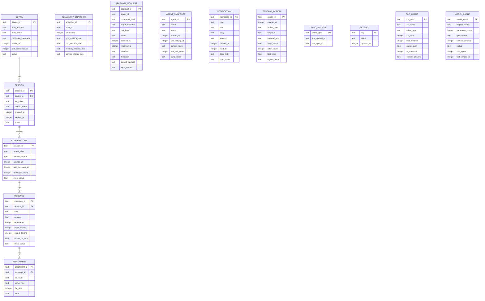

# §7 — Local Database Architecture

> **Document**: AegisOS Mobile — Local Database Architecture
> **Status**: DRAFT
> **Version**: 1.0.0

---

## 7.1 Database Selection: Drift + SQLCipher

### Recommendation

**Drift** (formerly Moor) ORM with **SQLCipher** backend for AES-256-GCM encryption at rest.

### Alternatives Considered

| Database | Considered | Verdict |
|----------|-----------|---------|
| **Drift + SQLCipher** | ✅ Selected | Type-safe Dart ORM, full SQLite power, hardware-backed encryption, mature migration system |
| **Hive** | ❌ Rejected | No SQL query capability, no relational integrity, encryption is application-level (not file-level), no migration tooling |
| **Isar** | ❌ Rejected | Abandoned by maintainer (development ceased 2024), no encryption, no Dart 3 support |
| **Realm** | ❌ Rejected | Proprietary license (MongoDB), mandatory cloud sync SDK, violates local-first principle |
| **ObjectBox** | ❌ Rejected | Commercial license required for production, closed-source native binary, limited encryption options |
| **sqflite + raw SQL** | ❌ Rejected | No type safety, manual migration management, no compile-time query validation |
| **Floor** | ❌ Rejected | Room-inspired but less mature than Drift, smaller community, fewer features |

### Rationale

1. **Full SQLCipher Encryption**: The entire database file is encrypted using AES-256-GCM. Unlike application-level encryption (where individual fields are encrypted), SQLCipher protects against forensic extraction of backup images and unrooted device file system access.

2. **Type-Safe Dart ORM**: Drift generates type-safe Dart code from table definitions. Queries are validated at compile time, eliminating SQL injection risks and runtime type errors.

3. **Relational Integrity**: Full support for foreign keys, indexes, triggers, views, and complex joins — essential for the conversation → message → attachment hierarchy.

4. **Migration System**: Drift provides a versioned migration framework with `onUpgrade` callbacks, enabling safe schema evolution across app updates without data loss.

5. **Reactive Streams**: Drift tables expose `Stream<List<T>>` that automatically re-emit when data changes, integrating seamlessly with Riverpod providers.

6. **SQLCipher Key Derivation**: The encryption key is derived from the Secure Enclave / KeyStore and released only after biometric authentication. The key never exists in plaintext in application memory.

### Trade-offs

| Advantage | Disadvantage |
|-----------|-------------|
| Full file encryption via SQLCipher | 5-10% overhead on read/write operations |
| Type-safe queries with compile-time validation | Code generation step required (`build_runner`) |
| Reactive streams for UI updates | Learning curve for Drift-specific query DSL |
| Relational model with foreign keys | Larger binary size than NoSQL alternatives (~2MB) |
| Mature migration framework | Schema changes require migration code |

### Implementation Complexity

**Low-Medium**. Drift is well-documented with extensive examples. SQLCipher integration requires a platform-specific native library but is handled by the `sqlcipher_flutter_libs` package.

---

## 7.2 Database Schema

### Entity-Relationship Model



---

## 7.3 Table Definitions

### Core Tables

| Table | Row Count Estimate | Access Pattern | Indexes |
|-------|-------------------|----------------|---------|
| `device` | 1-5 | Read-heavy, rarely updated | PK only |
| `session` | 1-3 | Read on every request | `idx_session_device`, `idx_session_status` |
| `conversation` | 50-200 | List + detail views | `idx_conv_last_message`, `idx_conv_model` |
| `message` | 5,000-50,000 | Paginated list per conversation | `idx_msg_session`, `idx_msg_timestamp` |
| `attachment` | 100-1,000 | Loaded per message | `idx_attach_message` |
| `telemetry_snapshot` | 1,440 (1 day at 1/min) | Time-series queries | `idx_telem_host_time` |
| `approval_request` | 50-500 | Filtered by status | `idx_approval_status`, `idx_approval_created` |
| `agent_snapshot` | 10-50 | List + detail | `idx_agent_status` |
| `notification` | 200-1,000 | Reverse chronological | `idx_notif_created`, `idx_notif_read` |
| `pending_action` | 0-50 | Status-filtered processing | `idx_pending_status`, `idx_pending_created` |
| `sync_anchor` | ~10 | Per-entity type lookup | PK only |
| `setting` | 20-50 | Key-value lookup | PK only |
| `file_cache` | 1,000-10,000 | Tree traversal | `idx_file_parent` |
| `model_cache` | 5-50 | Full scan (small table) | PK only |

---

## 7.4 Index Strategy

### Primary Indexes (Auto-created by PK)

All tables have a primary key index. No additional action needed.

### Secondary Indexes

```sql
-- Conversation: Sort by last activity
CREATE INDEX idx_conv_last_message ON conversation(last_message_at DESC);

-- Message: Paginated load per conversation
CREATE INDEX idx_msg_session_time ON message(session_id, timestamp DESC);

-- Telemetry: Time-range queries per host
CREATE INDEX idx_telem_host_time ON telemetry_snapshot(host_id, timestamp DESC);

-- Approval: Pending-first display
CREATE INDEX idx_approval_status_created ON approval_request(status, created_at DESC);

-- Notification: Unread-first display
CREATE INDEX idx_notif_read_created ON notification(read_at, created_at DESC);

-- Pending Actions: Queue processing order
CREATE INDEX idx_pending_status_created ON pending_action(sync_status, created_at ASC);

-- File Cache: Directory tree traversal
CREATE INDEX idx_file_parent ON file_cache(parent_path);
```

### Index Design Rationale

- **Composite indexes** are preferred over single-column indexes for queries that filter + sort
- **DESC ordering** on timestamps enables efficient "most recent first" pagination
- **No full-text indexes** in SQLCipher (FTS5 has limited encryption support); full-text search uses LIKE with application-side ranking

---

## 7.5 Migration Strategy

### Versioning Scheme

```
Database Version = Sequential integer (1, 2, 3, ...)
Mapped to app version in migration registry:

Version 1 → App v1.0.0 (Initial schema)
Version 2 → App v1.1.0 (Add model_cache table)
Version 3 → App v1.2.0 (Add file_cache.content_preview column)
...
```

### Migration Rules

1. **Forward-only**: Migrations are never reversed. Rollback requires reinstalling the app.
2. **Additive preferred**: New columns with defaults and new tables are preferred over column renames or type changes.
3. **Data preservation**: Every migration must preserve existing data. Destructive migrations require explicit user consent via a migration dialog.
4. **Atomic**: Each migration runs in a single transaction. If any statement fails, the entire migration rolls back.
5. **Tested**: Every migration must have a corresponding unit test that applies the migration to a populated database and verifies data integrity.

### Migration Implementation Pattern (Drift)

```dart
// Conceptual — not executable code
@DriftDatabase(tables: [Conversations, Messages, ...])
class AppDatabase extends _$AppDatabase {
  @override
  int get schemaVersion => 3;

  @override
  MigrationStrategy get migration => MigrationStrategy(
    onCreate: (m) => m.createAll(),
    onUpgrade: (m, from, to) async {
      // Version 1 → 2: Add model_cache table
      if (from < 2) {
        await m.createTable(modelCache);
      }
      // Version 2 → 3: Add content_preview to file_cache
      if (from < 3) {
        await m.addColumn(fileCache, fileCache.contentPreview);
      }
    },
  );
}
```

### Schema Drift Testing

```dart
// Verify migration integrity
test('migration from v1 to v3 preserves data', () async {
  // Create v1 database with test data
  // Run migrations to v3
  // Assert all v1 data is intact
  // Assert new columns have correct defaults
});
```

---

## 7.6 Performance Considerations

| Concern | Mitigation |
|---------|-----------|
| SQLCipher encryption overhead (5-10%) | Acceptable for mobile scale; < 15ms for 99% of reads (NFR target) |
| Large message tables (50K+ rows) | Pagination with cursor-based queries; eviction of old messages |
| Frequent telemetry writes (1/min) | Batch inserts using Drift's `batch` API |
| Memory pressure from reactive streams | Use `distinct()` and `limit()` on Drift queries to avoid unnecessary re-emissions |
| Database file size growth | Monthly VACUUM on app launch; storage usage monitoring in Diagnostics module |
| Concurrent access from main + background isolate | Drift supports multi-isolate access via `LazyDatabase` and `NativeDatabase.createInBackground()` |
