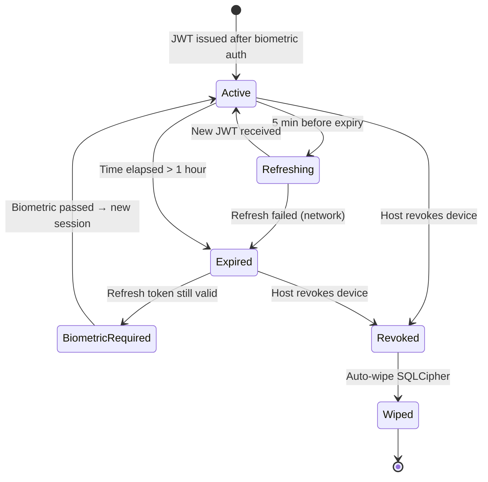
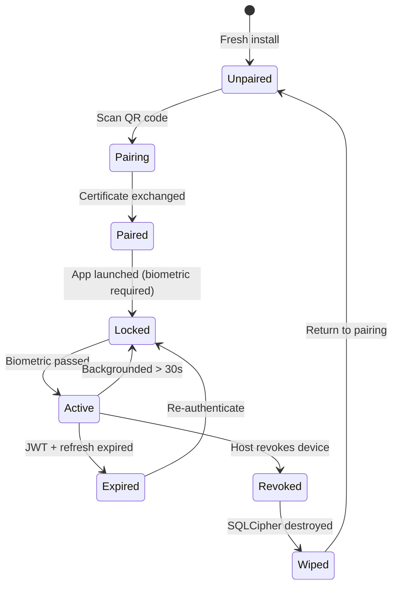

# §8 — Security Architecture

> **Document**: AegisOS Mobile — Security Architecture
> **Status**: DRAFT
> **Version**: 1.0.0

---

## 8.1 Security Posture: Zero Trust

Every interaction between the mobile device and the workstation host is treated as untrusted until cryptographically verified. There is no implicit trust based on network location.

```
┌─────────────────────────────────────────────────────────────────┐
│                    DEFENSE-IN-DEPTH (MOBILE)                     │
├─────────────────────────────────────────────────────────────────┤
│ Layer 1: Device Guard (Biometric + Secure Enclave)               │
│ Layer 2: Transport Guard (mTLS + Tailscale VPN)                  │
│ Layer 3: Session Guard (JWT + Refresh Token + Session DB)        │
│ Layer 4: Authorization Guard (RBAC Permission Enforcement)       │
│ Layer 5: Input Guard (Schema Validation + Size Limits)           │
│ Layer 6: Storage Guard (SQLCipher AES-256-GCM + Memory Purge)   │
│ Layer 7: Crypto Guard (ECDSA Signing for HITL Approvals)         │
│ Layer 8: Audit Guard (Immutable Audit Trail)                     │
└─────────────────────────────────────────────────────────────────┘
```

---

## 8.2 Device Registration & Pairing

### QR Code Pairing Flow

```
Step 1: GENERATE (Workstation Web Console)
  Admin clicks "Add Mobile Device" → Console generates:
  ├── Workstation ECDSA public key
  ├── Local IP address + port
  ├── Tailscale hostname (if available)
  ├── One-time pairing challenge token (UUID v7, 10-min TTL)
  └── QR code encoding all above as JSON + base64

Step 2: SCAN (Mobile App)
  Mobile scans QR code → Extracts:
  ├── Host public key
  ├── Connection endpoints
  └── Pairing challenge token

Step 3: EXCHANGE (Mobile → Workstation)
  Mobile generates ECDSA P-256 keypair in Secure Enclave
  Mobile sends to host over temporary TLS:
  ├── Mobile public key
  ├── Pairing challenge token (proves possession of QR)
  ├── Device metadata (OS, model, device_id)
  └── Push notification token (FCM/APNs)
  
Step 4: REGISTER (Workstation)
  Host validates challenge token (single-use, not expired)
  Host generates X.509 client certificate signed by host CA
  Host stores mobile public key in paired device registry
  Host returns:
  ├── Signed client certificate (for mTLS)
  ├── Host CA certificate (for certificate pinning)
  └── Initial JWT + refresh token

Step 5: STORE (Mobile)
  Mobile stores in Secure Enclave / KeyStore:
  ├── ECDSA private key (never leaves enclave)
  ├── Client certificate
  ├── Host CA certificate
  └── Refresh token (encrypted)
```

### Pairing Security Properties

| Property | Mechanism |
|----------|-----------|
| **Single-use** | Challenge token is invalidated after first use |
| **Time-limited** | Challenge token expires after 10 minutes |
| **Proximity-required** | QR code requires physical proximity for scanning |
| **Replay-resistant** | UUID v7 timestamp ensures uniqueness |
| **Man-in-the-middle resistant** | Host public key in QR establishes trust root |

---

## 8.3 Token Lifecycle

### JWT Architecture

```
JWT Header:
  alg: "ES256" (ECDSA P-256)
  typ: "JWT"
  kid: "<key-id>"

JWT Payload:
  sub: "<device_id>"
  iss: "aegis-host-<host_id>"
  aud: "aegis-mobile"
  iat: <issued_at>
  exp: <expires_at>           (1 hour from issuance)
  jti: "<unique-token-id>"    (for revocation tracking)
  role: "operator"
  permissions: ["telemetry.read", "agents.control", ...]
  device_fingerprint: "<cert_sha256>"

JWT Signature:
  Signed with host ECDSA private key (ES256)
  Verified by mobile using pinned host public key
```

### Token Lifecycle State Machine



### Refresh Token

| Attribute | Value |
|-----------|-------|
| **Type** | Opaque string (UUID v7) |
| **Storage** | flutter_secure_storage (iOS Keychain / Android EncryptedSharedPreferences) |
| **Lifetime** | 7 days |
| **Rotation** | New refresh token issued on every refresh; old token invalidated |
| **Binding** | Bound to device_id and certificate fingerprint |

### Token Refresh Protocol

```
1. Mobile detects JWT expires in < 5 minutes
2. Mobile sends POST /auth/refresh with:
   ├── Current refresh token (in request body, encrypted)
   ├── Client certificate (in mTLS handshake)
   └── Device fingerprint
3. Host validates:
   ├── Refresh token exists in DB and is not revoked
   ├── Refresh token is bound to the presented certificate CN
   ├── Device is not revoked in paired device registry
   └── Refresh token is not expired (< 7 days)
4. Host issues:
   ├── New JWT (1 hour)
   └── New refresh token (7 days, old one invalidated)
5. Mobile stores new tokens, discards old
```

---

## 8.4 Certificate Pinning

### Strategy: Host CA Pinning

```
Mobile stores the host's self-signed CA certificate (received during pairing).
All HTTPS/WSS connections verify the server certificate against this pinned CA.

Pinning Enforcement:
  ├── TLS handshake validates server cert is signed by pinned CA
  ├── Certificate chain must be exactly 2 deep (CA → server cert)
  ├── If pinning fails → connection rejected, alert user
  └── Backup: Host CA can be rotated via authenticated API call

Why CA Pinning (not Leaf Pinning):
  ├── Host may regenerate server certificates (e.g., IP change)
  ├── CA pinning allows certificate rotation without re-pairing
  └── Leaf pinning would require re-pairing on every cert renewal
```

### Alternatives Considered

| Strategy | Verdict |
|----------|---------|
| Leaf certificate pinning | Rejected: Requires re-pairing on every certificate renewal; operationally fragile |
| Public key pinning (HPKP) | Rejected: Deprecated in browsers; complex backup key management |
| No pinning (system trust store) | Rejected: Vulnerable to rogue CA compromise; unacceptable for local-first security model |

---

## 8.5 Biometric Authentication

### Biometric Gate Configuration

| Setting | Default | Configurable |
|---------|---------|-------------|
| **Required on app launch** | Yes | No (always required) |
| **Required on resume after background** | Yes (after 30 seconds) | Yes (10s – 5min) |
| **Required for HITL approvals** | Yes | No (always required for signing) |
| **Fallback on biometric failure** | Device PIN/passcode | No (device-level fallback only) |
| **Max failed attempts** | 3 | No |
| **Action on max failures** | Purge DB key from memory; require re-authentication | No |

### Biometric Integration

```
iOS:
  LAContext.evaluatePolicy(.deviceOwnerAuthenticationWithBiometrics)
  → Success: Secure Enclave releases SQLCipher key
  → Failure: Prompt device passcode fallback
  → Max failures: Lock app, purge keys

Android:
  BiometricPrompt.authenticate(CryptoObject)
  → Success: KeyStore releases SQLCipher key via CryptoObject
  → Failure: Prompt device PIN fallback
  → Max failures: Lock app, purge keys
```

---

## 8.6 Encryption Standards

| Use Case | Algorithm | Key Length | Key Storage |
|----------|-----------|-----------|-------------|
| SQLCipher database encryption | AES-256-GCM | 256-bit | Secure Enclave / StrongBox KeyStore |
| Client certificate private key | ECDSA P-256 | 256-bit | Secure Enclave / StrongBox KeyStore |
| HITL approval signing | ECDSA P-256 | 256-bit | Secure Enclave / StrongBox KeyStore |
| JWT validation | ES256 (ECDSA P-256) | 256-bit | Host CA pinned public key |
| Refresh token encryption at rest | AES-256-GCM | 256-bit | iOS Keychain / Android EncryptedSharedPreferences |
| Push notification payload | AES-256-GCM (envelope) + ECDH (key agreement) | 256-bit | Device public/private keypair |
| TLS transport | TLS 1.3 (ECDHE + AES-256-GCM) | — | OS-managed |

---

## 8.7 Key Rotation

| Key Type | Rotation Period | Trigger | Process |
|----------|---------------|---------|---------|
| **Client certificate** | 90 days | Automatic (background worker) | Host generates new cert → Mobile receives via authenticated API → Old cert revoked |
| **SQLCipher key** | Never (device lifecycle) | Device re-pairing only | Key is hardware-bound; rotation = re-pairing |
| **JWT signing key (host)** | 30 days | Scheduled host maintenance | Host rotates key → Issues new JWTs with new `kid` → Old key valid for 24h grace period |
| **Refresh token** | Every use | Token refresh request | New refresh token issued; old one invalidated |
| **Push notification key** | On re-pairing | Manual or device change | New ECDH keypair generated; host updates device registry |

---

## 8.8 Session Management

### Session States



### Session Properties

| Property | Value |
|----------|-------|
| **Session storage** | Server-side (PostgreSQL) + client-side (JWT in memory, refresh in secure storage) |
| **Idle timeout** | 30 seconds → biometric re-prompt (configurable) |
| **Absolute timeout** | 12 hours → full re-authentication |
| **Concurrent sessions** | 1 per device (new session invalidates previous) |
| **Session binding** | Bound to device_id + certificate fingerprint |

---

## 8.9 Remote Logout & Device Revocation

### Revocation Flow

```
1. Admin accesses Web Console → Devices → Select device → Revoke
   OR
   Admin runs CLI: aegis-admin client revoke --device-id <ID>

2. Host actions:
   ├── Invalidate client certificate in paired device registry
   ├── Revoke all active sessions for device_id
   ├── Revoke all refresh tokens for device_id
   ├── Emit 'device.revoked' event on event bus
   └── If WebSocket connected: send 'force_disconnect' message

3. Mobile actions (on next connection attempt or WebSocket message):
   ├── mTLS handshake rejected by host
   ├── App detects revocation
   ├── Purge SQLCipher encryption key from memory
   ├── Delete SQLCipher database file
   ├── Clear all secure storage entries
   ├── Clear push notification registration
   └── Return to unpaired state (pairing screen)
```

### Remote Wipe Guarantee

| Scenario | Wipe Triggered? | Mechanism |
|----------|----------------|-----------|
| Device online, WebSocket connected | Immediate | WebSocket `force_disconnect` message → local wipe |
| Device online, HTTP request | On next request | mTLS rejection → local wipe |
| Device offline | On next connection attempt | mTLS rejection → local wipe |
| Device permanently offline | No remote wipe | Data protected by SQLCipher encryption (key in Secure Enclave) |

---

## 8.10 Threat Mitigations (Mobile-Specific)

| Threat | Mitigation |
|--------|-----------|
| Lost/stolen device | Biometric gate + SQLCipher encryption + remote revocation |
| Man-in-the-middle | mTLS + certificate pinning + Tailscale E2EE |
| Token theft | JWT in memory only (never persisted to disk); refresh token in encrypted secure storage |
| Replay attack | JWT `jti` claim + timestamp validation; HITL signatures include nonce |
| Jailbreak/root detection | Warning banner (not block — open-source philosophy); increased audit logging |
| Backup extraction | SQLCipher full-file encryption; backup of encrypted DB is useless without Secure Enclave key |
| Push notification interception | E2EE payload; relay is zero-knowledge |
| Clipboard sniffing | Sensitive data (tokens, keys) never written to clipboard |
| Screen capture | Biometric-gated sections marked with `FLAG_SECURE` (Android) / `isSecureTextEntry` patterns |
| Memory forensics | Sensitive buffers zeroed on background; Dart GC supplemented with explicit nullification |
