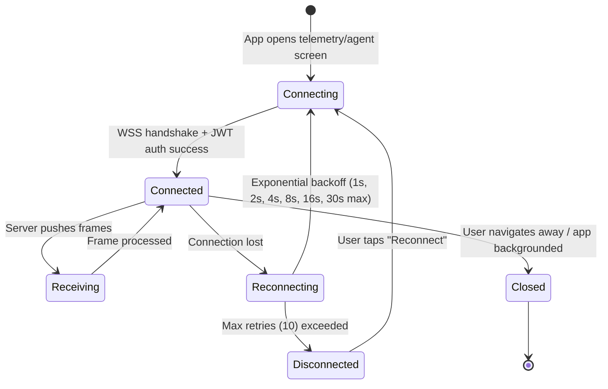

# §9 — Communication Architecture + §10 — Design System Foundation

> **Document**: AegisOS Mobile — Communication & Design System
> **Status**: DRAFT
> **Version**: 1.0.0

---

# §9 Communication Architecture

## 9.1 Protocol Matrix

| Protocol | Use Case | Direction | Latency Target | Compression | Auth |
|----------|----------|-----------|---------------|-------------|------|
| **REST (HTTPS)** | CRUD operations, sync, commands | Request/Response | < 500ms | gzip | mTLS + JWT |
| **SSE (HTTPS)** | Chat token streaming | Server → Client | < 30ms per token | None (streaming) | mTLS + JWT |
| **WebSocket (WSS)** | Telemetry, agent logs, approvals | Bidirectional | < 150ms | Per-message deflate | mTLS + JWT |
| **Background Sync** | Scheduled delta pull | Client → Server | Scheduled (15 min) | gzip | mTLS + JWT |
| **Push (FCM/APNs)** | Alerts, HITL approvals | Server → Client | Best-effort | E2EE payload | Device token |

---

## 9.2 REST Communication

### HTTP Client Configuration

| Setting | Value | Rationale |
|---------|-------|-----------|
| **Base URL** | From paired device registry | Dynamic per-host |
| **Connect Timeout** | 10 seconds | Tailscale may take time to establish |
| **Read Timeout** | 30 seconds | Model operations may be slow |
| **Write Timeout** | 30 seconds | File uploads |
| **Max Redirects** | 0 (no redirects) | Prevent open redirect attacks |
| **Connection Pool** | 5 persistent connections | Reduce TLS handshake overhead |
| **Request Compression** | gzip (Accept-Encoding) | Reduce bandwidth on cellular |
| **Response Compression** | gzip (Content-Encoding) | Reduce bandwidth on cellular |

### Request Interceptor Pipeline

```
1. Authentication Interceptor
   └── Attach JWT in Authorization: Bearer <token> header
   └── Attach X-Device-ID header
   └── Attach X-AegisOS-Client-Version header

2. Retry Interceptor
   └── On 401: trigger token refresh, then retry once
   └── On 429: respect Retry-After header
   └── On 500-503: exponential backoff (1s, 2s, 4s)

3. Logging Interceptor
   └── Log method, URL, status code, duration
   └── Redact Authorization header value
   └── Redact request/response body in production

4. Connectivity Interceptor
   └── Check network state before sending
   └── If offline: route to offline queue
   └── If VPN required but not connected: prompt user

5. Cache Interceptor
   └── ETag/If-None-Match for GET requests
   └── 304 Not Modified handling
```

---

## 9.3 Server-Sent Events (SSE)

### Chat Token Streaming

```
Endpoint: GET /sse/chat/:sessionId
Headers:
  Accept: text/event-stream
  Authorization: Bearer <jwt>
  Cache-Control: no-cache

Event Format:
  event: token
  data: {"content": "Hello", "index": 0, "model": "gemma-32b"}

  event: token
  data: {"content": " world", "index": 1, "model": "gemma-32b"}

  event: metrics
  data: {"input_tokens": 128, "output_tokens": 42, "cache_hit": 0.85}

  event: done
  data: {"message_id": "uuid", "total_tokens": 170, "duration_ms": 1200}

  event: error
  data: {"code": "MODEL_OVERLOADED", "message": "Ollama queue full"}
```

### SSE Resilience

| Scenario | Handling |
|----------|---------|
| Connection dropped mid-stream | Client stores partial message; reconnects with `Last-Event-ID` header; server resumes from offset |
| Server sends `event: error` | Display error inline in chat bubble; offer retry button |
| Network switch (Wi-Fi → cellular) | SSE connection restarted automatically; partial tokens preserved |
| App backgrounded during stream | Stream paused; resume on foreground; missing tokens fetched via REST |

---

## 9.4 WebSocket Communication

### Connection Lifecycle



### WebSocket Message Frame

```json
{
  "type": "telemetry.frame",
  "timestamp": "2026-07-13T14:30:00.000Z",
  "payload": {
    "gpu_utilization": 78.5,
    "vram_used_mb": 14336,
    "vram_total_mb": 24576,
    "cpu_load": 32.1,
    "ram_used_gb": 18.4,
    "temperature_celsius": 67,
    "active_models": ["gemma-32b", "codestral-22b"],
    "queue_depth": 3,
    "request_latency_ms": 145
  }
}
```

### Backpressure and Frame Rate Control

| Connection Type | Frame Rate | Rationale |
|----------------|-----------|-----------|
| Local Wi-Fi | 5 Hz (200ms intervals) | Low latency, no bandwidth concern |
| Cellular / VPN | 1 Hz (1000ms intervals) | Bandwidth conservation, battery preservation |
| Low battery mode | 0.2 Hz (5000ms intervals) | Minimal battery drain |
| App backgrounded | Disconnected | No WebSocket in background |

---

## 9.5 Push Notifications

### E2EE Push Pipeline

```
1. EVENT occurs on host (agent approval request, system fault, etc.)

2. Host NotificationService:
   ├── Serialize notification payload (JSON)
   ├── Generate random AES-256-GCM key (ephemeral)
   ├── Encrypt payload with ephemeral key
   ├── Encrypt ephemeral key with device's ECDH public key
   └── Package: { encrypted_payload, encrypted_key, iv, tag }

3. Host sends to AegisOS Push Relay:
   ├── POST /relay with encrypted blob
   ├── Relay routes to FCM/APNs (device push token)
   └── Relay does NOT store or inspect payload

4. FCM/APNs delivers push to device

5. Mobile receives push:
   ├── Decrypt ephemeral key using ECDH private key (Secure Enclave)
   ├── Decrypt payload using ephemeral AES key
   ├── Display notification content
   └── If actionable (HITL): display Approve/Reject buttons
```

### Push Categories

| Category | Priority | Sound | Action Buttons | Requires Biometric |
|----------|----------|-------|---------------|-------------------|
| `hitl_approval` | Critical | Alert | Approve, Reject | Yes (for approve) |
| `system_fault` | High | Warning | View Details | No |
| `agent_complete` | Normal | Default | View Agent | No |
| `model_ready` | Normal | Default | Open Models | No |
| `sync_conflict` | Normal | None | Resolve | No |
| `certificate_expiry` | High | Warning | Renew | No |

---

## 9.6 Timeout Configuration

| Operation | Timeout | Retry | Rationale |
|-----------|---------|-------|-----------|
| REST connect | 10s | 3 attempts | Tailscale tunnel establishment |
| REST read | 30s | 1 retry (after timeout) | Model operations may be slow |
| SSE connect | 10s | Infinite (with backoff) | Chat must eventually resume |
| SSE read | 60s heartbeat | Auto-reconnect | Detect stale connections |
| WebSocket connect | 10s | 10 attempts (with backoff) | Telemetry is non-critical |
| WebSocket ping/pong | 30s | 3 missed pongs → disconnect | Detect dead connections |
| Background sync | 30s total | 1 retry | Conserve battery |
| Push delivery | Best-effort | None (OS-managed) | FCM/APNs handles delivery |

---

## 9.7 Compression Strategy

| Channel | Compression | Method | Rationale |
|---------|------------|--------|-----------|
| REST request body | Enabled | gzip (Content-Encoding) | Reduce upload bandwidth on cellular |
| REST response body | Enabled | gzip (Accept-Encoding) | Reduce download bandwidth; 60-80% reduction on JSON |
| SSE stream | Disabled | — | Streaming data cannot be buffered for compression |
| WebSocket frames | Enabled | Per-message deflate (permessage-deflate extension) | 40-60% reduction on JSON telemetry frames |
| Push payload | Disabled | — | Already encrypted; compression reveals plaintext patterns |

---

# §10 Design System Foundation

## 10.1 Typography

### Font Stack

| Weight | Family | Use Case |
|--------|--------|----------|
| Primary | Inter (variable weight) | All body text, labels, navigation |
| Monospace | JetBrains Mono | Code snippets, terminal logs, token streams |
| System Fallback | SF Pro (iOS) / Roboto (Android) | When custom fonts unavailable |

### Type Scale

| Token | Size | Weight | Line Height | Use |
|-------|------|--------|-------------|-----|
| `display-lg` | 32dp | 700 | 40dp | Screen titles (Mission Control) |
| `display-md` | 28dp | 700 | 36dp | Section headers |
| `headline` | 22dp | 600 | 28dp | Card titles, module headers |
| `title-lg` | 18dp | 600 | 24dp | Subheadings |
| `title-md` | 16dp | 600 | 22dp | Navigation labels |
| `body-lg` | 16dp | 400 | 24dp | Primary content |
| `body-md` | 14dp | 400 | 20dp | Secondary content, descriptions |
| `body-sm` | 12dp | 400 | 16dp | Captions, metadata |
| `label-lg` | 14dp | 500 | 20dp | Button labels, form labels |
| `label-md` | 12dp | 500 | 16dp | Badges, tags |
| `label-sm` | 10dp | 500 | 14dp | Timestamps, micro-labels |
| `mono-md` | 13dp | 400 | 18dp | Code blocks, logs |
| `mono-sm` | 11dp | 400 | 16dp | Inline code, metrics |

---

## 10.2 Spacing System

### Base Unit: 4dp

| Token | Value | Use |
|-------|-------|-----|
| `space-0` | 0dp | — |
| `space-1` | 4dp | Icon-to-label, inline padding |
| `space-2` | 8dp | Element spacing, card padding (compact) |
| `space-3` | 12dp | List item spacing |
| `space-4` | 16dp | Section spacing, standard padding |
| `space-5` | 20dp | Card padding (comfortable) |
| `space-6` | 24dp | Section dividers |
| `space-8` | 32dp | Major section spacing |
| `space-10` | 40dp | Screen edge padding (tablets) |
| `space-12` | 48dp | Minimum touch target |
| `space-16` | 64dp | Large component spacing |

---

## 10.3 Layout Grid

| Breakpoint | Width | Columns | Gutter | Margin | Navigation |
|-----------|-------|---------|--------|--------|------------|
| **Compact** (Phone) | < 600dp | 4 | 16dp | 16dp | Bottom tabs (5 items) |
| **Medium** (Foldable) | 600–840dp | 8 | 16dp | 24dp | Navigation rail + split pane |
| **Expanded** (Tablet) | > 840dp | 12 | 24dp | 32dp | Navigation rail + multi-pane |

---

## 10.4 Color System

### Dark Theme (Default)

| Token | Hex | Usage |
|-------|-----|-------|
| `surface-base` | `#030712` | App background |
| `surface-1` | `#0B0F19` | Card backgrounds |
| `surface-2` | `#111827` | Elevated surfaces |
| `surface-3` | `#1F2937` | Input fields, dropdowns |
| `border-subtle` | `#374151` | Subtle borders, dividers |
| `border-default` | `#4B5563` | Standard borders |
| `text-primary` | `#F9FAFB` | Primary text |
| `text-secondary` | `#9CA3AF` | Secondary text, captions |
| `text-tertiary` | `#6B7280` | Placeholder text |
| `accent-primary` | `#6366F1` | Electric Indigo — primary actions, links |
| `accent-primary-hover` | `#818CF8` | Hover/pressed state |
| `status-active` | `#10B981` | Emerald — online, running, healthy |
| `status-warning` | `#F59E0B` | Amber — throttled, degraded |
| `status-error` | `#EF4444` | Red — offline, failed, critical |
| `status-info` | `#3B82F6` | Blue — informational, syncing |
| `gpu-gradient-start` | `#6366F1` | GPU gauge gradient |
| `gpu-gradient-end` | `#A855F7` | GPU gauge gradient |
| `vram-bar` | `#8B5CF6` | VRAM utilization bar |

### Light Theme

| Token | Hex | Usage |
|-------|-----|-------|
| `surface-base` | `#FFFFFF` | App background |
| `surface-1` | `#F9FAFB` | Card backgrounds |
| `surface-2` | `#F3F4F6` | Elevated surfaces |
| `text-primary` | `#111827` | Primary text |
| `text-secondary` | `#6B7280` | Secondary text |
| `accent-primary` | `#4F46E5` | Indigo — slightly deeper for light backgrounds |

### Dynamic Color (Android Material You)

On Android 12+, the app supports Material You dynamic color extraction from the user's wallpaper. Dynamic colors override the accent palette only; status colors remain fixed for accessibility compliance.

---

## 10.5 Elevation System

| Token | Elevation | Shadow | Use |
|-------|----------|--------|-----|
| `elevation-0` | 0dp | None | Flat surfaces |
| `elevation-1` | 1dp | `0 1px 2px rgba(0,0,0,0.3)` | Cards, list items |
| `elevation-2` | 3dp | `0 2px 4px rgba(0,0,0,0.3)` | Floating action buttons |
| `elevation-3` | 6dp | `0 4px 8px rgba(0,0,0,0.3)` | Dropdown menus, bottom sheets |
| `elevation-4` | 8dp | `0 6px 12px rgba(0,0,0,0.4)` | Dialogs, modal overlays |
| `elevation-5` | 12dp | `0 8px 16px rgba(0,0,0,0.4)` | Navigation drawer |

---

## 10.6 Iconography

| Set | Source | Style | Size Grid |
|-----|--------|-------|-----------|
| Primary | Phosphor Icons | Duotone (dark), Regular (light) | 16dp, 20dp, 24dp, 32dp |
| Status | Custom SVG | Filled circles, triangles, squares | 8dp, 12dp |
| Navigation | Material Symbols | Rounded, weight 400, filled | 24dp |

### Icon Design Rules

- Icons must have a minimum touch target of 48×48dp
- All icons must include semantic accessibility labels
- Status icons use shape + color (never color alone)

---

## 10.7 Animation System

| Token | Duration | Curve | Use |
|-------|----------|-------|-----|
| `anim-instant` | 100ms | `easeOut` | Toggle switches, checkbox |
| `anim-fast` | 200ms | `easeInOut` | Button press, icon transitions |
| `anim-normal` | 300ms | `easeInOut` | Page transitions, card expand |
| `anim-slow` | 500ms | `easeInOut` | Modal open/close, drawer sweep |
| `anim-pulse` | 1500ms | `linear` (infinite) | Active agent indicator |
| `anim-spring` | 400ms | `spring(damping: 0.6)` | Pull-to-refresh, swipe actions |

### Micro-Interactions

- **Agent running**: Subtle pulsing green dot (1.5s cycle)
- **Token streaming**: Character-by-character fade-in (100ms stagger)
- **Approval swipe**: Springy horizontal slide with haptic feedback
- **Connection status**: Smooth color transition (green → red) on disconnect
- **Telemetry gauges**: Animated value transitions (300ms ease)

---

## 10.8 Accessibility (WCAG 2.2 AAA)

| Requirement | Implementation |
|-------------|---------------|
| **Contrast ratio** | Min 7:1 (text), 4.5:1 (large text) — verified via automated tests |
| **Touch targets** | Min 48×48dp with 8dp separation |
| **Screen readers** | All widgets have semantic labels (VoiceOver / TalkBack) |
| **Dynamic Type** | Supports 200% text scaling without layout breakage |
| **Reduced motion** | Respects `prefers-reduced-motion` / `AccessibilityFeatures.reduceMotion` |
| **Focus order** | Logical left-to-right, top-to-bottom tab order |
| **Live regions** | Critical alerts announced immediately via accessibility live regions |
| **Color independence** | Status conveyed by shape + label + color (never color alone) |
| **Keyboard navigation** | Full support for hardware keyboards and trackpads |
| **Gesture alternatives** | Every swipe gesture has an explicit button equivalent |

---

## 10.9 Responsive Behavior

### Adaptive Layouts

```
Compact (< 600dp):
  ┌────────────────────────┐
  │  App Bar               │
  ├────────────────────────┤
  │                        │
  │  Content Area          │
  │  (Single Pane)         │
  │                        │
  ├────────────────────────┤
  │  Bottom Navigation     │
  └────────────────────────┘

Medium (600–840dp):
  ┌──────┬─────────────────┐
  │ Nav  │                 │
  │ Rail │  Content Area   │
  │      │  (Split Pane)   │
  │      │                 │
  └──────┴─────────────────┘

Expanded (> 840dp):
  ┌──────┬──────────┬──────┐
  │ Nav  │  Primary │ Side │
  │ Rail │  Content │ Panel│
  │      │          │      │
  └──────┴──────────┴──────┘
```

### Foldable Support

- Detect fold state via `MediaQuery.displayFeatures`
- On fold: split UI across two panes (list/detail)
- Avoid placing interactive elements on the hinge zone
- Gracefully handle fold/unfold transitions without state loss

### Tablet Layouts

- Navigation rail replaces bottom tabs
- Multi-pane layouts show list + detail simultaneously
- Increased information density (more data per screen)
- Larger touch targets for stylus input compatibility

---

## 10.10 Dark Mode

| Behavior | Implementation |
|----------|---------------|
| **Default** | Dark mode (matches AegisOS console branding) |
| **System sync** | Follows iOS/Android system theme preference |
| **Manual override** | User can force dark or light in Settings |
| **Transition** | Smooth 300ms cross-fade on theme switch |
| **Persistence** | Theme preference stored in SQLCipher settings table |
