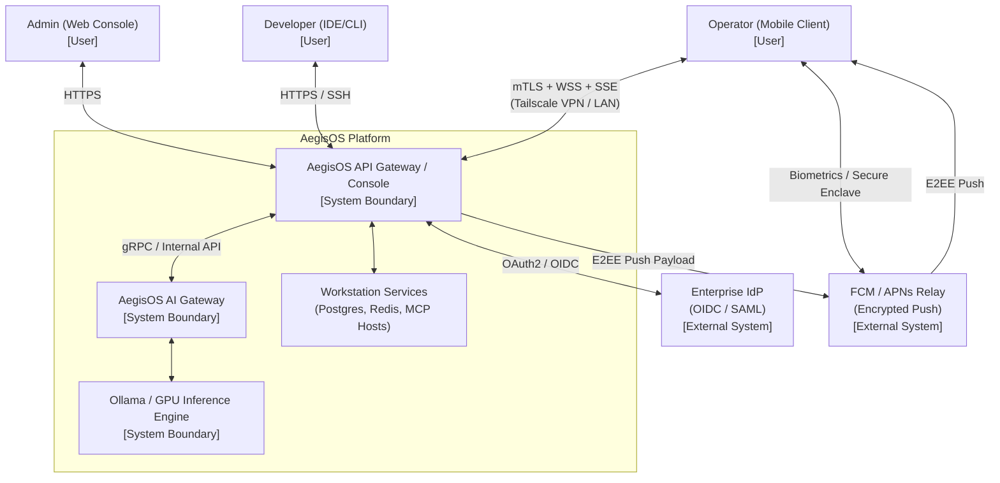
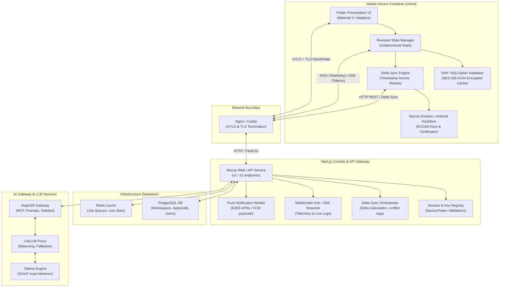
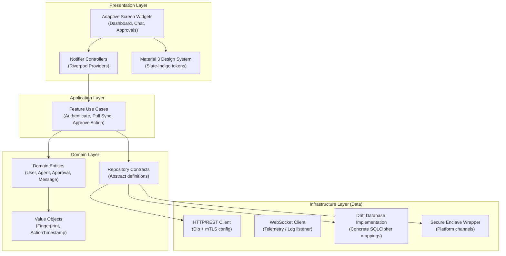
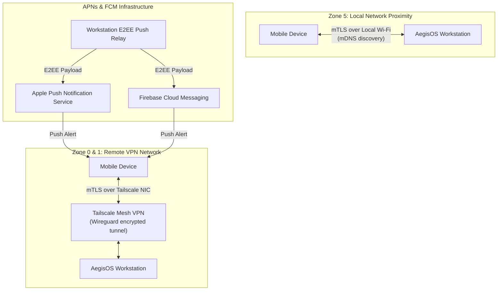
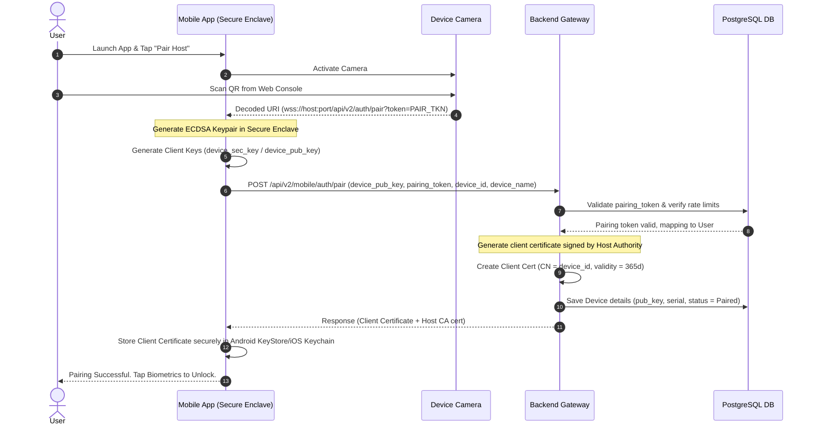
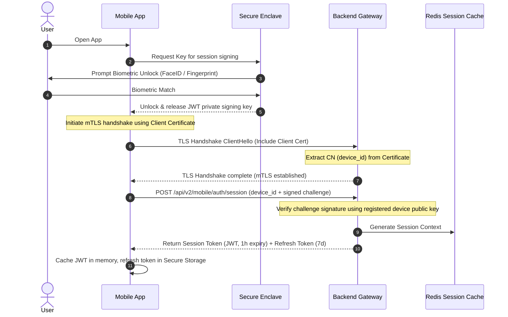
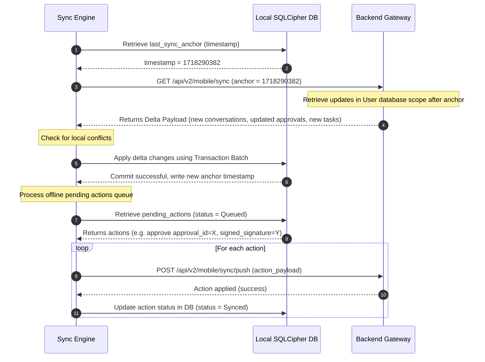
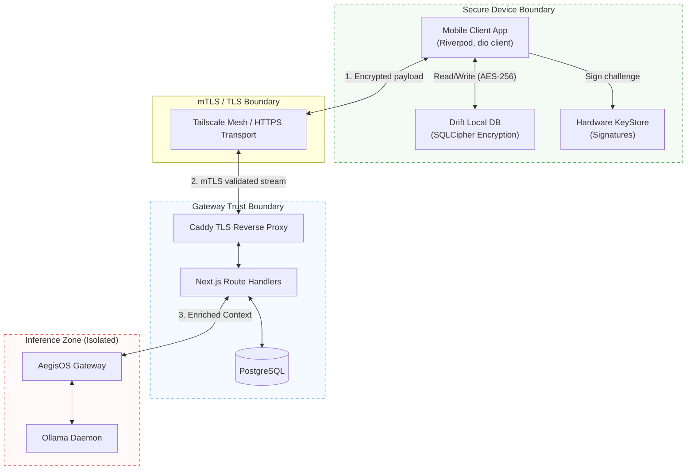

# §11 — C4 Model & Detailed Architectural Reference

> **Document**: AegisOS Mobile — C4 Model & Detailed Architectural Reference
> **Status**: DRAFT
> **Version**: 1.0.0
> **Last Updated**: 2026-07-13

---

## 11.1 C4 Architecture Model

### Level 1: System Context Diagram

The System Context diagram illustrates the system boundaries, users, and external integrations.

---

### Level 2: Container Diagram

The Container diagram decomposes the platform and highlights the specific technical boundaries of the mobile client, backend gateway, and inference components.

---

### Level 3: Component Diagram (Mobile Client)

This diagram details the internal layers of the Flutter Application, illustrating the dependency flows.

---

### Level 4: Code & Package Guidelines

To enforce Clean Architecture constraints, the project applies the following structural import guidelines:

1.  **Strict Dependency Hierarchy**:
    *   `presentation` may import `application`, `domain`, and `core`.
    *   `application` may import `domain` and `core`.
    *   `infrastructure` may import `domain` and `core` (implements Domain contracts).
    *   `domain` may **ONLY** import `core` and other domain elements. It must have **zero** dependencies on UI, Riverpod, Drift, or network clients.
2.  **No Circular Feature Imports**: Features located in `lib/features/` must communicate either via shared entities in the `domain` root layer or through event bus subscriptions. Direct imports from another feature's `presentation` or `infrastructure` layers are strictly forbidden.
3.  **Encapsulation via Barrel Files**: Each layer or sub-module must export its public API using a single entry point (e.g., `features/auth/auth.dart`). Only barrel exports may be imported externally.

---

## 11.2 Deployment Topology

The mobile companion communicates over two distinct network topologies depending on host proximity:

---

## 11.3 Sequence Diagrams

### Zero-Trust QR Pairing Flow

This sequence diagrams the initialization of trust between the mobile companion and the local workstation.

---

### Biometric Session Recovery & mTLS Authentication

Every session establishment uses cryptographic validation to obtain a stateless JWT, ensuring hardware-backed trust.

---

### Offline Delta Sync Pull & Push Queue

---

## 11.4 Trust Boundaries & Data Flow Diagrams

The following diagram traces the trust boundaries (demarcated by dashed lines) and the data validation requirements across the systems.

---

## 11.5 Threat Model (STRIDE)

We evaluate security vectors using the STRIDE threat model targeting the Mobile and Gateway surfaces:

| Threat Category | Target | Vector | Mitigation Strategy |
| :--- | :--- | :--- | :--- |
| **Spoofing Identity** | Gateway API | Attacker attempts to call `/api/v2/mobile/sync` masquerading as a paired device. | **mTLS Client Validation**: Caddy terminates client certificates and extracts CN. The API gateway verifies that the CN maps to a registered active device and that the token matches. |
| **Tampering with Data** | Local Database | Attacker gains access to local mobile filesystem and extracts offline chat caches. | **SQLCipher Encryption**: The SQLite database is encrypted with AES-256-GCM. The key is derived on launch using a salt and secret stored in the Secure Enclave, released only via biometric confirmation. |
| **Repudiation** | HITL Approvals | User claims they did not approve a command that caused data loss or compromise. | **Cryptographic Signatures**: The approval action payload is signed on-device using the device's private key stored in the Secure Enclave. The gateway validates the signature before executing. |
| **Information Disclosure** | Push Notifications | Push notification payload contains sensitive conversational AI context leaked via FCM/APNs. | **End-to-End Encryption**: Push notification payload data is encrypted with the client's public key on the host. The notification text only reads "New Agent Action Required", content is decrypted locally on the device. |
| **Denial of Service** | Telemetry Stream | Attacker floods the gateway with high-frequency REST or WebSocket messages. | **Token-Bucket Rate Limiting**: Limit of 300 authenticated requests per minute per device, and strict limits on concurrent WebSocket connections (max 5 per device). |
| **Elevation of Privilege** | Route Handlers | An operator device attempts to execute Administrator commands. | **Role-Based Access Control (RBAC)**: All route handlers map the session token to the user role and assert permissions in the database before proceeding. |
