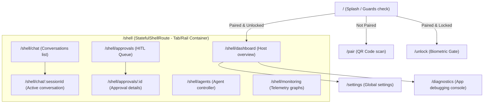

# Navigation & User Flow Specification

This document defines the routing configuration, layout adaptation, deep link mapping, and user gestures for AegisOS Mobile.

---

## 1. GoRouter Navigation Graph



---

## 2. Redirection Guards & Auth Triggers
GoRouter implements the following redirection flow:

```dart
String? redirectGuard(BuildContext context, GoRouterState state) {
  final pairingState = ref.read(pairingProvider);
  final authState = ref.read(authProvider);

  // 1. Ensure paired
  if (!pairingState.isPaired && state.matchedLocation != '/pair') {
    return '/pair';
  }

  // 2. Ensure unlocked via biometrics
  if (pairingState.isPaired && !authState.isUnlocked && state.matchedLocation != '/unlock') {
    return '/unlock';
  }

  // 3. Prevent loop on login screens if authenticated
  if (pairingState.isPaired && authState.isUnlocked && 
      (state.matchedLocation == '/pair' || state.matchedLocation == '/unlock')) {
    return '/shell/dashboard';
  }

  return null; // Proceed to target route
}
```

---

## 3. Deep Linking Catalog

The app registers the custom scheme `aegis://` and handles universal link routing on iOS and Android:

| Deep Link URI | Target Screen | Route Resolution | Parameters |
| :--- | :--- | :--- | :--- |
| `aegis://dashboard` | Host Dashboard | `/shell/dashboard` | None |
| `aegis://chat/{sessionId}` | Active Chat Session | `/shell/chat/{sessionId}` | `sessionId` (String) |
| `aegis://approvals/{id}` | Approval Action Sheet | `/shell/approvals/{id}` | `id` (String) |
| `aegis://settings/security`| Security Settings | `/settings/security` | None |

---

## 4. Gesture & Interaction Model
*   **Edge Swipe-Back**: Dismisses current sub-page (e.g. ChatActive to Chat list).
*   **Long-Press Approval**: Requires the user to hold down the "Approve" button for **1.5 seconds** (displays circular filling progress) to prevent accidental execution of critical commands.
*   **Swipe to Reject**: Left-swipe on an approval card in the queue triggers a prompt for rejection.
*   **Shake for Diagnostics**: Shaking the device on any screen pulls up the diagnostics overlay bundle to capture logs.

---

## 5. State Restoration
The app preserves state during lifecycle events (backgrounding, low memory terminations):
*   **Scroll Position**: Cached dynamically via `PageStorageKey` on the conversations and approvals lists.
*   **Draft Message Text**: Local database `conversations` table caches the unsubmitted draft string in real time.
*   **Active Shell Tab Index**: Persisted in Secure Storage, restoring the last active tab on relaunch.
