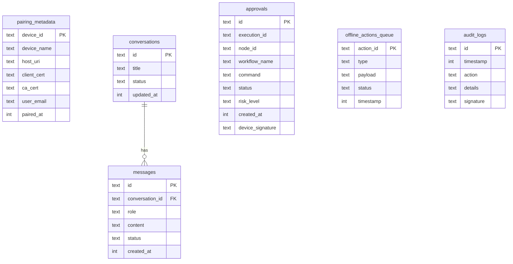

# Local Database Schema: Drift & SQLCipher

AegisOS Mobile stores all active data in an encrypted SQLite database using Drift ORM and SQLCipher.

---

## 1. Database Configuration
*   **Engine**: SQLite via Drift.
*   **Encryption**: SQLCipher (AES-256-GCM) with key derivation using SHA-256 and salt.
*   **Pragmas**:
    ```sql
    PRAGMA key = 'SECURE_DERIVED_KEY_FROM_ENCLAVE';
    PRAGMA cipher_memory_security = ON;
    PRAGMA journal_mode = WAL;
    PRAGMA synchronous = NORMAL;
    PRAGMA temp_store = MEMORY;
    ```

---

## 2. Table Definitions (Drift / SQL DSL)

### 2.1 Table: `pairing_metadata`
Stores details of the workstation authorization.
```sql
CREATE TABLE pairing_metadata (
    device_id TEXT PRIMARY KEY NOT NULL,
    device_name TEXT NOT NULL,
    host_uri TEXT NOT NULL,
    client_cert TEXT NOT NULL,
    ca_cert TEXT NOT NULL,
    user_email TEXT NOT NULL,
    paired_at INTEGER NOT NULL
);
```

### 2.2 Table: `conversations`
Caches chat threads.
```sql
CREATE TABLE conversations (
    id TEXT PRIMARY KEY NOT NULL,
    title TEXT NOT NULL,
    status TEXT CHECK(status IN ('Active', 'Archived', 'Deleted')) NOT NULL DEFAULT 'Active',
    updated_at INTEGER NOT NULL
);
```

### 2.3 Table: `messages`
Caches conversation messages.
```sql
CREATE TABLE messages (
    id TEXT PRIMARY KEY NOT NULL,
    conversation_id TEXT NOT NULL,
    role TEXT CHECK(role IN ('user', 'assistant', 'system')) NOT NULL,
    content TEXT NOT NULL,
    status TEXT CHECK(status IN ('Sending', 'Sent', 'Error')) NOT NULL DEFAULT 'Sent',
    created_at INTEGER NOT NULL,
    FOREIGN KEY(conversation_id) REFERENCES conversations(id) ON DELETE CASCADE
);
CREATE INDEX idx_messages_conversation ON messages(conversation_id);
```

### 2.4 Table: `approvals`
Caches human-in-the-loop pending approval operations.
```sql
CREATE TABLE approvals (
    id TEXT PRIMARY KEY NOT NULL,
    execution_id TEXT NOT NULL,
    node_id TEXT NOT NULL,
    workflow_name TEXT NOT NULL,
    command TEXT NOT NULL,
    status TEXT CHECK(status IN ('Pending', 'Approved', 'Rejected', 'TimedOut')) NOT NULL DEFAULT 'Pending',
    risk_level TEXT CHECK(risk_level IN ('Low', 'Medium', 'High', 'Critical')) NOT NULL,
    created_at INTEGER NOT NULL,
    device_signature TEXT
);
```

### 2.5 Table: `offline_actions_queue`
Appends local actions executed while offline for future sync pushes.
```sql
CREATE TABLE offline_actions_queue (
    action_id TEXT PRIMARY KEY NOT NULL,
    type TEXT CHECK(type IN ('CHAT_SEND', 'APPROVAL_RESOLVE', 'NOTIFICATION_READ')) NOT NULL,
    payload TEXT NOT NULL, -- JSON string
    status TEXT CHECK(status IN ('Queued', 'Processing', 'Failed')) NOT NULL DEFAULT 'Queued',
    timestamp INTEGER NOT NULL
);
```

### 2.6 Table: `audit_logs`
Read-only local append-only trail.
```sql
CREATE TABLE audit_logs (
    id TEXT PRIMARY KEY NOT NULL,
    timestamp INTEGER NOT NULL,
    action TEXT NOT NULL,
    details TEXT NOT NULL,
    signature TEXT NOT NULL
);
```

---

## 3. Entity Relationship Diagram (ERD)



---

## 4. Migrations & Schema Versioning
*   **Version 1**: Initial release schema layout.
*   **Drift Migrations Helper**:
    *   On Schema Creation (`onCreate`): Execute Drift table creations and verify Pragmas.
    *   On Schema Upgrade (`onUpgrade`): Drift schema migrator executes migration files. For version increments:
        1. Run DB backup before structural alters.
        2. Execute schema statements.
        3. If failed, restore backup and flag synchronization mismatch.
