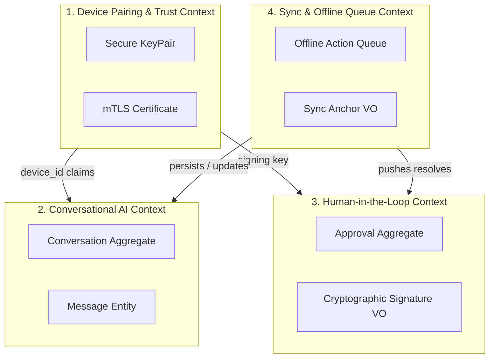

# Domain Model: AegisOS Mobile Companion

This document designs the complete business domain model for the AegisOS Mobile Companion app following Domain-Driven Design (DDD) principles.

---

## 1. Bounded Contexts



---

## 2. Context Definitions, Aggregates, and Entities

### 2.1 Device Pairing & Trust Context
Establishes cryptographic identity and trust with the workstation.

*   **Aggregates**:
    *   `DeviceIdentity` (Aggregate Root): Represents the unique paired device.
*   **Entities**:
    *   `HostConnection`: Details of the target workstation connection.
*   **Value Objects**:
    *   `DevicePublicKey`: ECDSA public key.
    *   `DevicePrivateKey`: Kept exclusively inside Secure Enclave.
    *   `ClientCertificate`: mTLS certificate issued by Host CA.
    *   `Fingerprint`: SHA-256 hash of the client certificate.

### 2.2 Conversational AI Context
Orchestrates conversations and messages cached locally.

*   **Aggregates**:
    *   `Conversation` (Aggregate Root): Captures a chat thread session.
*   **Entities**:
    *   `Message`: A single message entry within a conversation (User, AI, System).
*   **Value Objects**:
    *   `MessageContent`: Text content, tokens, mimeType, and markdown layout details.
    *   `ModelIdentifier`: String representing LLM used (e.g. `llama3:8b`).

### 2.3 Human-in-the-Loop (HITL) Context
Handles approvals of dangerous actions executed by workstation agents.

*   **Aggregates**:
    *   `ApprovalItem` (Aggregate Root): A single approval block (e.g. terminal execution).
*   **Value Objects**:
    *   `SignedApproval`: Cryptographic signature validating the operator decision.
    *   `RiskLevel`: Enum (`Low`, `Medium`, `High`, `Critical`).
    *   `ApprovalCommand`: The shell command or operation details to execute.

### 2.4 Sync & Offline Queue Context
Maintains synchronization state and queues offline operations.

*   **Aggregates**:
    *   `SyncSession` (Aggregate Root): Manages delta boundaries.
*   **Entities**:
    *   `OfflineAction`: Represents a task queued during offline status.
*   **Value Objects**:
    *   `SyncAnchor`: Anchor timestamp (Unix epoch milliseconds).

---

## 3. Domain Events

Domain Events represent state transitions within our model.

| Domain Event | Context | Payload |
| :--- | :--- | :--- |
| `TrustEstablished` | Pairing | `{ deviceId, clientCert, timestamp }` |
| `SessionUnlocked` | Pairing | `{ sessionId, unlockedAt }` |
| `ConversationUpdated`| Chat | `{ conversationId, lastMessageId, timestamp }` |
| `ApprovalSigned` | Approval | `{ approvalId, decision, signature }` |
| `SyncCompleted` | Sync | `{ oldAnchor, newAnchor, durationMs }` |
| `ActionQueued` | Sync | `{ actionId, actionType, timestamp }` |

---

## 4. Commands & Queries

### Commands (State Modifiers)
*   `RegisterDevice(pairingToken, deviceName, deviceId)`: Generates keys, requests client cert.
*   `AuthorizeApproval(approvalId, decision)`: Fetches key from Enclave, signs, pushes or queues action.
*   `SendMessage(conversationId, text, model)`: Adds local message to DB, starts SSE listener.
*   `SynchronizeCache()`: Executes delta sync check.

### Queries (Read Operations)
*   `GetDashboardSummary()`: Returns active system stats, pending approvals count.
*   `ListConversations()`: Lists cached threads ordered by `updatedAt`.
*   `GetPendingApprovals()`: Queries local DB for items with status `Pending`.

---

## 5. Repository Interfaces

Repositories define the contracts for data access layers:

```dart
abstract class DeviceRepository {
  Future<DeviceIdentity?> getDevice();
  Future<void> saveDevice(DeviceIdentity device);
  Future<void> clearDevice();
}

abstract class ConversationRepository {
  Future<List<Conversation>> getConversations();
  Future<void> saveConversation(Conversation conversation);
  Future<void> addMessage(String conversationId, Message message);
}

abstract class ApprovalRepository {
  Future<List<ApprovalItem>> getPendingApprovals();
  Future<void> updateApprovalStatus(String id, String status, String? signature);
}

abstract class SyncQueueRepository {
  Future<List<OfflineAction>> getPendingActions();
  Future<void> enqueueAction(OfflineAction action);
  Future<void> markActionSynced(String actionId);
}
```

---

## 6. Audit & Compliance Model

All operations on the mobile app are logged locally in a read-only audit partition using Drift.
*   **Structure**: Every audit entry contains `{ timestamp, actionName, userRole, deviceSignature, status }`.
*   **Immutability**: Audit entries are append-only. They are signed with the device private key and flushed to the workstation during synchronization, preserving compliance integrity.
