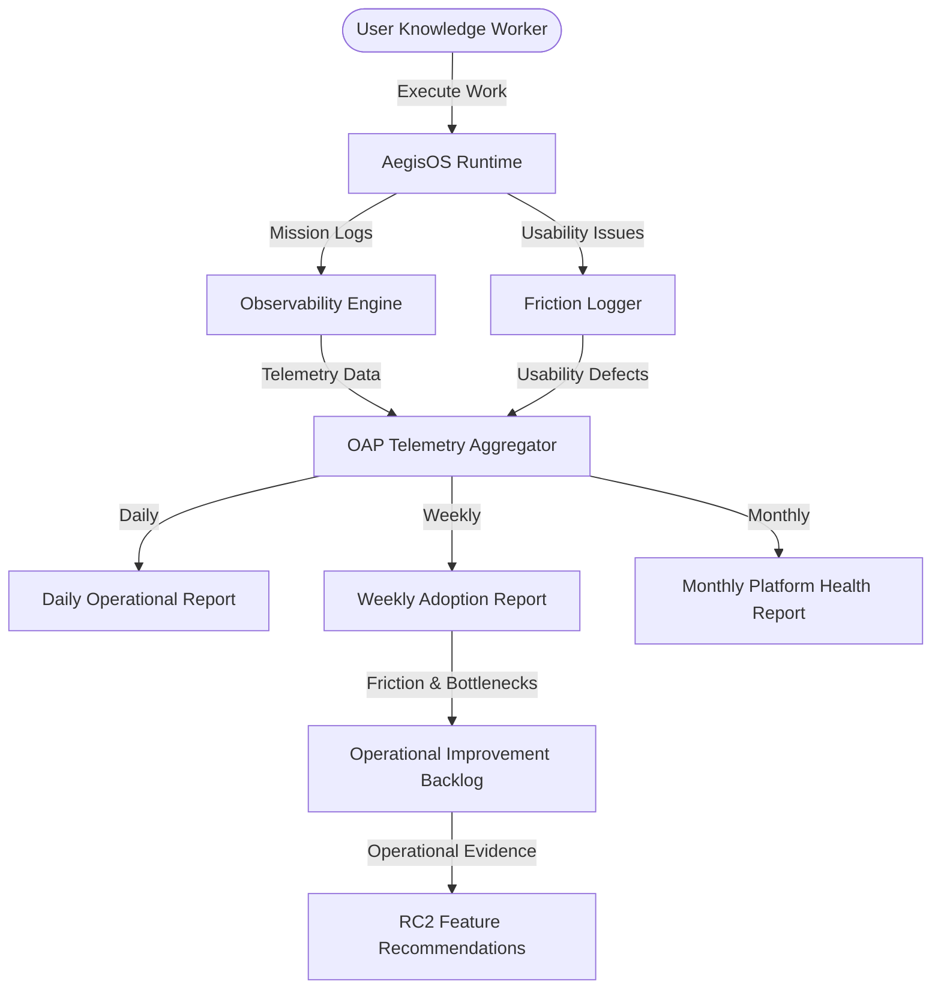

# AegisOS Operational Adoption Program (OAP)
## Master Governance Framework & Operating Charter

> **STATUS:** APPROVED & IN EFFECT  
> **BASELINE:** RELEASE RC1 (Engineering Certified) & PVP PLATFORM VALIDATION COMPLETE  
> **FOCUS:** DAILY OPERATIONAL ADOPTION  

---

## 1. Program Executive Summary

With the successful completion of **Release Candidate 1 (RC1)** engineering baseline certification and the **Platform Validation Program (PVP)** 50+ mission execution validation, AegisOS has crossed the threshold from foundational engineering into **Operational Adoption**.

The core objective of the platform is **no longer feature implementation or architectural expansion**. The primary goal is achieving total daily operational adoption across all knowledge work activities.

### Non-Negotiable Directives
1. **No Speculative Platform Features:** No new platform features shall be engineered unless real-world operational usage demonstrates a genuine, evidence-backed need.
2. **Operational Evidence First:** Architectural evolution, optimizations, and feature enhancements for RC2 must strictly follow empirical operational telemetry and friction log data.
3. **Internal Dogfooding:** AegisOS must serve as the primary operating system for all engineering, product, architectural, research, and managerial knowledge work.

---

## 2. OAP Mission & Operating Rules

### Mission Statement
> *"Adopt AegisOS as the primary daily operating system for all knowledge work. Every engineering, research, and management activity should execute inside AegisOS whenever practical."*

### Mandatory In-System Knowledge Domains
For the duration of the Operational Adoption Program, the following 16 knowledge work activities **MUST execute inside AegisOS**:

| Work Domain | Description & Requirements | In-System Execution Mechanism |
| :--- | :--- | :--- |
| **Research** | Initial domain investigation, web research, literature synthesis | Intent Engine + Research Agents |
| **Architecture** | System design, component blueprints, ADR generation | Architecture Agent + Knowledge Engine |
| **Coding** | Feature implementation, refactoring, bug fixes | Execution Runtime + IDE Agent |
| **Product Management** | PRDs, feature specs, metric definition | PM Agent + Artifact Store |
| **Documentation** | Technical guides, API specs, operational manuals | Markdown Generator + Knowledge Engine |
| **Planning** | Sprint planning, implementation plans, task checklists | Planning Engine + Task Manager |
| **Roadmapping** | Long-term strategy, milestone tracking, priority mapping | Strategic Agent + Knowledge Base |
| **Technical Analysis** | System performance analysis, security audits, code reviews | Diagnostic Engine + Code Graph |
| **Deep Research** | Comprehensive multi-source synthesis, benchmarking | Deep Research Agent |
| **Meeting Notes** | Capture action items, decisions, transcript summaries | Assistant Agent + Knowledge Base |
| **Knowledge Capture** | Repository pattern capture, KI generation | Knowledge Engine + Artifact Store |
| **Decision Logs** | Architectural Decision Records (ADRs), trade-off logs | Governance Engine + ADR Store |
| **Issue Tracking** | Bug logging, friction logging, task tracking | Friction Logger + Backlog Engine |
| **Mission Planning** | Multi-step agent graph synthesis, goal decomposition | Intent Engine + Mission Runtime |
| **Artifact Generation** | Diagram creation, report synthesis, summary docs | Artifact Store + Markdown Engine |
| **Operational Auditing** | System health checks, telemetry review, scorecard generation | Observability Engine + Telemetry Service |

---

## 3. Telemetry & Observability Architecture

OAP mandates continuous background capture of operational metrics to quantify platform usage, friction, and productivity:

### Core Observability Metrics Captured
- **Mission Success Rate (%)**: Percentage of completed missions achieving defined objectives without critical failures.
- **Mission Duration (s)**: Wall-clock completion time from prompt submission to final artifact generation.
- **User Intervention Count**: Number of times Human-in-the-Loop (HITL) manual intervention or correction was required.
- **Reflection Cycles**: Count of internal self-correction iterations executed by agents.
- **Manual Corrections**: Specific instances where user manually edited agent outputs or corrected execution steps.
- **Agent Utilization**: Distribution and execution count across intent, planning, developer, and governance agents.
- **Tool Utilization**: Execution frequency and failure rates of tools (file, command, code graph, MCP tools).
- **Knowledge Reuse Rate (%)**: Frequency of accessing existing Knowledge Items (KIs) vs re-discovering information.
- **Workspace Usage**: Active workspace sessions, open context files, and execution tree nodes.
- **Execution Graph Size**: Total nodes and edges synthesized during mission planning and resolution.
- **Artifact Quality Score (0-100)**: Structural completeness, lint correctness, and user feedback rating of artifacts.
- **Prompt Revisions**: Count of prompt refinements or re-query attempts required to achieve intended result.
- **Failures & Recovery Rate**: Rate of unhandled exceptions vs successfully recovered retry attempts.

---

## 4. Friction Logging Governance

Every usability barrier, delay, unexpected behavior, or manual workaround encountered during daily work **MUST** be recorded as a Friction Artifact.

### Friction Item Schema
Each friction record contains:
1. **Description**: Concise summary of the usability barrier.
2. **Severity**: `CRITICAL` (blocks adoption), `MAJOR` (causes significant delay/workaround), `MINOR` (inconvenience), `COSMETIC` (visual/formatting issue).
3. **Frequency**: `ALWAYS`, `FREQUENT`, `OCCASIONAL`, `RARE`.
4. **Reproduction Steps**: Clear step-by-step instructions to recreate the friction.
5. **Subsystem**: Responsible component (`Intent Engine`, `Mission Runtime`, `Execution Runtime`, `Knowledge Engine`, `HITL Manager`, `UI/UX`, `Tools`).
6. **Suggested Improvement**: Minimal operational change to eliminate the friction.

---

## 5. User Experience (UX) Speed Metrics

OAP tracks 7 core time-to-value benchmarks to quantify operational efficiency:

| UX Metric | Target Benchmark | Description |
| :--- | :--- | :--- |
| **Time to Create Workspace** | $< 5.0\text{ seconds}$ | Time from repo initialization to active context indexing |
| **Time to Launch Mission** | $< 2.0\text{ seconds}$ | Time from user prompt submission to initial agent dispatch |
| **Time to Find Artifacts** | $< 3.0\text{ seconds}$ | Time to search and locate generated artifacts in workspace |
| **Time to Locate Knowledge** | $< 2.0\text{ seconds}$ | Time to retrieve existing Knowledge Item (KI) context |
| **Time to Approve HITL** | $< 5.0\text{ seconds}$ | Latency for presenting HITL prompt to user decision |
| **Time to Recover Execution** | $< 10.0\text{ seconds}$ | Latency to detect failure, trigger reflection, and resume execution |
| **Time to Onboard Project** | $< 30.0\text{ seconds}$ | Complete workspace indexing, dependency mapping, and readiness check |

---

## 6. Review & Reporting Cadence

OAP operates on a continuous, multi-tiered reporting structure:

1. **Daily Operational Report (`docs/oap/03_Daily_Operational_Report.md`)**:
   - Daily snapshot of mission throughput, pass rates, friction counts, and execution metrics.
2. **Weekly Adoption Report (`docs/oap/04_Weekly_Adoption_Report.md`)**:
   - Comprehensive weekly dashboard analyzing capability usage, unused features, user friction, and architecture gaps.
3. **Monthly Platform Health Report (`docs/oap/05_Monthly_Platform_Health_Report.md`)**:
   - Strategic summary of adoption growth, total cost of ownership, knowledge base expansion, and platform stability.
4. **Operational Improvement Backlog (`docs/oap/06_Operational_Improvement_Backlog.md`)**:
   - Living backlog of operational friction fixes prioritized strictly by operational impact.
5. **RC2 Feature Recommendations (`docs/oap/07_RC2_Feature_Recommendations.md`)**:
   - Formal recommendations for RC2 development, locked to operational evidence.

---

## 7. Success Criteria & Definition of Excellence

Success in OAP is **NOT** measured by lines of code written or speculative features designed. Success is measured strictly by:

- **Reduced Friction:** $> 50\%$ reduction in weekly logged friction points.
- **Increased Productivity:** $> 30\%$ improvement in average mission completion speed.
- **High Mission Success:** $> 95\%$ end-to-end mission completion without manual intervention.
- **High Knowledge Reuse:** $> 80\%$ reuse of existing system knowledge and artifacts.
- **100% Daily Adoption:** Complete execution of all internal knowledge work inside AegisOS.
