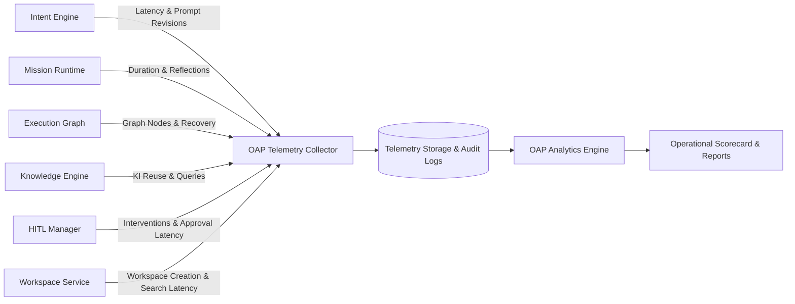

# AegisOS Telemetry & UX Observability Specification

> **PROGRAM:** AegisOS Operational Adoption Program (OAP)  
> **COMPONENT:** Operational Telemetry & UX Metric Engine Specification  
> **SPECIFICATION VERSION:** 1.0.0  

---

## 1. Overview & Architecture

The **Observability & UX Telemetry Engine** automatically captures, structures, and correlates system operational metrics and user experience latency across all knowledge work executed inside AegisOS.



---

## 2. Core Observability Metrics Specification

Every execution mission inside AegisOS automatically collects 14 foundational operational telemetry dimensions:

| Telemetry Metric | Type | Target Unit | Data Collector Source | Operational Purpose |
| :--- | :--- | :--- | :--- | :--- |
| **Mission Success** | Boolean / Enum | `PASS` / `WARN` / `FAIL` | Mission Evaluation Service | Measures objective fulfillment accuracy |
| **Mission Duration** | Numeric | Milliseconds (`ms`) | Execution Runtime Clock | Identifies execution latency & bottlenecks |
| **User Intervention** | Numeric | Count | HITL Manager | Tracks manual user intervention rate |
| **Reflection Cycles** | Numeric | Count | Mission Reflection Engine | Quantifies agent self-correction overhead |
| **Manual Corrections** | Numeric | Count | Workspace Artifact Monitor | Measures manual user post-editing |
| **Agent Utilization** | Object | Agent Call Map | Control Plane Dispatcher | Monitors agent load distribution |
| **Tool Utilization** | Object | Tool Execution Map | Tool Execution Service | Identifies tool execution frequency & failures |
| **Knowledge Reuse** | Numeric | Percentage (`%`) | Knowledge Engine | Measures KI retrieval vs re-synthesis |
| **Workspace Usage** | Object | Files / Tokens | Workspace Context Manager | Tracks context size & active session count |
| **Execution Graph Size** | Numeric | Node Count | Intent Resolution Engine | Measures plan complexity and depth |
| **Artifact Quality Score**| Numeric | Rating (`0-100`) | Evaluation Engine | Assesses structural & lint compliance |
| **Prompt Revisions** | Numeric | Count | Intent Classifier | Tracks prompt clarification cycles |
| **Failures** | Object | Exception List | Runtime Diagnostics Engine | Identifies unhandled exceptions |
| **Recovery Rate** | Numeric | Percentage (`%`) | Failure Recovery Manager | Measures auto-recovery effectiveness |

---

## 3. User Experience (UX) Metric Specifications

OAP defines 7 high-impact UX time-to-value metrics:

```typescript
export interface OAPUserExperienceMetrics {
  /** Time from repo selection to context indexing readiness (ms) */
  timeToCreateWorkspaceMs: number;
  
  /** Latency from prompt submission to agent graph dispatch (ms) */
  timeToLaunchMissionMs: number;
  
  /** Time taken to locate and display generated artifacts (ms) */
  timeToFindArtifactsMs: number;
  
  /** Time taken to search and inject relevant Knowledge Items (ms) */
  timeToLocateKnowledgeMs: number;
  
  /** Latency for presenting HITL prompt and receiving user decision (ms) */
  timeToApproveHitlMs: number;
  
  /** Latency to detect execution failure, reflect, and resume work (ms) */
  timeToRecoverExecutionMs: number;
  
  /** End-to-end onboarding time for a newly imported project workspace (ms) */
  timeToOnboardProjectMs: number;
}
```

### UX Benchmark Targets & Thresholds

| UX Metric | Optimal Target | Warning Threshold | Critical Alert |
| :--- | :--- | :--- | :--- |
| `timeToCreateWorkspace` | $< 3.0\text{s}$ | $5.0\text{s} - 10.0\text{s}$ | $> 10.0\text{s}$ |
| `timeToLaunchMission` | $< 1.5\text{s}$ | $2.0\text{s} - 4.0\text{s}$ | $> 4.0\text{s}$ |
| `timeToFindArtifacts` | $< 2.0\text{s}$ | $3.0\text{s} - 6.0\text{s}$ | $> 6.0\text{s}$ |
| `timeToLocateKnowledge` | $< 1.0\text{s}$ | $2.0\text{s} - 4.0\text{s}$ | $> 4.0\text{s}$ |
| `timeToApproveHitl` | $< 4.0\text{s}$ | $5.0\text{s} - 15.0\text{s}$ | $> 15.0\text{s}$ |
| `timeToRecoverExecution` | $< 5.0\text{s}$ | $10.0\text{s} - 20.0\text{s}$ | $> 20.0\text{s}$ |
| `timeToOnboardProject` | $< 20.0\text{s}$ | $30.0\text{s} - 60.0\text{s}$ | $> 60.0\text{s}$ |

---

## 4. Telemetry Schema & Payload Format

Telemetry logs are serialized as structured JSON events:

```json
{
  "$schema": "http://json-schema.org/draft-07/schema#",
  "title": "OAPOperationalTelemetryEvent",
  "type": "object",
  "properties": {
    "missionId": { "type": "string" },
    "domain": { "type": "string" },
    "timestamp": { "type": "string", "format": "date-time" },
    "status": { "type": "string", "enum": ["PASS", "WARNING", "FAIL"] },
    "executionTimeMs": { "type": "number" },
    "reflectionCycles": { "type": "number" },
    "userInterventionCount": { "type": "number" },
    "manualCorrections": { "type": "number" },
    "agentUtilization": {
      "type": "object",
      "additionalProperties": { "type": "number" }
    },
    "toolUtilization": {
      "type": "object",
      "additionalProperties": { "type": "number" }
    },
    "knowledgeReuseRatePercent": { "type": "number" },
    "executionGraphNodeCount": { "type": "number" },
    "artifactQualityScore": { "type": "number" },
    "promptRevisionCount": { "type": "number" },
    "recoveryCount": { "type": "number" },
    "uxMetrics": {
      "type": "object",
      "properties": {
        "timeToCreateWorkspaceMs": { "type": "number" },
        "timeToLaunchMissionMs": { "type": "number" },
        "timeToFindArtifactsMs": { "type": "number" },
        "timeToLocateKnowledgeMs": { "type": "number" },
        "timeToApproveHitlMs": { "type": "number" },
        "timeToRecoverExecutionMs": { "type": "number" },
        "timeToOnboardProjectMs": { "type": "number" }
      },
      "required": [
        "timeToCreateWorkspaceMs",
        "timeToLaunchMissionMs",
        "timeToFindArtifactsMs",
        "timeToLocateKnowledgeMs",
        "timeToApproveHitlMs",
        "timeToRecoverExecutionMs",
        "timeToOnboardProjectMs"
      ]
    }
  },
  "required": [
    "missionId",
    "domain",
    "timestamp",
    "status",
    "executionTimeMs",
    "reflectionCycles",
    "userInterventionCount",
    "agentUtilization",
    "toolUtilization",
    "knowledgeReuseRatePercent",
    "artifactQualityScore",
    "uxMetrics"
  ]
}
```

---

## 5. Mathematical Metric Aggregation Formulas

To compute platform-wide adoption scorecards, the telemetry aggregator uses the following mathematical formulas:

### 1. Overall Operational Adoption Index (OAI)
$$\text{OAI} = 0.35 \times S_{\text{rate}} + 0.25 \times Q_{\text{artifact}} + 0.20 \times (100 - U_{\text{hitl}}\times 10) + 0.20 \times R_{\text{knowledge}}$$
*Where:*
- $S_{\text{rate}}$ = Mission Success Rate (%)
- $Q_{\text{artifact}}$ = Average Artifact Quality Score (0-100)
- $U_{\text{hitl}}$ = Average HITL Intervention count per mission
- $R_{\text{knowledge}}$ = Knowledge Reuse Percentage (%)

### 2. Execution Recovery Efficiency (ERE)
$$\text{ERE} = \left( \frac{\text{Successful Auto-Recoveries}}{\text{Total Failure Events}} \right) \times 100$$

### 3. Productivity Velocity Gain (PVG)
$$\text{PVG} = \left( \frac{T_{\text{baseline}} - T_{\text{aegis}}}{T_{\text{baseline}}} \right) \times 100$$
*Where $T_{\text{baseline}}$ is traditional manual task duration and $T_{\text{aegis}}$ is AegisOS execution duration.*
