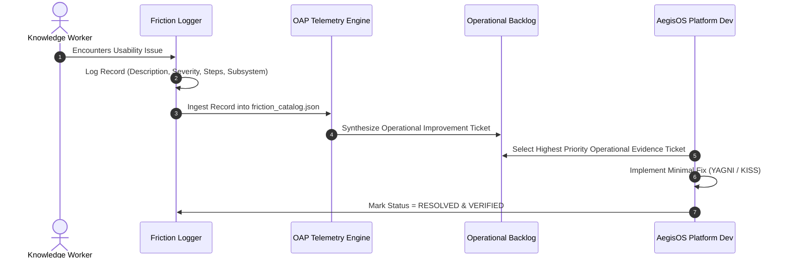

# AegisOS Friction Log Governance Framework

> **PROGRAM:** AegisOS Operational Adoption Program (OAP)  
> **GOVERNANCE:** Usability Issue Artifact & Refinement Protocol  
> **RULE:** Every Usability Issue Becomes an Engineering Artifact  

---

## 1. Governance Principles & Directives

During the **Operational Adoption Program (OAP)**, software engineering priorities are strictly dictated by user experience telemetry and logged operational friction.

### Core Friction Rules
1. **Zero Silent Workarounds:** Any developer or knowledge worker who encounters an unexpected delay, redundant prompt, manual context copy-paste, UI clutter, or approval bottleneck **MUST** immediately log a friction entry.
2. **Artifact Conversion:** Every friction log entry is automatically converted into an operational backlog ticket (`docs/oap/06_Operational_Improvement_Backlog.md`).
3. **No Speculative Engineering:** Features or optimizations that do NOT resolve a logged friction item or operational telemetry deficit are prohibited during OAP.

---

## 2. Friction Record Schema

Every friction entry captures 7 mandatory fields:

```typescript
export interface OAPFrictionItem {
  /** Unique friction identifier (e.g. FRIC-001) */
  id: string;

  /** Domain of knowledge work being executed when friction occurred */
  domain: "Research" | "Architecture" | "Coding" | "Product Management" | "Documentation" | "Planning" | "Meeting Notes" | "Issue Tracking";

  /** Detailed description of the friction or usability barrier */
  description: string;

  /** Severity impact on operational adoption */
  severity: "CRITICAL" | "MAJOR" | "MINOR" | "COSMETIC";

  /** Recurrence frequency */
  frequency: "ALWAYS" | "FREQUENT" | "OCCASIONAL" | "RARE";

  /** Step-by-step reproduction instructions */
  reproductionSteps: string[];

  /** Target platform subsystem responsible */
  subsystem: "Intent Engine" | "Capability Layer" | "Mission Runtime" | "Execution Graph" | "Execution Runtime" | "Knowledge Engine" | "HITL Manager" | "Tools" | "UI/UX";

  /** Minimal, practical operational change to eliminate friction */
  suggestedImprovement: string;

  /** Current lifecycle status */
  status: "LOGGED" | "TRIAGED" | "IN_PROGRESS" | "RESOLVED" | "VERIFIED";

  /** Associated RC2 Priority or Backlog Ticket ID */
  backlogTicketId?: string;
}
```

---

## 3. Severity & Frequency Classification Matrix

Friction entries are prioritized using a matrix combining **Severity** and **Frequency**:

| Severity Rating | Definition | Impact on OAP |
| :--- | :--- | :--- |
| **CRITICAL** | Blocks execution, causes mission failure, or forces out-of-system fallback | Immediate fix required; halts non-essential activity |
| **MAJOR** | Requires significant user workaround ($> 30\text{s}$ delay) or multiple manual steps | High priority for current weekly sprint |
| **MINOR** | Minor inconvenience, slight UI lag, or minor formatting flaw | Triaged into weekly operational backlog |
| **COSMETIC** | Non-blocking visual alignment, terminology mismatch | Low priority background refinement |

| Frequency | Value Weight | Action Trigger |
| :--- | :--- | :--- |
| **ALWAYS** | $1.0$ | Escalated to top 3 backlog priority |
| **FREQUENT** | $0.8$ | Included in weekly refinement cycle |
| **OCCASIONAL** | $0.5$ | Addressed during subsystem optimization |
| **RARE** | $0.2$ | Logged for trend monitoring |

---

## 4. Friction Lifecycle & Workflow



---

## 5. Subsystem Mapping & Taxonomy

Friction items map directly to AegisOS platform layers to simplify engineering triage:

- **Intent Engine (`subsystem: Intent Engine`)**: Misclassification of prompt intent, excessive intent prompt revisions, incorrect capability matching.
- **Capability Layer (`subsystem: Capability Layer`)**: Missing capability resolution mappings, ambiguous intent-to-capability routing.
- **Mission Runtime (`subsystem: Mission Runtime`)**: Graph plan synthesis delays, rigid execution graph node ordering.
- **Execution Graph (`subsystem: Execution Graph`)**: Deadlock during node execution, missing parallelization across independent steps.
- **Execution Runtime (`subsystem: Execution Runtime`)**: Tool execution timeout, unhandled agent errors, redundant agent handoffs.
- **Knowledge Engine (`subsystem: Knowledge Engine`)**: High latency KI retrieval ($> 2.0\text{s}$), stale context injection, missing vector index pre-warming.
- **HITL Manager (`subsystem: HITL Manager`)**: Excessive permission prompts for read-only actions, clumsy approval modal UI.
- **Tools (`subsystem: Tools`)**: Shell command escaping issues, file read line truncation, missing structured JSON tool output.
- **UI/UX (`subsystem: UI/UX`)**: Deeply nested artifact navigation, lack of real-time execution node progress visualization.
