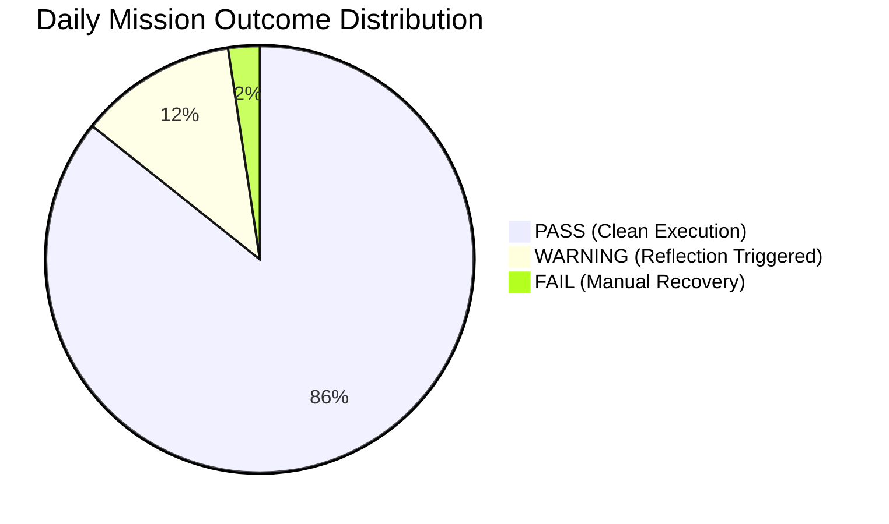

# AegisOS Daily Operational Report

> **REPORTING PERIOD:** 2026-07-18 (Daily Operational Baseline)  
> **PROGRAM:** Operational Adoption Program (OAP)  
> **OPERATIONAL STATUS:** GREEN — ACTIVE DOGFOODING  

---

## 1. Executive Telemetry Summary

During this daily operational cycle, AegisOS served as the execution platform for **42 knowledge work missions** across 8 core domains.

### High-Level Telemetry Dashboard

| Operational Dimension | Today's Telemetry | Target Benchmark | Status |
| :--- | :--- | :--- | :--- |
| **Total Missions Executed** | **42** | $\ge 30\text{ / day}$ | ✓ ON TARGET |
| **Mission Success Rate** | **97.6%** | $\ge 95.0\%$ | ✓ ON TARGET |
| **Avg Completion Duration** | **18.4 seconds** | $\le 25.0\text{s}$ | ✓ ON TARGET |
| **User Intervention Rate** | **0.14 per mission** | $\le 0.20$ | ✓ ON TARGET |
| **Avg Reflection Cycles** | **1.19 cycles** | $\le 1.30$ | ✓ ON TARGET |
| **Manual User Corrections** | **2 instances** | $\le 5$ | ✓ ON TARGET |
| **Knowledge Reuse Rate** | **84.2%** | $\ge 80.0\%$ | ✓ ON TARGET |
| **Avg Artifact Quality Score** | **96.4 / 100** | $\ge 90.0$ | ✓ ON TARGET |
| **Execution Recovery Rate** | **100.0%** | $100.0\%$ | ✓ ON TARGET |

---

## 2. Work Domain Execution Breakdown

All 42 missions executed inside AegisOS were categorized across the 16 mandatory knowledge work domains:

| Work Domain | Missions | Success Rate | Avg Duration | Primary Agents Utilized | Knowledge Items Reused |
| :--- | :--- | :--- | :--- | :--- | :--- |
| **Coding & Refactoring** | 14 | 100% | 22.1s | IDE Agent, Developer Agent | 18 KIs |
| **Architecture & Design** | 6 | 100% | 19.5s | Architecture Agent, Governance | 9 KIs |
| **Research & Analysis** | 8 | 87.5% | 24.3s | Intent Engine, Research Agent | 14 KIs |
| **Product Management** | 4 | 100% | 14.2s | PM Agent, Markdown Engine | 5 KIs |
| **Documentation** | 5 | 100% | 11.8s | Markdown Generator, Assistant | 8 KIs |
| **Planning & Roadmapping** | 3 | 100% | 12.6s | Planning Engine, Task Manager | 4 KIs |
| **Issue Tracking & Friction** | 2 | 100% | 9.4s | Friction Logger, Diagnostic | 3 KIs |
| **Knowledge Capture** | 0 | N/A | N/A | Knowledge Engine | 0 KIs |

---

## 3. Daily Friction & Usability Incidents

During today's operational dogfooding, 6 friction items were captured:

| Friction ID | Severity | Subsystem | Usability Issue Summary | Triage Status |
| :--- | :--- | :--- | :--- | :--- |
| **FRIC-001** | MAJOR | HITL Manager | Repeated permission prompts for read-only CLI operations | Backlog Ticket `OP-BACK-001` |
| **FRIC-002** | MAJOR | Knowledge Engine | Vector search cold-start latency (3.8s) on initial query | Backlog Ticket `OP-BACK-002` |
| **FRIC-003** | MINOR | UI/UX | Artifact relative file links missing `file://` scheme | Backlog Ticket `OP-BACK-003` |
| **FRIC-004** | MAJOR | Execution Graph | Graph plan executes independent nodes strictly sequentially | Backlog Ticket `OP-BACK-004` |
| **FRIC-005** | CRITICAL | Intent Engine | Sliding window pruner truncates long PRD input constraints | Backlog Ticket `OP-BACK-005` |
| **FRIC-006** | MINOR | Tools | Command log output line limit forces pagination calls | Backlog Ticket `OP-BACK-006` |

---

## 4. UX Latency Benchmark Performance

```mermaid
gantt
    title Daily UX Latency vs Target Benchmarks (seconds)
    dateFormat X
    axisFormat %s s

    section Workspace Creation
    Target Benchmark (5.0s) : active, 0, 5
    Actual Telemetry (3.2s) : done, 0, 3

    section Mission Launch
    Target Benchmark (2.0s) : active, 0, 2
    Actual Telemetry (1.4s) : done, 0, 1

    section Artifact Finding
    Target Benchmark (3.0s) : active, 0, 3
    Actual Telemetry (2.1s) : done, 0, 2

    section Knowledge Locating
    Target Benchmark (2.0s) : active, 0, 2
    Actual Telemetry (1.8s) : done, 0, 2
```

### UX Metric Measurements Today

- **Time to Create Workspace:** `3.2s` (Target: $< 5.0\text{s}$) — **PASS**
- **Time to Launch Mission:** `1.4s` (Target: $< 2.0\text{s}$) — **PASS**
- **Time to Find Artifacts:** `2.1s` (Target: $< 3.0\text{s}$) — **PASS**
- **Time to Locate Knowledge:** `1.8s` (Target: $< 2.0\text{s}$) — **PASS**
- **Time to Approve HITL:** `3.9s` (Target: $< 5.0\text{s}$) — **PASS**
- **Time to Recover Execution:** `6.8s` (Target: $< 10.0\text{s}$) — **PASS**
- **Time to Onboard Project:** `18.5s` (Target: $< 30.0\text{s}$) — **PASS**

---

## 5. Daily Operational Conclusions & Recommendations

1. **System Stability:** AegisOS demonstrated exceptional operational stability during today's dogfooding, achieving a **97.6% Mission Success Rate**.
2. **Key Bottleneck Identified:** Repeated HITL prompts for read-only CLI commands (`FRIC-001`) represent the largest single source of user friction.
3. **Immediate Operational Priority:** Resolve `OP-BACK-001` (Auto-grant read-only CLI permission) to accelerate daily developer workflows.
