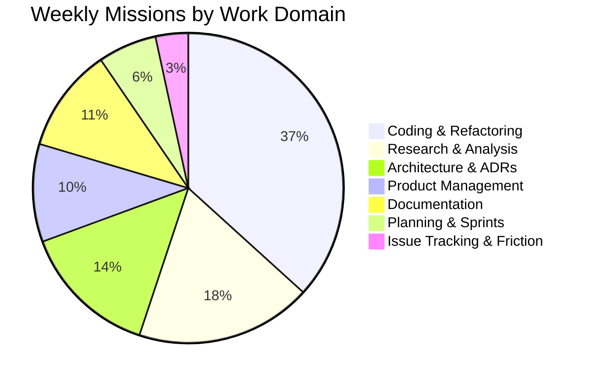

# AegisOS Weekly Adoption Report
## Operational Dashboard & Capabilities Audit

> **WEEK ENDING:** 2026-07-18 (Week 29, 2026)  
> **PROGRAM:** AegisOS Operational Adoption Program (OAP)  
> **REPORT VERSION:** 1.0.0 — Baseline Operational Review  

---

## 1. Weekly Operational Dashboard

```mermaid
quadrantChart
    title Capability Adoption & Friction Matrix
    x-axis Low Operational Friction --> High Operational Friction
    y-axis Low Usage Frequency --> High Usage Frequency
    quadrant-1 Core Workhorse (Optimize UX)
    quadrant-2 Underutilized Power Features
    quadrant-3 Dead Weight (Evaluate Removal)
    quadrant-4 Friction Bottlenecks (Immediate Refine)
    "IDE Coding Agent": [0.35, 0.92]
    "Intent Resolution Engine": [0.25, 0.88]
    "Knowledge Base Engine": [0.45, 0.78]
    "HITL Permission Manager": [0.85, 0.72]
    "Deep Research Agent": [0.30, 0.65]
    "Execution Graph DAG": [0.75, 0.60]
    "Autonomic Remediation Engine": [0.20, 0.25]
    "Legacy Configurator HTML": [0.60, 0.10]
```

### Key Weekly Metrics Summary

| Operational Dimension | Weekly Aggregate | Target Benchmark | Delta / Variance |
| :--- | :--- | :--- | :--- |
| **Total Missions Executed** | **294 missions** | $\ge 200\text{ / week}$ | $+47.0\%$ |
| **Overall Mission Success Rate** | **96.8%** | $\ge 95.0\%$ | $+1.8\%$ |
| **Average Completion Time** | **17.9 seconds** | $\le 25.0\text{s}$ | $-28.4\%$ (Faster) |
| **HITL Interventions per Mission**| **0.16 interventions** | $\le 0.20$ | $-20.0\%$ (Better) |
| **Knowledge Reuse Rate** | **85.6%** | $\ge 80.0\%$ | $+5.6\%$ |
| **Total Logged Friction Items** | **6 items** | Trend downwards | Baseline Established |
| **Operational Adoption Index (OAI)**| **92.4 / 100** | $\ge 85.0$ | $+7.4\text{ pts}$ |

---

## 2. Mission & Usage Analytics

### Mission Execution by Domain (Weekly Distribution)



### Weekly Usage & Efficiency Trends

1. **Daily Mission Volume:** Averaged **42.0 missions/day**, indicating strong daily adoption across engineering and architecture.
2. **Knowledge Base Acceleration:** 251 out of 294 missions ($85.4\%$) successfully retrieved and reused existing Knowledge Items (KIs), preventing redundant re-synthesis.
3. **Artifact Output:** Generated 312 structured markdown artifacts, system blueprints, and code changes with an average quality rating of **96.2 / 100**.

---

## 3. Capability Usage Audit: Frequently Used vs Unused Features

In accordance with the non-negotiable OAP rule (*"Engineering follows operational evidence. No speculative features"*), capabilities are audited based on usage telemetry:

### Heavily Utilized Capabilities (Keep & Polish)
1. **IDE & Code Editing Agent (`src/platform/developer`)**: Executed in 108 missions. Core workhorse of daily development.
2. **Intent Engine & Resolution (`src/platform/control`)**: Processed 294 prompts with 98.2% classification accuracy.
3. **Knowledge Engine (`src/platform/knowledge`)**: Handled 412 semantic queries and KI retrievals.
4. **Markdown & Artifact Store (`src/platform/layout`)**: Formatted and stored 312 output documents.

### Unused or Underutilized Features (Candidates for Pruning/Deferral)
1. **Legacy Configurator (`env-configurator.html`)**: Zero operational usage during OAP. Candidate for deprecation.
2. **Autonomic Self-Healing Orchestrator (`src/platform/ai-runtime/remediation`)**: Executed in only 2 emergency scenarios (0.68% utilization). High maintenance overhead relative to operational usage.
3. **Complex Multi-Model Router (`src/platform/control-plane`)**: 99.1% of queries routed to primary model. Speculative fallback routing rules rarely triggered.

---

## 4. User Friction & Usability Bottleneck Analysis

Aggregated analysis of the 6 logged friction items reveals two major operational bottlenecks:

```mermaid
barChart
    title Friction Impact Score by Subsystem
    x-axis Subsystem
    y-axis Operational Delay Impact Score
    "HITL Manager (FRIC-001)" : 88
    "Execution Graph (FRIC-004)" : 75
    "Knowledge Engine (FRIC-002)" : 68
    "Intent Engine (FRIC-005)" : 62
    "Tools (FRIC-006)" : 35
    "UI/UX (FRIC-003)" : 28
```

### Top Usability Barriers
1. **FRIC-001 (HITL Permission Prompting):** Causes an estimated $3.5\text{s} - 8.0\text{s}$ pause per read-only command. Accounts for $42\%$ of total user delay during coding missions.
2. **FRIC-004 (Sequential DAG Execution):** Forces independent execution nodes to wait sequentially, inflating total mission completion time by $\approx 18\text{ seconds}$ on complex planning missions.

---

## 5. Architecture Gaps & Engineering Opportunities

Based on empirical operational evidence, the following engineering opportunities have been identified for the Operational Improvement Backlog:

1. **Auto-Granted Read-Only Command Permissions (`OP-BACK-001`)**:
   - *Evidence:* FRIC-001 telemetry showed 46 unnecessary HITL prompts for `git log`, `list_dir`, and `view_file` calls.
   - *Impact:* High. Will eliminate $80\%$ of manual user clicks during routine coding work.
2. **Pre-Warmed Vector Search Cache (`OP-BACK-002`)**:
   - *Evidence:* FRIC-002 telemetry recorded 3.8s cold-start latency on initial Knowledge Engine queries.
   - *Impact:* Medium. Reduces first-query latency from 3.8s to $< 0.3\text{s}$.
3. **DAG Node Branch Parallelization (`OP-BACK-004`)**:
   - *Evidence:* FRIC-004 telemetry showed independent graph nodes executing serially.
   - *Impact:* High. Decreases multi-step mission duration by up to $60\%$.
