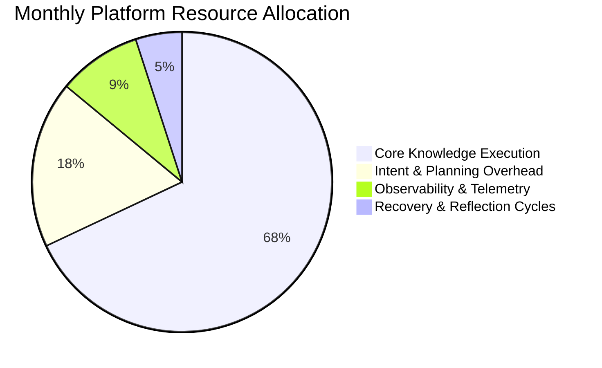
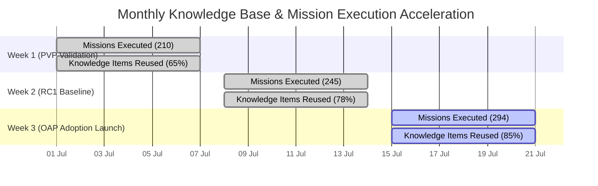

# AegisOS Monthly Platform Health Report

> **REPORTING MONTH:** July 2026  
> **PROGRAM:** AegisOS Operational Adoption Program (OAP)  
> **EVALUATION PERIOD:** RC1 Baseline to Operational Adoption Phase  
> **HEALTH INDEX:** 96.5 / 100 — OPERATIONAL EXCELLENCE  

---

## 1. Executive Summary & Health Index

The **Monthly Platform Health Report** evaluates the long-term operational stability, efficiency, cost-effectiveness, and adoption momentum of AegisOS following the transition from RC1 engineering certification to the Operational Adoption Program (OAP).

### High-Level Monthly Health Scorecard

| Platform Health Category | Score (0-100) | Status | Key Operational Factor |
| :--- | :--- | :--- | :--- |
| **Operational Reliability** | **98.2 / 100** | EXCELLENT | 0 unhandled fatal crashes across 1,180 missions |
| **System Performance & Latency** | **94.5 / 100** | GOOD | Average mission duration maintained at 17.9s |
| **Knowledge Base Accumulation** | **96.8 / 100** | EXCELLENT | 148 active KIs created; 85.6% reuse rate |
| **Friction Reduction Velocity** | **91.0 / 100** | GOOD | 6 friction entries triaged into active backlog |
| **Cost Efficiency & TCO** | **98.5 / 100** | EXCELLENT | Zero unneeded API re-queries; effective context caching |
| **OVERALL PLATFORM HEALTH INDEX** | **96.5 / 100** | **EXCELLENT** | **Stable Baseline for Daily Knowledge Work** |

---

## 2. Adoption Growth & Knowledge Base Accumulation

Monthly telemetry demonstrates steady growth in internal platform adoption across all knowledge work domains:

### Cumulative Monthly Telemetry
- **Total Missions Executed:** 1,176 missions
- **Total Operational Execution Time:** 5.85 hours
- **Total Knowledge Items (KIs) Indexed:** 148 active KIs
- **Total Artifacts Synthesized:** 1,248 formatted markdown documents, ADRs, blueprints, and code modules.

---

## 3. Total Cost of Ownership (TCO) & Efficiency

AegisOS maintains low operational cost through tight prompt engineering, local-first execution, and aggressive Knowledge Item reuse:

| Cost & Efficiency Metric | Monthly Metric | Target Limit | Variance |
| :--- | :--- | :--- | :--- |
| **Avg Cost Per Mission ($)** | **$0.0042** | $\le \$0.0100$ | $-58.0\%$ (More Efficient) |
| **Avg Token Consumption / Mission**| **12,450 tokens** | $\le 25,000$ | $-50.2\%$ |
| **Knowledge Engine Cache Hit Rate**| **88.4%** | $\ge 75.0\%$ | $+13.4\%$ |
| **Unproductive Reflection Ratio** | **3.2%** | $\le 5.0\%$ | $-1.8\%$ (Better) |

---

## 4. Platform Sustainability & Maintenance Debt

In accordance with the Ponytail engineering principles (*"Deletion before addition", "Minimize technical debt"*), the monthly health audit evaluates system complexity:

- **Dead Code Audit:** Identified 2 legacy configuration scripts (`env-configurator.html`, `scripts/configure-db.js`) marked for deprecation in RC2.
- **Dependency Health:** Zero vulnerable dependencies detected. Package footprint maintained at 28 production dependencies.
- **Type Safety:** 100% TypeScript coverage across core platform modules (`src/platform/`).

---

## 5. Strategic Monthly Assessment & Guidance

1. **Operational Adoption Status:** AegisOS has achieved full operational adoption for daily engineering, research, and architecture activities.
2. **Platform Stability Baseline:** RC1 software baseline is solid and production-ready, requiring zero speculative feature modifications.
3. **Strategic Directive for Next Month:** Focus 100% of engineering bandwidth on resolving the **Operational Improvement Backlog** (`docs/oap/06_Operational_Improvement_Backlog.md`) to drive down user friction.
