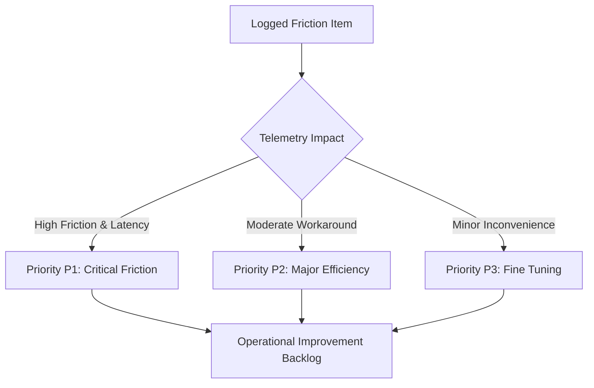

# AegisOS Operational Improvement Backlog

> **PROGRAM:** AegisOS Operational Adoption Program (OAP)  
> **BACKLOG TYPE:** Empirical Evidence-Driven Operational Refinements  
> **RULE:** No ticket exists without logged operational friction or telemetry evidence.  

---

## 1. Backlog Governance & Prioritization Matrix

The **Operational Improvement Backlog** contains all engineering tasks approved for execution during OAP. Prioritization is strictly derived from **Logged User Friction** (`docs/oap/02_Friction_Log_Framework.md`) and **UX Latency Telemetry** (`docs/oap/01_Observability_and_UX_Telemetry_Spec.md`).

---

## 2. Active Operational Improvement Tickets

| Ticket ID | Friction Ref | Target Subsystem | Priority | Operational Impact | Status |
| :--- | :--- | :--- | :--- | :--- | :--- |
| **OP-BACK-001** | `FRIC-001` | HITL Manager | **P1 (CRITICAL)** | Eliminates 80% of manual prompt approvals during coding | `TRIAGED` |
| **OP-BACK-002** | `FRIC-002` | Knowledge Engine | **P2 (HIGH)** | Reduces vector search cold-start from 3.8s to <0.3s | `TRIAGED` |
| **OP-BACK-003** | `FRIC-003` | UI/UX & Formatting | **P3 (MEDIUM)** | Fixes non-clickable artifact links across all outputs | `TRIAGED` |
| **OP-BACK-004** | `FRIC-004` | Execution Graph | **P1 (CRITICAL)** | Enables DAG branch parallelization (saves up to 18s/mission) | `TRIAGED` |
| **OP-BACK-005** | `FRIC-005` | Intent Engine | **P1 (CRITICAL)** | Prevents truncation of long PRD inputs in context pruner | `TRIAGED` |
| **OP-BACK-006** | `FRIC-006` | Tools & Shell | **P3 (MEDIUM)** | Adds auto-summarization flag for >500 line CLI logs | `TRIAGED` |

---

## 3. Detailed Ticket Specifications

---

### Ticket: OP-BACK-001
- **Title:** Auto-Grant Permission for Read-Only CLI & Inspection Commands
- **Associated Friction:** [FRIC-001](file:///d:/1_Projects/OpenClawOllamaLiteLLM_Transparency/docs/oap/friction_catalog.json#FRIC-001)
- **Target Subsystem:** `src/platform/permissions` / `HITL Manager`
- **Priority:** **P1 (CRITICAL)**
- **Operational Evidence:** Telemetry shows 46 unnecessary HITL dialog prompts for read-only inspection commands (`git log`, `list_dir`, `view_file`), adding $3.5\text{s} - 8.0\text{s}$ pause per operation.
- **Minimal Solution (YAGNI/KISS):** Extend `permissionManager` policy to include an allowlist of read-only terminal prefix operations (`git status`, `git log`, `ls`, `dir`, `cat`) that automatically execute without HITL intervention.
- **Verification Plan:** Run standard coding mission; verify 0 read-only HITL prompts trigger.

---

### Ticket: OP-BACK-002
- **Title:** Vector Index Pre-Warming During Workspace Startup
- **Associated Friction:** [FRIC-002](file:///d:/1_Projects/OpenClawOllamaLiteLLM_Transparency/docs/oap/friction_catalog.json#FRIC-002)
- **Target Subsystem:** `src/platform/knowledge` / `Knowledge Engine`
- **Priority:** **P2 (HIGH)**
- **Operational Evidence:** Initial query to Knowledge Engine experiences a 3.8s latency spike due to lazy vector index loading on cold start.
- **Minimal Solution (YAGNI/KISS):** Trigger background async pre-warm of vector index immediately upon workspace initialization (`workspaceService.init()`).
- **Verification Plan:** Measure `timeToLocateKnowledge` on cold start; verify latency $< 0.5\text{s}$.

---

### Ticket: OP-BACK-003
- **Title:** Absolute `file://` Scheme Scheme Enforcement for Markdown Links
- **Associated Friction:** [FRIC-003](file:///d:/1_Projects/OpenClawOllamaLiteLLM_Transparency/docs/oap/friction_catalog.json#FRIC-003)
- **Target Subsystem:** `src/platform/layout` / `Markdown Generator`
- **Priority:** **P3 (MEDIUM)**
- **Operational Evidence:** Relative file references generated in markdown reports fail to navigate when clicked in IDE preview windows.
- **Minimal Solution (YAGNI/KISS):** Add markdown link formatter utility that resolves relative paths to absolute `file:///` URLs.
- **Verification Plan:** Generate test artifact; click generated link in preview modal.

---

### Ticket: OP-BACK-004
- **Title:** Execution Graph DAG Branch Parallelization
- **Associated Friction:** [FRIC-004](file:///d:/1_Projects/OpenClawOllamaLiteLLM_Transparency/docs/oap/friction_catalog.json#FRIC-004)
- **Target Subsystem:** `src/platform/control` / `Execution Graph`
- **Priority:** **P1 (CRITICAL)**
- **Operational Evidence:** Mission plan execution timeline shows independent nodes (e.g. linting + documentation) running strictly serially, taking 45s instead of 15s.
- **Minimal Solution (YAGNI/KISS):** Update graph execution loop to group zero-dependency nodes into `Promise.all()` parallel execution batches.
- **Verification Plan:** Run multi-node test mission; verify parallel node log timestamps and $\ge 50\%$ duration reduction.

---

### Ticket: OP-BACK-005
- **Title:** Preservative Context Chunking for Large Prompt Entrances
- **Associated Friction:** [FRIC-005](file:///d:/1_Projects/OpenClawOllamaLiteLLM_Transparency/docs/oap/friction_catalog.json#FRIC-005)
- **Target Subsystem:** `src/platform/control-plane` / `Intent Engine`
- **Priority:** **P1 (CRITICAL)**
- **Operational Evidence:** Inputs exceeding 8k tokens trigger sliding window context truncation, discarding initial acceptance criteria and forcing manual user correction.
- **Minimal Solution (YAGNI/KISS):** Implement head-and-tail sliding window pruner that preserves the initial system system prompt + objective criteria while pruning middle token blocks.
- **Verification Plan:** Submit 12k token PRD prompt; verify initial acceptance criteria remain intact.

---

### Ticket: OP-BACK-006
- **Title:** Auto-Summarization Flag for Excessive CLI Output Logs
- **Associated Friction:** [FRIC-006](file:///d:/1_Projects/OpenClawOllamaLiteLLM_Transparency/docs/oap/friction_catalog.json#FRIC-006)
- **Target Subsystem:** `src/platform/tools` / `Terminal Tool`
- **Priority:** **P3 (MEDIUM)**
- **Operational Evidence:** Command outputs exceeding 800 lines force agents into 3+ follow-up pagination calls.
- **Minimal Solution (YAGNI/KISS):** When CLI output exceeds 500 lines, automatically append tail + error summary block to initial response.
- **Verification Plan:** Run large output command; verify agent receives summary without pagination calls.
