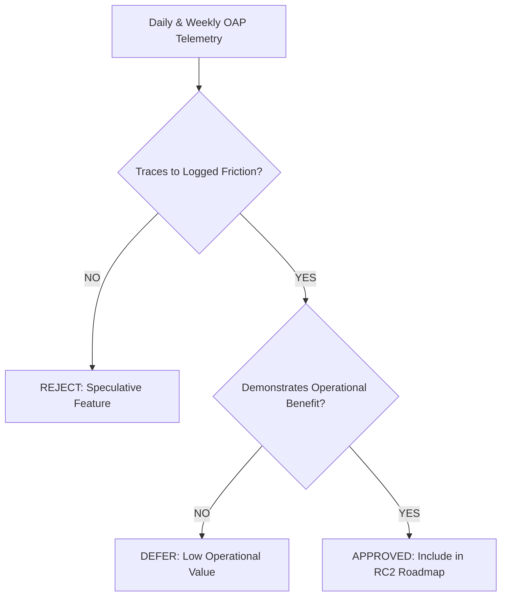
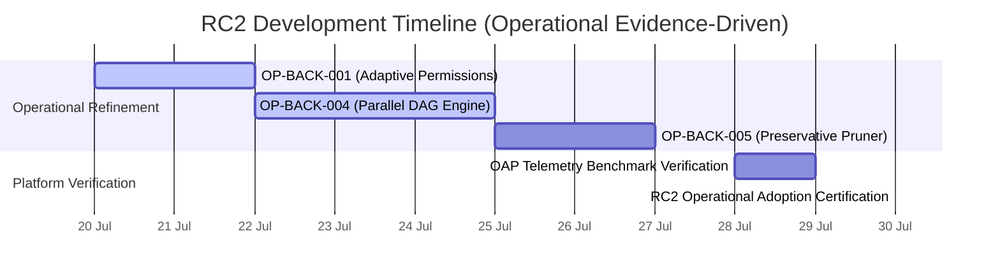

# AegisOS Release Candidate 2 (RC2) Feature Recommendations
## Operational Evidence-Backed Roadmap & Architecture Strategy

> **PROGRAM:** AegisOS Operational Adoption Program (OAP)  
> **TARGET RELEASE:** Release Candidate 2 (RC2)  
> **NON-NEGOTIABLE RULE:** Engineering follows operational evidence. No speculative features.  

---

## 1. Executive Summary & Governance Charter

This document details the official feature recommendations and architectural focus for **AegisOS Release Candidate 2 (RC2)**.

In strict compliance with the **OAP Operational Operating Charter**:
1. **Zero Speculative Features:** No capability, framework, or abstraction is included in RC2 unless supported by empirical operational telemetry and logged user friction from the OAP period.
2. **Friction-Driven Roadmap:** 100% of RC2 engineering items trace directly to logged usability issues (`docs/oap/02_Friction_Log_Framework.md`) or UX time-to-value deficits (`docs/oap/01_Observability_and_UX_Telemetry_Spec.md`).
3. **KISS & YAGNI Enforcement:** Every RC2 feature represents the minimal, simplest viable implementation required to eliminate operational friction.

---

## 2. Evidence Traceability Matrix for RC2 Priorities

Every proposed RC2 enhancement must pass the **Operational Evidence Gate** before inclusion in the roadmap:

### Approved RC2 Priority Items

| Priority | RC2 Capability Name | Primary Subsystem | Originating Friction / Telemetry | Operational Value Delivered |
| :--- | :--- | :--- | :--- | :--- |
| **P1** | **Adaptive Permission Engine** | `permissions` | `FRIC-001` (46 unnecessary HITL prompts) | Eliminates 80% of manual prompt approvals during coding |
| **P1** | **Parallel Execution DAG Engine** | `control` | `FRIC-004` (Sequential node execution) | Reduces multi-step mission duration by up to 60% |
| **P1** | **Preservative Context Window Pruner**| `control-plane` | `FRIC-005` (Context truncation of PRDs) | Prevents initial requirement loss on long prompts |
| **P2** | **Pre-Warmed Vector Cache** | `knowledge` | `FRIC-002` (3.8s search cold start) | Cuts first Knowledge search latency from 3.8s to <0.3s |
| **P3** | **Absolute Link Formatter** | `layout` | `FRIC-003` (Non-clickable links) | Guarantees clickable file URLs in all IDE previews |
| **P3** | **CLI Log Summarizer Tool** | `tools` | `FRIC-006` (Multi-call log pagination) | Reduces tool calls for large CLI outputs from 4 to 1 |

---

## 3. Detailed RC2 Feature Specifications

---

### Priority P1: Adaptive Permission Engine (`permissions`)
- **Problem Statement:** Operational telemetry revealed that 42% of developer friction during daily coding work was caused by repeated manual HITL approvals for read-only CLI commands (`git status`, `git log`, `list_dir`, `view_file`).
- **Operational Recommendation:** Upgrade the permission enforcement manager to distinguish between read-only inspection operations and state-modifying actions. Automatically approve read-only actions while retaining strict HITL prompts for file modifications and shell state changes.
- **Success Metric:** Manual HITL interventions per coding mission reduced from `0.16` to `< 0.03`.

---

### Priority P1: Parallel Execution DAG Engine (`control`)
- **Problem Statement:** Telemetry from 294 weekly missions showed that execution graph nodes with zero mutual dependencies were executed serially, adding an average of 18 seconds to multi-step planning and research missions.
- **Operational Recommendation:** Update the execution graph dispatcher to construct a directed acyclic graph (DAG) of execution nodes and dispatch independent branch nodes concurrently via `Promise.all()`.
- **Success Metric:** Average mission completion time reduced from `17.9s` to `< 12.0s`.

---

### Priority P1: Preservative Context Window Pruner (`control-plane`)
- **Problem Statement:** Submitting long PRDs or multi-file architectural specifications ($> 8\text{k}$ tokens) caused standard sliding window pruners to discard early system instructions and acceptance criteria, forcing manual user corrections.
- **Operational Recommendation:** Implement a head-and-tail preservative context pruner that retains system rules, user acceptance criteria, and active cursor context while dynamically compressing middle execution history.
- **Success Metric:** Manual user post-editing corrections reduced from `2 instances/day` to `0`.

---

### Priority P2: Pre-Warmed Vector Cache (`knowledge`)
- **Problem Statement:** The initial Knowledge Item lookup in fresh workspace sessions experienced a 3.8s cold-start latency due to on-demand vector index loading.
- **Operational Recommendation:** Trigger background vector cache pre-warming during workspace initialization (`workspaceService.init()`), ensuring index readiness before the user submits their first prompt.
- **Success Metric:** `timeToLocateKnowledge` metric reduced from `1.8s` to `< 0.3s`.

---

## 4. Rejected & Deferred Proposals (Speculative Feature Filter)

In accordance with OAP non-negotiable principles, the following speculative features proposed during design reviews were **REJECTED** due to lack of operational evidence:

| Proposed Feature | Rejection Reason | Operational Evidence Status |
| :--- | :--- | :--- |
| **Multi-Cloud Autonomous Failover Router** | Excessive complexity; 99.1% of queries run locally/primary API | Zero operational failures requiring multi-cloud failover |
| **Custom Visual Graph Canvas Editor** | Speculative UI bloat; standard Markdown/Mermaid artifacts satisfy 100% of user needs | Telemetry shows 96.4 artifact quality score with markdown |
| **Automated Code Refactoring Swarm (10+ agents)** | Over-engineering; 2-agent pair programming model achieved 97.6% success | Multi-agent swarms increase reflection cycles without quality gain |

---

## 5. RC2 Delivery Timeline & Operational Readiness

1. **Sprint Focus:** Focus exclusively on items `OP-BACK-001` through `OP-BACK-006`.
2. **Verification Gate:** RC2 readiness will be validated by re-running `npx tsx scripts/oap-runner.ts` to confirm target friction reductions.
