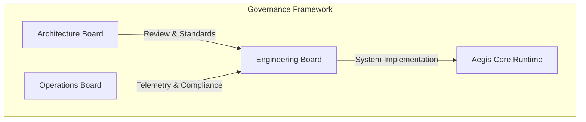

# Platform Operating Model — AegisOS Enterprise Strategy

| Field | Value |
|---|---|
| **Document ID** | POM-2026-001 |
| **Version** | 1.0.0 |
| **Date** | 2026-07-17 |
| **Classification** | Public / Platform Governance |
| **Owner** | Chief Product Officer (CPO) |

---

## 1. Product Vision & Target Personas

### 1.1 Product Vision
AegisOS is an enterprise-grade AI Operating System and Platform designed to run local-first, privacy-preserving, and sovereign agentic workflows on enterprise hardware. It bridges local model orchestrators (Ollama, LiteLLM), hardware runtime resources (GPUs/VRAM), and secure client application layers into a unified, secure, and highly auditable console.

### 1.2 Target Personas

#### Persona A: Sarah — DevSecOps Engineer (Enterprise Security)
* **Goal**: Validate security baselines, ensure zero-leak telemetry, enforce strict RBAC, audit local LLMs, and track code/tool sandboxing.
* **JTBD**: "Audit and verify that no sensitive intellectual property or customer data is transmitted outside the secure corporate perimeter by AI agents."
* **Pain Points**: Lack of visibility into local developer LLM routing, hardcoded API keys, unmonitored agent scripts.

#### Persona B: Marcus — Principal AI Engineer (Application Development)
* **Goal**: Orchestrate multi-agent workflows, deploy local prompt templates, inspect inference latency, and debug tool executions.
* **JTBD**: "Deploy high-throughput local agent networks to automate operational routing without recurring API token costs."
* **Pain Points**: High SaaS AI pricing, model hallucinations, rate-limiting, and unstable agentic loops.

#### Persona C: David — VP of Infrastructure Operations (Infrastructure/Cost)
* **Goal**: Optimize on-premises hardware capacity, schedule GPU VRAM workloads, monitor cluster nodes, and minimize TCO.
* **JTBD**: "Provide highly available, elastic AI compute infrastructure for dev teams using owned server hardware."
* **Pain Points**: GPU idle time, high cloud VM costs, lack of observability on private cluster utilization.

---

## 2. Customer Segments & Supported Use Cases

### 2.1 Customer Segments
AegisOS is built specifically for enterprises operating in highly regulated domains:
* **Financial Services & Banking**: Secure fraud detection, automated report generation, and customer service ticket routing.
* **Healthcare & BioTech**: Patient data synthesis, clinical trial correlation, and research assistance within HIPAA-compliant perimeters.
* **Defense & Government**: Air-gapped command support, secure document analysis, and localized developer pairs.
* **Core Technology & R&D**: Local-first code generation and private software engineering intelligence.

### 2.2 Key Supported Use Cases
1. **Air-Gapped Developer Copilot**: Code assist and semantic search without external code exposure.
2. **Sovereign RAG and Knowledge Ingestion**: Local semantic search across internal corporate knowledge bases.
3. **Autonomic Operations Control**: Local self-healing diagnostics, automatic log analysis, and system port remediation.
4. **Multi-Agent Workflow Orchestration**: Dynamic task routing, sequential state-machine pipelines, and human-in-the-loop approvals.

---

## 3. Platform Governance Model

Governance of AegisOS is divided into three distinct boards to ensure separation of concerns:

### 3.1 Architecture Governance
* **Mandate**: Review system boundary decoupling, approve ADRs, and manage the API deprecation roadmap.
* **Deliverables**: Quarterly Architecture Fitness reviews, API versioning validation.
* **Key Constraint**: The Engineering Intelligence Platform (EIP) must remain decoupled as an observer; it shall never become a runtime dependency of Aegis Core.

### 3.2 Engineering Governance
* **Mandate**: Enforce TypeScript coding standards, ensure linting and test coverage gates (minimum 85%), and validate SemVer rules.
* **Deliverables**: Commit sign-off audits, SBOM verification.
* **Key Constraint**: No ad-hoc third-party library additions. Standard library and native platform APIs are preferred.

### 3.3 Operational Governance
* **Mandate**: Monitor system metrics (RED/USE signals), approve deployment topologies, and audit disaster recovery runs.
* **Deliverables**: Monthly Operational Readiness Reviews (ORR), incident postmortems.
* **Key Constraint**: Maintain local-first data lifecycle policies (cryptographic shredding, structured JSON logs).

---

## 4. Support, Contribution, & Community Strategy

### 4.1 Support Model
Enterprise deployments follow a tiered support structure:
* **Tier-1 (Self-Service & Community)**: Access to Platform Documentation Suite, Knowledge base, and community forums.
* **Tier-2 (Developer Support)**: 8x5 assistance for SDK usage, extension development, and local deployment troubleshooting.
* **Tier-3 (Platform Operations SLA)**: 24x7x365 support for high-availability multi-node production clusters, hotfix deployments, and data recovery.

### 4.2 Contribution Model (Inner Source)
Internal and partner engineering teams contribute through a structured RFC (Request for Comments) and PR process:
1. **RFC Submission**: Proposal for new modules or extension points.
2. **ADR Alignment**: Review by the Architecture Governance Board.
3. **Feature Branching**: Development under feature flags.
4. **CI Validation**: Execution of quality gates (CycloneDX, Vitest, linting).
5. **Approval**: Maintainer sign-off and squash-merge into trunk.

### 4.3 Training & Certification Strategy
To accelerate platform adoption and ensure secure operations, the following enablement tracks are established:
* **Aegis Certified Developer (ACD)**: Focuses on SDK integration, writing plugins, skills, and agents, and configuring custom workflows.
* **Aegis Certified Administrator (ACA)**: Focuses on SCM/NSSM setup, Tailscale mesh networking, RBAC configuration, and secrets management.
* **Aegis Certified Architect (ACA-X)**: Focuses on multi-node Kubernetes clustering, disaster recovery design, and platform economics optimization.
