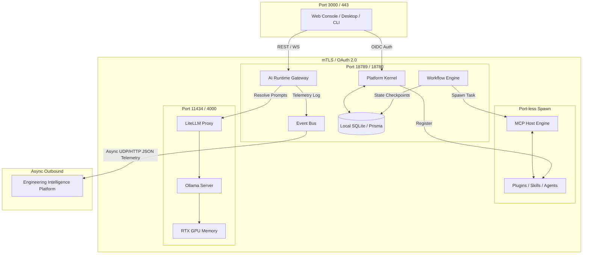
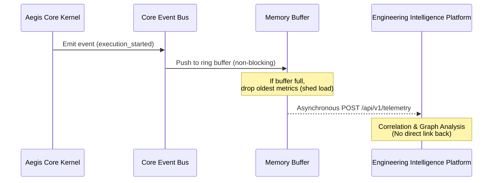

# Platform Boundary Map — AegisOS Networking & Data Flow Map

| Field | Value |
|---|---|
| **Document ID** | PBM-2026-001 |
| **Version** | 1.0.0 |
| **Date** | 2026-07-17 |
| **Classification** | Public / Architecture Diagram |
| **Owner** | Principal Systems Architect |

---

## 1. System Boundary Map

The following map defines the separation of services, data repositories, and networking zones.

---

## 2. Telemetry and Data Flow Decoupling

The Aegis Core Event Bus streams platform operations to EIP. The flow is strictly unidirectional, preventing back-pressure from impacting runtime execution:

---

## 3. Network Zoning & Port Allocation

To guarantee zero data exfiltration, the deployment is segmented into strict network perimeters:

| Zone | Bound Services | Access Policy | Default Port | Encryption |
|---|---|---|---|---|
| **Loopback Zone** | Ollama, LiteLLM | Restricted to `127.0.0.1` | `11434`, `4000` | Unencrypted Local |
| **Platform Zone** | Aegis Core Runtime, Event Bus | mTLS; restricted to cluster private network | `18789`, `18780` | TLS v1.3 with Client Certs |
| **Ingress Zone** | Web Console, REST APIs | OAuth 2.0 OIDC + JWT token validation | `3000`, `443` | HTTPS / WSS |
| **Extension Zone**| MCP Server Hosts | Isolated local OS process (stdin/stdout pipes) | N/A | Process IPC |
| **Analytics Zone**| EIP Ingestion APIs | Outbound streaming endpoint; no inbound routing | `9090` | HTTPS (JSON payload) |

---

## 4. Database Isolation

* **Core Database**: SQLite (single-node) or PostgreSQL (multi-node) holds active system registries (configurations, users, workflows, tasks, logs).
* **MCP Stores**: Private index stores managed locally by individual knowledge provider extensions.
* **EIP Graph Store**: Relational historical database combined with vector databases to run long-term prediction math and build engineering logs. Core never queries the EIP databases.
