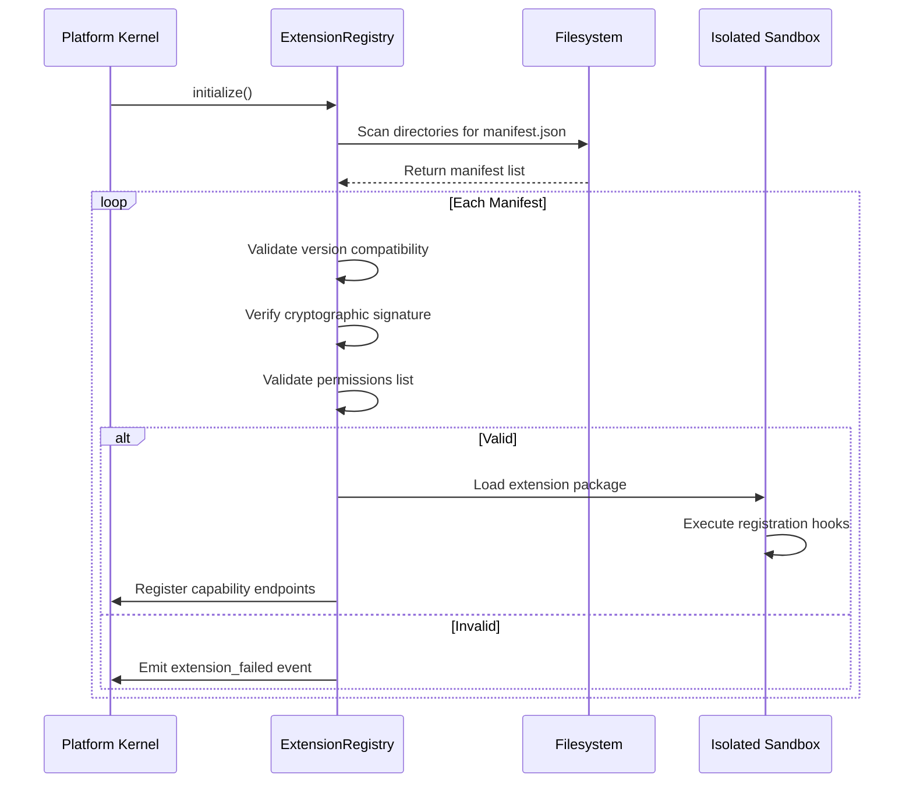

# Extension Framework Specification — AegisOS Plugin Model

| Field | Value |
|---|---|
| **Document ID** | EFS-2026-001 |
| **Version** | 1.0.0 |
| **Date** | 2026-07-17 |
| **Classification** | Public / Extension Specification |
| **Owner** | Platform Integration Lead |

---

## 1. Extension Taxonomy

To keep the platform core lean, AegisOS enforces an extension-first development model. All custom capabilities are encapsulated into discrete extension types:

* **Plugins**: Code bundles modifying frontend console widgets or system API routes.
* **Skills**: Reusable instruction packs containing prompt templates and supporting scripts.
* **Agents**: Autonomic orchestrators mapping to specific tasks with recursion protection.
* **Models**: Custom local configuration profiles mapping GGUF weight files.
* **Knowledge Providers**: Vectors / RAG sources exposing custom indexing pipelines.
* **Tool Providers**: Custom MCP integrations enabling agents to execute code or access filesystems.
* **Workflow Packs**: Declarative YAML templates mapping complex operations.
* **Dashboards / Themes / Policies / Adapters**: Custom interfaces, styles, and configurations.

---

## 2. Extension Manifest Schema (`manifest.json`)

Every extension must include a root-level `manifest.json` file. The platform validates this manifest before loading the extension.

```json
{
  "$schema": "https://aegisos.dev/schemas/v1/extension.schema.json",
  "id": "org.aegisos.mcp.postgres-tool",
  "name": "Postgres Database Tool Provider",
  "version": "1.2.0",
  "description": "Exposes read-write operations on Postgres schemas to local agents.",
  "type": "tool_provider",
  "publisher": "Aegis Enterprise Solutions",
  "entryPoint": "./dist/index.js",
  "engines": {
    "aegisCore": ">=1.0.0 <2.0.0"
  },
  "dependencies": {
    "org.aegisos.plugins.db-core": "^1.0.0"
  },
  "permissions": [
    "network:connect:*.corp.local",
    "fs:read:d:/1_Projects/temp/*",
    "secrets:read:db_credentials"
  ],
  "compatibility": {
    "os": ["windows", "linux"],
    "minVramGb": 8
  }
}
```

---

## 3. Auto-Discovery & Registration Hooks

Extensions are discovered dynamically from designated paths without requiring changes to Aegis Core:
1. **Workspace Root**: `./.agents/extensions/`
2. **User Home Directory**: `C:\Users\<user>\.aegisos\extensions\`
3. **System Directory**: `/var/lib/aegisos/extensions/`

### 3.1 Registration Sequence
During bootstrap, `ExtensionRegistry` scans these directories:



---

## 4. Lifecycle & Execution Sandboxing

To guarantee enterprise system stability, extensions are executed in isolated sandboxes:

```
+-------------------------------------------------------------+
|                     AegisOS Core Kernel                     |
+-------------------------------------------------------------+
                              |
                     IPC (Stdin/Stdout)
                              |
+-------------------------------------------------------------+
|             QuickJS / Node vm2 Sandboxed Process            |
|                                                             |
|  - Restrictive Network Access (Allowlist only)              |
|  - Read-Only Filesystem Mounts                              |
|  - Memory Cap: 128MB                                        |
|  - Execution Timeout: 30 seconds                            |
+-------------------------------------------------------------+
```

### 4.1 Lifecycle Hooks
Extensions implement a common lifecycle contract:

```typescript
export interface IAegisExtension {
  /** Called immediately after loading in the sandbox */
  onInitialize(context: IExtensionContext): Promise<void>;
  
  /** Called when the extension is activated by a workflow or user action */
  onActivate(): Promise<void>;
  
  /** Called before the extension is updated or deactivated */
  onDeactivate(): Promise<void>;
  
  /** Called to run self-diagnostic checks */
  onHealthCheck(): Promise<IExtensionHealth>;
}
```
* **Dynamic Loading/Unloading**: Extensions can be added or removed at runtime. Calling `onDeactivate` releases file locks, kills child tasks, and frees VRAM buffers, ensuring clean resource cleanup.
