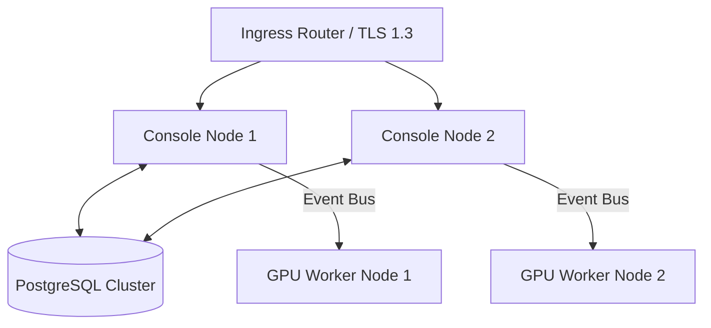

# Enterprise Deployment Guide — AegisOS Topologies & Operations

| Field | Value |
|---|---|
| **Document ID** | EDG-2026-001 |
| **Version** | 1.0.0 |
| **Date** | 2026-07-17 |
| **Classification** | Public / Infrastructure Guide |
| **Owner** | Director of Site Reliability Engineering |

---

## 1. Deployment Topologies

AegisOS supports multiple physical topologies to adapt to different security and scale targets.

### 1.1 Local Development Workstation
* **Description**: Deployed directly on a developer's workstation for prompt building and debugging.
* **Topography**: Aegis Core Next.js server runs as a local loopback service. Ollama and LiteLLM run locally on the same host using standard ports. Database is SQLite.

### 1.2 Enterprise Single-Node Server
* **Description**: Centralized server supporting a team of developer workstations.
* **Topography**: Next.js console running in Docker. DB is local SQLite or PG. LiteLLM routes queries to a single dedicated GPU card (e.g., NVIDIA H100 or RTX 4090).

### 1.3 Multi-Node Cluster
* **Description**: Multi-instance setup distributing inference and console workflows.
* **Topography**: Consolidated console instances balance requests through an ingress router. An event bus routes asynchronous tasks to dedicated inference worker nodes:



### 1.4 Edge Deployment
* **Description**: Lightweight nodes running on resource-constrained devices (e.g., NVIDIA Jetson).
* **Topography**: Single-node setup running small specialized quantized models (e.g., Llama 3B). SQLite database backed up to a central catalog.

### 1.5 Air-Gapped Deployment
* **Description**: High-security isolated environments (Defense, FinTech R&D).
* **Topography**: Local server with zero outbound connections. Base images, models (GGUF), and NPM dependencies are pre-scanned and side-loaded via USB/private registry.

### 1.6 Containerized Kubernetes (HA)
* **Description**: Managed enterprise cloud/on-premise scaling.
* **Topography**: Core Next.js deployed as a stateless deployment. GPU nodes configured as DaemonSets with GPU passthrough (`nvidia.com/gpu` resource requests). PostgreSQL managed via CloudNativePG.

---

## 2. Hardware Sizing Matrix

To achieve optimal performance, host nodes must match these minimum hardware configurations:

| Segment | Concurrency | Target Models | Min CPU | Min RAM | GPU / VRAM | Min Disk |
|---|---|---|---|---|---|---|
| **Edge / Dev** | 1–2 Users | Llama-3-8B (Q4_K_M) | 8 Cores | 16 GB | 1x RTX 4060 (8GB VRAM) | 100GB SSD |
| **Team Server**| 5–20 Users | Mistral-7B, CodeLlama | 16 Cores| 64 GB | 1x RTX 4090 (24GB VRAM)| 500GB NVMe|
| **Enterprise Core**| 100+ Users | Llama-3-70B (FP16) | 32 Cores| 256 GB| 2x H100 (80GB VRAM) | 2TB NVMe |
| **K8s DaemonSet**| Scaling | Multi-model routing | Variable | Variable| GPU Passthrough Enabled | Cloud Volume|

---

## 3. High Availability & Disaster Recovery

### 3.1 High Availability (HA) Rules
* **Stateless App Nodes**: Next.js console instances store zero local session data. Session state is stored in Redis or database-backed JSON Web Tokens (JWTs).
* **Active-Active Database**: PostgreSQL cluster deployed with multi-region replication.
* **Least-Busy Model Routing**: LiteLLM actively monitors worker latency, bypassing offline or VRAM-exhausted GPU nodes.

### 3.2 Disaster Recovery (DR) Rules
* **Backup Runbook**: Executed using `Backup.ps1` or cron jobs. Backs up SQLite databases, prompt registries, and dynamic configuration keys.
* **Recovery Time Objective (RTO)**: `<15 minutes` for complete site failover.
* **Recovery Point Objective (RPO)**: `<5 minutes` via transaction log replication.
* **DPAPI Decryption Key Recovery**: Backup files encrypt credentials using machine keys. DR systems require key restoration files or environment-level bootstrap variables (`OPS_SECRET_KEY`).

---

## 4. Upgrade & Rollback Procedures

```
+--------------------------------------------------------------+
|                    1. Run Pre-Flight Checks                  |
|                    (Check disk, backup database)             |
+--------------------------------------------------------------+
                               |
+--------------------------------------------------------------+
|                    2. Set Maintenance Mode                   |
|                    (Drain active agent tasks)                |
+--------------------------------------------------------------+
                               |
+--------------------------------------------------------------+
|                    3. Deploy Target Version                  |
|                    (Run DB migration, swap code)             |
+--------------------------------------------------------------+
                               |
+--------------------------------------------------------------+
|                    4. Execute Verification Probes            |
|                    (Health pings, model tests)               |
+--------------------------------------------------------------+
             /                                    \
       (Success)                                (Failure)
           /                                        \
+----------------------+                  +--------------------+
| 5. Clear Maint Mode  |                  | 5. Auto Rollback   |
| (Release Traffic)    |                  | (Restore DB/Code)  |
+----------------------+                  +--------------------+
```

* **Rollback Trigger**: If liveness probes or database health validation tests fail post-upgrade, the pipeline executes an automated rollback to the pre-deployment database checkpoint and triggers an operator alert.
