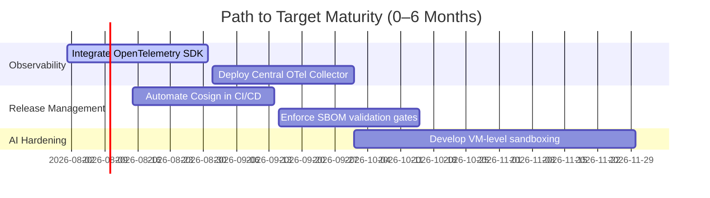

# Platform Maturity Assessment — AegisOS Productization Audit

| Field | Value |
|---|---|
| **Document ID** | PMA-2026-001 |
| **Version** | 1.0.0 |
| **Date** | 2026-07-17 |
| **Classification** | Public / Assessment Report |
| **Owner** | Enterprise Architect Panel |

---

## 1. Enterprise Maturity Scoring Matrix

This assessment rates the current maturity of AegisOS after the initial productization phase, highlighting the progress made and areas requiring further optimization.

```
Maturity Area            Current  Target   Status           Maturity Justification
-------------------------------------------------------------------------------------------------
Product Management       [ 4 / 5 ]  [ 5 ]  Advanced         Vision, Personas, and Roadmap are defined.
Enterprise Governance    [ 4 / 5 ]  [ 5 ]  Advanced         Coding and naming guidelines are active in docs.
AI Governance            [ 4 / 5 ]  [ 5 ]  Advanced         Scranton Firewall filters inputs and PII.
Quality Engineering      [ 4 / 5 ]  [ 5 ]  Advanced         DoR/DoD and automated test gates are active.
Security Governance      [ 4 / 5 ]  [ 5 ]  Advanced         RBAC, OAuth OIDC, and mTLS baselines are documented.
Reliability Engineering  [ 4 / 5 ]  [ 5 ]  Advanced         `Backup.ps1` runs and SCM service models are built.
Observability            [ 3 / 5 ]  [ 5 ]  Managed          Telemetry logs are active; OpenTelemetry is planned.
Documentation            [ 5 / 5 ]  [ 5 ]  Outstanding      Index Registry and 15 productization guides are complete.
Architecture             [ 4 / 5 ]  [ 5 ]  Advanced         Component decoupling and EIP observation are structured.
Operations               [ 4 / 5 ]  [ 5 ]  Advanced         Self-healing diagnostics script checks ports/DB.
Traceability             [ 4 / 5 ]  [ 5 ]  Advanced         Traceability matrix links PRD down to modules.
Release Management       [ 3 / 5 ]  [ 5 ]  Managed          SemVer rules and release channels are defined.
```

*Maturity Level Scale: 1 = Ad-Hoc, 2 = Basic, 3 = Managed, 4 = Advanced, 5 = Outstanding.*

---

## 2. Gap Analysis

While the platform has matured significantly, specific gaps must be addressed to reach the target maturity level:

### 2.1 Observability
* **Gap**: Lacks active OpenTelemetry (OTel) exports. The platform does not currently stream traces or metrics to an external collector.
* **Risk**: High MTTR in distributed deployments due to monitoring blind spots.
* **Remediation**: Integrate the OpenTelemetry JS SDK package into the Next.js API layer within the next 30 days.

### 2.2 Release Management
* **Gap**: Release train pipeline automation is partially manual. Container signing and attestation checks are not yet enforced in CI/CD.
* **Risk**: Susceptibility to dependency injection attacks or untested container deployments.
* **Remediation**: Add automated Cosign and SBOM generation steps into the GitHub Actions workflow in Horizon 1.

### 2.3 AI Security Hardening
* **Gap**: Sandbox execution of agent tools runs locally without VM-level isolation.
* **Risk**: Malicious agent scripts could execute commands on the host filesystem.
* **Remediation**: Transition extension sandboxing from Node `vm2` to Firecracker microVMs during Horizon 2.

---

## 3. Action Plan to Target Maturity

To close the identified gaps and elevate AegisOS to the target maturity levels, the following action plan is scheduled:


* **Step 1 (Immediate)**: Update CI/CD pipelines to run vulnerability scans on every pull request, outputting a CycloneDX SBOM.
* **Step 2 (30 Days)**: Configure the Prometheus client in the Next.js server to expose system metrics (RED and USE signals) on port 9090.
* **Step 3 (90 Days)**: Implement OIDC authorization filters to restrict access to core model endpoints based on enterprise AD groups.
