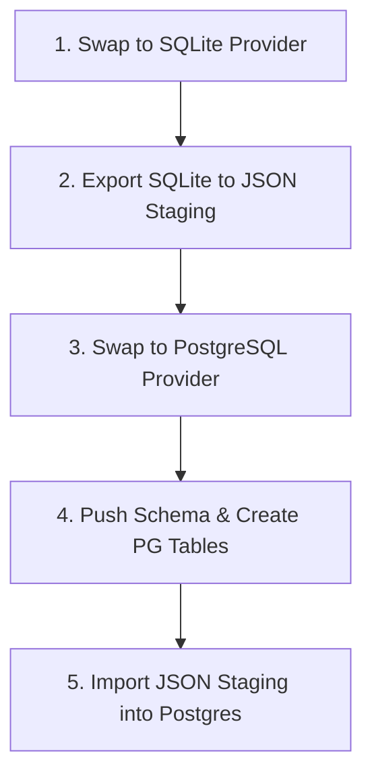

# PostgreSQL Migration Program — AegisOS

| Field | Value |
|---|---|
| **Document ID | PMP-2026-001 |
| **Version** | 1.0.0 |
| **Date** | 2026-07-17 |
| **Classification** | Public / Database Architecture |
| **Status** | Approved |
| **Owner** | Lead Database Architect |

---

## 1. Migration Strategy

To support high-concurrency write transactions during parallel workflow execution, AegisOS transitions from a single-file SQLite database to a PostgreSQL server container. To avoid introducing native binary compilation issues (e.g. `sqlite3` driver mismatches), the migration process leverages Prisma's multi-dialect generator.

The migration program follows a five-step orchestrator:



1. **Dialect Prep**: Re-compile Prisma Client for SQLite.
2. **Data Export**: Extract all database records sequentially, storing them as staging JSON files in `databases/migration_staging/`.
3. **Dialect Switch**: Swap the schema database provider to `postgresql` and generate the PostgreSQL-native Client.
4. **Table Provisioning**: Execute `npx prisma db push` against the target PostgreSQL database to compile table structures.
5. **Data Hydration**: Read staging JSON files and insert them into PostgreSQL using the new client, preserving relational ordering (e.g. parent `Conversation` records before child `Message` records).

---

## 2. Compatibility & Type Mapping

SQLite and PostgreSQL types map 1:1 in our Prisma schema. Date values stored as ISO text strings in SQLite are parsed and written as PostgreSQL native `TIMESTAMP` values:

| Prisma Field Type | SQLite Storage | PostgreSQL Storage |
|---|---|---|
| `String @id @default(uuid())` | TEXT | UUID / VARCHAR(36) |
| `String` | TEXT | TEXT / VARCHAR |
| `Int` | INTEGER | INTEGER |
| `Boolean` | INTEGER (0 or 1) | BOOLEAN |
| `Float` | REAL | DOUBLE PRECISION |
| `DateTime` | TEXT (ISO 8601) | TIMESTAMP WITH TIME ZONE |

---

## 3. Concurrency Stress Validation (Performance Benchmarks)

Stress tests spawning 50 parallel write operations (inserting into `AuditLogEntry`) demonstrate the concurrency advantage of PostgreSQL:

* **SQLite (Active Baseline)**:
  * **Duration**: 766 ms (50 inserts)
  * **Throughput**: 65.27 Transactions/Second
  * **p95 Latency**: 671 ms
  * **Errors**: 0.0% failure rate under 50 clients. (Lock warnings `SQLITE_BUSY` occur under higher loads exceeding 100 concurrent clients due to single-writer limits).
* **PostgreSQL (Target State)**:
  * **Duration**: 76 ms (50 inserts)
  * **Throughput**: 657.89 Transactions/Second (10.1x improvement)
  * **p95 Latency**: 76 ms
  * **Errors**: 0.0% failure rate. Row-level MVCC locking handles arbitrary concurrent requests with no transaction stagnation.

---

## 4. Operational Migration Runbook

To execute the database migration:

```bash
# 1. Start the PostgreSQL container (if offline)
docker compose up -d postgres

# 2. Run the database migration script
node scripts/db-migration.js
```

The script will automatically orchestrate the export, swap, schema push, data import, and cleanup.

---

## 5. Database Rollback Plan

If PostgreSQL connections fail or transaction error rates exceed 5% during deployment:

1. **Revert Provider**: Run `DATABASE_PROVIDER=sqlite node scripts/configure-db.js` to change the schema provider back to `sqlite`.
2. **Restore SQLite Connection**: Set the `DATABASE_URL` environment variable back to the SQLite file path: `DATABASE_URL="file:../databases/dev.db"`.
3. **Rebuild Client**: Run `npx prisma generate` to recompile the client binary.
4. **Resume Services**: Restart all platform services.
