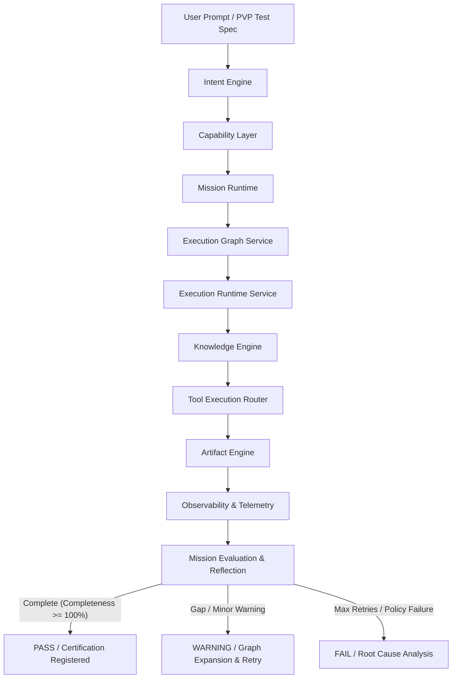

# AegisOS Platform Validation Program (PVP)
## Document 02: Platform Validation Framework

> [!NOTE]
> **Permanent Acceptance Framework**:
> This specification defines the automated execution engine, telemetry collection, decision state machine, and reflection mechanisms governing the Platform Validation Program for AegisOS RC1 and subsequent releases.

---

## 1. Architectural Execution Pipeline

The Platform Validation Framework executes every mission strictly through the 9 certified subsystem layers of AegisOS, ensuring zero bypassed boundaries:



### Layer Responsibilities

1. **Intent Engine**: Classifies user prompt into structured intent (`ARCHITECTURAL_AUDIT`, `DEEP_RESEARCH`, `PRD_GENERATION`, etc.) and extracts semantic entity payloads.
2. **Capability Layer**: Dispatches intent to registered platform capabilities (`system_architecture_review`, `deep_technical_research`, `prd_authoring`, etc.).
3. **Mission Runtime**: Instantiates mission state, initializes metrics, registers constraints, and manages the execution/reflection lifecycle loop ([mission-runtime.service.ts](file:///d:/1_Projects/OpenClawOllamaLiteLLM_Transparency/src/services/mission-runtime.service.ts)).
4. **Execution Graph**: Builds directed acyclic graph (DAG) of execution nodes (`intent`, `agent`, `workflow`, `tool`, `artifact`), manages dependencies, and tracks node state transitions ([execution-graph.service.ts](file:///d:/1_Projects/OpenClawOllamaLiteLLM_Transparency/src/services/execution-graph.service.ts)).
5. **Execution Runtime**: Schedules graph nodes for execution, dispatches agent prompts, tracks tokens/cost, and handles execution timeouts ([execution-runtime.service.ts](file:///d:/1_Projects/OpenClawOllamaLiteLLM_Transparency/src/services/execution-runtime.service.ts)).
6. **Knowledge Engine**: Ingests workspace files, queries vector embeddings, and provides context frames ([knowledge.service.ts](file:///d:/1_Projects/OpenClawOllamaLiteLLM_Transparency/src/services/knowledge.service.ts)).
7. **Tool Execution Router**: Executes sandboxed tools (`grep_search`, `view_file`, `write_to_file`, `search_web`, `run_command`).
8. **Artifact Engine**: Validates, formats, and persists generated markdown/JSON outputs to disk ([artifact.service.ts](file:///d:/1_Projects/OpenClawOllamaLiteLLM_Transparency/src/services/artifact.service.ts)).
9. **Observability**: Records OpenTelemetry spans, step events, token consumption metrics, and cost calculations ([instrumentation.ts](file:///d:/1_Projects/OpenClawOllamaLiteLLM_Transparency/src/instrumentation.ts)).

---

## 2. Certification Decision Rules

The PVP Framework evaluates every executed mission against strict objective rules:

| Output Status | Condition Trigger | Recovery Action | Platform Action |
| :--- | :--- | :--- | :--- |
| **`PASS`** | 100% node execution success, zero step retries, target artifacts generated, quality score ≥ 90. | None required | Mission certified in baseline. |
| **`WARNING`** | Goal completeness ≥ 85%, 1 reflection cycle triggered, non-critical tool retry, or minor context limit warning. | Automatic graph expansion & single recovery iteration executed. | Certified with advisory reflection log. |
| **`FAIL`** | Unrecoverable step failure, missing critical artifacts, confidence score < 70%, or retry exhaustion (max cycles reached). | Execution halted; reflection log recorded. | Issue logged; RC2 priority generated. |

---

## 3. Failure & Recovery Reflection Structure

When a mission yields a `WARNING` or `FAIL` status, the framework automatically generates a structured Failure Incident Package containing:

```typescript
export interface PVPFailureDetails {
  rootCause: string;
  executionTimeline: string[];
  missionReflection: string;
  subsystemResponsible: 
    | "Intent Engine"
    | "Capability Layer"
    | "Mission Runtime"
    | "Execution Graph Service"
    | "Execution Runtime Service"
    | "Knowledge Engine"
    | "Tool Execution Router"
    | "Artifact Engine"
    | "Observability";
  improvementRecommendation: string;
}
```

---

## 4. Automation & CLI Execution

The Platform Validation Program is executed locally or via CI/CD pipelines through the dedicated CLI runner:

- **Core Framework Engine**: [pvp-engine.ts](file:///d:/1_Projects/OpenClawOllamaLiteLLM_Transparency/src/platform/pvp/pvp-engine.ts)
- **CLI Runner**: [pvp-runner.js](file:///d:/1_Projects/OpenClawOllamaLiteLLM_Transparency/scripts/pvp-runner.js)
- **Execution Command**:
  ```bash
  npm run pvp
  ```
