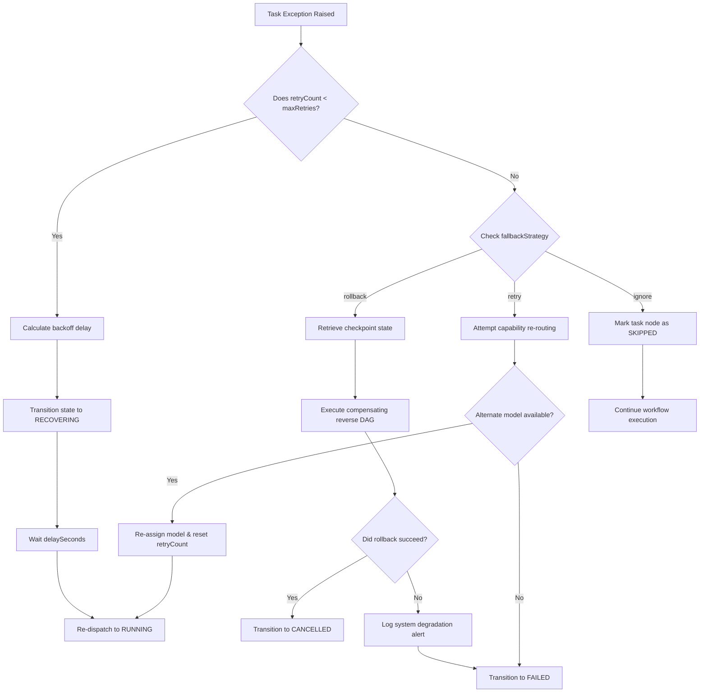
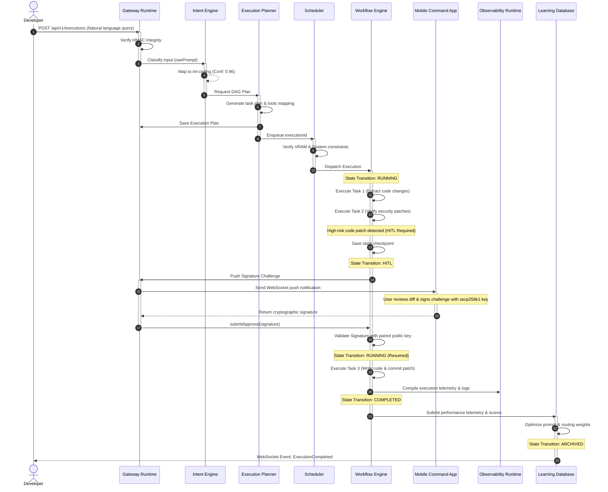

# AegisOS Runtime Semantics & Execution Governance Specification (WP-00C)

This document defines the authoritative, binding runtime behavior and execution governance specification for the AegisOS platform. No subsystem implementation, extension, or agent behavior may violate the invariants, lifecycle transitions, concurrency contracts, or security boundaries specified herein.

This specification builds directly upon and must be read in conjunction with:
*   [Universal Execution Contract (WP-00B)](file:///d:/1_Projects/OpenClawOllamaLiteLLM_Transparency/docs/universal_execution_contract.md)
*   [Capability Orchestration Blueprint (WP-00)](file:///d:/1_Projects/OpenClawOllamaLiteLLM_Transparency/docs/capability_orchestration_blueprint.md)
*   [Intent Resolution & Execution Planning Engine (WP-00A)](file:///d:/1_Projects/OpenClawOllamaLiteLLM_Transparency/docs/intent_resolution_planning_engine.md)

---

## 1. Foundational Execution Semantics

### 1.1 Execution Semantics
An *Execution* represents the atomic transactional unit of work inside AegisOS, uniquely identified by a UUIDv4 `executionId`.
*   **State Integrity**: State transitions must strictly follow the state transition matrix. Direct mutation of the state without appending to the `auditTrail` is prohibited.
*   **Parent-Child Relationships**: Parent executions cannot transition to `COMPLETED` until all registered `childExecutions` have terminated in either `COMPLETED`, `FAILED`, or `CANCELLED` states.
*   **Correlation Propagation**: The `correlationId` generated at ingress must be passed unmodified to all child executions, logs, event payloads, sub-agent spawning commands, and external service calls.

### 1.2 Agent Semantics
An *Agent* is an autonomous cognitive execution loop bound to a specific task node.
*   **Context Isolation**: Agents must run in isolated memory namespaces. An agent cannot access another agent's prompt history, tool-call state, or local variables unless explicitly shared via the `workspaceContext` or shared memory scopes.
*   **Execution Budgets**: Every agent invocation must declare a maximum token budget and max cost budget (`maxCostUsd`). If the model router detects that the cost boundary will be exceeded, it must suspend the agent and trigger an escalation to the Gateway Runtime.
*   **Lifecycle Boundary**: Agents are transient. When a task node transitions to `COMPLETED` or `FAILED`, the associated Agent instance must be safely torn down, releasing all associated file locks and VRAM contexts.

### 1.3 Workflow Semantics
A *Workflow* is the execution vehicle for a Directed Acyclic Graph (DAG) plan.
*   **DAG Execution**: Task nodes must be executed in topological order. A node can only enter the `RUNNING` state when all its ancestors (defined in `dependsOn`) are in the `COMPLETED` state.
*   **Edge Evaluation**: Transitions along edges can evaluate conditional expressions based on parent task outputs.
*   **Barriers & Sync**: Workflows must support synchronous execution barriers. When a parallel branch hits a barrier, execution must pause until all incoming branches reach the barrier state.

### 1.4 Artifact Semantics
An *Artifact* is a persistent output file produced during execution.
*   **Immutability**: Once an execution transitions to `COMPLETED` or `ARCHIVED`, all referenced artifacts are immutable. Modifying the content of an archived artifact must result in a new artifact registration with a unique `artifactId`.
*   **Cryptographic Verification**: Every artifact must possess a SHA-256 hash computed at creation. The Artifact Runtime must verify this hash before any read or transport operation. Any mismatch must raise an integrity failure.

### 1.5 Memory Semantics
Memory in AegisOS is divided into three tiers:
1.  **Thread-Local / Short-Term Memory**: Non-persistent context active only during the runtime execution of a single task node.
2.  **Execution-Scope Memory**: Persistent state shared across task nodes in the same DAG plan, stored inside the execution's `workspaceContext`.
3.  **Long-Term Memory (Learning Database)**: Ephemeral patterns, reinforcement scores, and optimized routing weights updated asynchronously after execution completion.

### 1.6 Knowledge Semantics
*   **Vector Query Safety**: Knowledge retrieval queries must be bounded by confidence and query score thresholds.
*   **Content Injection Limits**: Injected context size must not exceed 50% of the target model's context window. The Prompt Runtime must truncate contexts using semantic boundaries (paragraphs) and insert truncation metadata into the prompt.

### 1.7 Scheduling Semantics
*   **Priority Queuing**: Jobs in the queue are executed based on scheduling tier (`priority`) and deadline.
*   **Pre-execution Resource Allocation**: Prior to dispatching a queued job, the Scheduler must query the host system for resource availability (specifically checking that VRAM is $\ge$ `vramMinGb` and battery is $\ge$ `batteryThreshold`). If checks fail, the execution must be deferred.

### 1.8 Streaming Semantics
*   **SSE Routing**: Natural language completions and agent thoughts must be streamed using Server-Sent Events (SSE).
*   **Chunk Integrity**: Every stream chunk must adhere to the `text/event-stream` standard and carry the original `traceId` and `spanId`.
*   **Connection Termination**: In the event of a client disconnect, the Tool and Agent runtimes must continue execution to the nearest safe checkpoint unless the policy explicitly dictates immediate termination.

### 1.9 Mobile Semantics
*   **Biometric Cryptographic Binding**: Mobile approvals are verified using the user's paired mobile device, which signs the challenge string inside its Secure Enclave using a secp256k1 key.
*   **Fallback Routing**: If the mobile device is unreachable (WebSocket disconnect), the approval request must queue inside Redis. If the timeout expires before a signature is returned, the Gateway transitions the execution to `CANCELLED`.

---

## 2. Specification for the 13 Runtime Engines

```
┌───────────────────────────────────────────────────────────────────────────────────────────────────────┐
│                                            GATEWAY RUNTIME                                            │
└───────────────────────────────────────────────────────────────────────────────────────────────────────┘
       │                                                                                               
       ▼                                                                                               
┌──────────────┐      ┌─────────────────────┐      ┌───────────────┐      ┌───────────────┐      ┌─────┐
│Intent Runtime│ ───> │  Execution Planner  │ ───> │ Cap. Router   │ ───> │Workflow Engine│ ───> │ ... │
└──────────────┘      └─────────────────────┘      └───────────────┘      └───────────────┘      └─────┘
```

This section details the operational specification for each runtime engine.

### 2.1 Intent Engine
*   **Responsibilities**:
    *   Ingests raw text prompts from the Gateway.
    *   Classifies requests into the 18 standard intent categories using keyword heuristics and semantic routers.
    *   Extracts required parameters and context.
*   **Inputs**: Raw text prompt, user credentials, workspace metadata.
*   **Outputs**: Resolved Intent Object (`intentId`, `confidence`, `rawPrompt`).
*   **Lifecycle**: Stateless, hot-start capability, runs continuously.
*   **Failure Modes**: Low-confidence classification, malformed prompt structure.
*   **Recovery Rules**: On low confidence ($<0.80$), route to manual disambiguation or fallback to cognitive defaults.
*   **Persistence Rules**: Write raw inputs and classification outputs to the Audit Database.
*   **Retry Rules**: Not applicable (stateless).
*   **Caching Rules**: Cache frequent query patterns and their resolved intent IDs in Redis for 300 seconds.
*   **Concurrency Rules**: Concurrent classification threads are independent; stateless scalability.
*   **Checkpoint Rules**: None.
*   **Resource Ownership**: None.
*   **Timeout Rules**: Classification must complete within 2,500ms.
*   **Cancellation Rules**: Safe immediate cancellation.
*   **Escalation Rules**: Escalate to the operator if semantic mapping throws internal parser errors.
*   **Cleanup Rules**: Purge transient string buffers on request completion.

### 2.2 Capability Router
*   **Responsibilities**:
    *   Maps resolved intents to foundational and business capabilities.
    *   Resolves target models (using LiteLLM bindings) and matches available MCP tool servers.
    *   Assesses security clearance required for the target capabilities.
*   **Inputs**: Resolved Intent Object, User Role/Permissions.
*   **Outputs**: Capability Mapping Payload (`capabilityId`, `requiredTools`, `modelAssignments`).
*   **Lifecycle**: Initialized on gateway boot; reloadable config mapping.
*   **Failure Modes**: Missing required tool mapping, model service unavailable, insufficient user permission.
*   **Recovery Rules**: Fall back to secondary models if primary LLM service is offline.
*   **Persistence Rules**: Log routing decisions in the telemetry span.
*   **Retry Rules**: Retry model service checks up to 3 times with exponential backoff.
*   **Caching Rules**: Cache capability registry schema in memory.
*   **Concurrency Rules**: Read-only access to registry config; thread-safe.
*   **Checkpoint Rules**: None.
*   **Resource Ownership**: Does not own underlying models, acts as a broker.
*   **Timeout Rules**: Routing resolution must complete within 1,500ms.
*   **Cancellation Rules**: Safe immediate cancellation.
*   **Escalation Rules**: If permission checks fail, immediately transition state to `FAILED` and log a security violation.
*   **Cleanup Rules**: Free local configuration cache on restart.

### 2.3 Execution Planner
*   **Responsibilities**:
    *   Generates the Directed Acyclic Graph (DAG) plan for execution.
    *   Validates plan constraints (VRAM, battery, max cost limits).
    *   Assigns agents, tools, and prompts to specific task nodes.
*   **Inputs**: Capability Mapping Payload, Workspace Status, System Constraints.
*   **Outputs**: Validated Execution Plan DAG (`planId`, `tasks`, `edges`, `fallbackStrategy`).
*   **Lifecycle**: Spawned per request; terminated post-planning.
*   **Failure Modes**: Cyclic dependency detected in plan generation, resource constraints violated.
*   **Recovery Rules**: Simplify planning complexity or fall back to sequential safe plans on VRAM shortage.
*   **Persistence Rules**: Save complete DAG structure to PostgreSQL/SQLite before queue transition.
*   **Retry Rules**: Re-attempt planning up to 2 times if local model fails to generate a valid DAG structure.
*   **Caching Rules**: Cache plans for identical file paths and prompt intents.
*   **Concurrency Rules**: Plan generation runs in dedicated worker thread pools.
*   **Checkpoint Rules**: Save plan draft states before performing safety checks.
*   **Resource Ownership**: Owns planning buffers.
*   **Timeout Rules**: Plan generation must complete within 5,000ms.
*   **Cancellation Rules**: Terminate planning thread immediately on cancellation signal.
*   **Escalation Rules**: Escalate to user for manual approval if generated plan indicates a high financial cost estimate.
*   **Cleanup Rules**: Clear memory-mapped DAG scratch spaces.

### 2.4 Workflow Engine
*   **Responsibilities**:
    *   Orchestrates DAG execution, evaluating task nodes and dependencies.
    *   Manages DAG task states (`PENDING`, `RUNNING`, `COMPLETED`, `FAILED`, `SKIPPED`).
    *   Coordinates compensating rollback actions on workflow failures.
*   **Inputs**: Execution Plan DAG, execution state variables.
*   **Outputs**: Task execution results, final workflow state logs.
*   **Lifecycle**: Active from the moment execution enters `RUNNING` until it transitions to `COMPLETED` or `FAILED`.
*   **Failure Modes**: Task node failure, execution engine crash, state serialization failure.
*   **Recovery Rules**: Trigger rollback workflow or restore from last successful node checkpoint.
*   **Persistence Rules**: Save execution progress and audit trail logs to the database on every state transition.
*   **Retry Rules**: Execute task-level retries according to the execution's `retryStrategy`.
*   **Caching Rules**: Caches active execution status in Redis.
*   **Concurrency Rules**: Executes non-dependent task nodes in parallel worker threads.
*   **Checkpoint Rules**: Commit state checkpoint to database immediately before executing high-risk nodes.
*   **Resource Ownership**: Owns execution state contexts and references to child execution handles.
*   **Timeout Rules**: Workflow execution is bounded by the execution's `timeoutSeconds` policy.
*   **Cancellation Rules**: Halt all running task threads, run compensation routines, and transition state to `CANCELLED`.
*   **Escalation Rules**: Escalate to manual recovery mode if compensation/rollback steps fail.
*   **Cleanup Rules**: Release all associated Redis keys and workflow threads.

### 2.5 Agent Runtime
*   **Responsibilities**:
    *   Executes individual cognitive tasks.
    *   Manages agent prompts, history buffers, and short-term reasoning memory.
    *   Controls model token usage budgets.
*   **Inputs**: Task node variables, system prompt, model assignment, history log.
*   **Outputs**: Text completions, tool calls, execution thoughts.
*   **Lifecycle**: Transient; initialized per task node execution, terminated on node completion.
*   **Failure Modes**: Model timeout, context window overflow, max cost exceeded.
*   **Recovery Rules**: Truncate oldest prompt history or fall back to lighter models.
*   **Persistence Rules**: Write agent trace logs and prompt sequences to the telemetry repository.
*   **Retry Rules**: Delegate retries to the Capability Router for model re-routing.
*   **Caching Rules**: Cache prompt template configurations.
*   **Concurrency Rules**: Agents run in isolated sandboxed threads; no shared write state.
*   **Checkpoint Rules**: Save agent prompt history to database at the end of each turn.
*   **Resource Ownership**: Owns its short-term memory structures and local token counters.
*   **Timeout Rules**: Terminate model invocation if API response takes longer than 60 seconds.
*   **Cancellation Rules**: Immediately abort model API calls.
*   **Escalation Rules**: Escalate to the user when agent enters repetitive generation loops.
*   **Cleanup Rules**: Free local agent context memory and prompt buffers.

### 2.6 Knowledge Runtime
*   **Responsibilities**:
    *   Executes semantic queries over vector databases and local indexes.
    *   Validates database structural integrity and manages embeddings generation.
*   **Inputs**: Search query, limit parameter, collection target.
*   **Outputs**: Structured list of matching source chunks and confidence scores.
*   **Lifecycle**: Background service daemon, runs persistently.
*   **Failure Modes**: Index corruption, vector model timeout, database lock timeout.
*   **Recovery Rules**: Fall back to keyword-based SQLite FTS5 search.
*   **Persistence Rules**: Store file indexing status and catalog metadata.
*   **Retry Rules**: Retry database queries up to 3 times on connection drops.
*   **Caching Rules**: Cache vector query outputs for 60 seconds.
*   **Concurrency Rules**: Safe concurrent read operations; write operations queue sequentially.
*   **Checkpoint Rules**: Write index checkpoints to disk on every batch index update.
*   **Resource Ownership**: Owns vector database handles and local index files.
*   **Timeout Rules**: Retrieval queries must resolve within 3,000ms.
*   **Cancellation Rules**: Gracefully close search cursor.
*   **Escalation Rules**: Escalate index access errors to the Observability Runtime.
*   **Cleanup Rules**: Close idle database connections after 300 seconds.

### 2.7 Prompt Runtime
*   **Responsibilities**:
    *   Fetches, renders, and formats versioned prompts from the registry.
    *   Validates inputs against schema parameters.
*   **Inputs**: `promptId`, version key, parameter bindings.
*   **Outputs**: Interpolated prompt string.
*   **Lifecycle**: Stateless utility library.
*   **Failure Modes**: Prompt not found, parameter mismatch, rendering exception.
*   **Recovery Rules**: Fall back to the default version of the prompt if the requested version is missing.
*   **Persistence Rules**: Prompt revisions are stored in SQL tables.
*   **Retry Rules**: Not applicable.
*   **Caching Rules**: Cache compiled prompt templates in memory.
*   **Concurrency Rules**: Thread-safe concurrent reads.
*   **Checkpoint Rules**: None.
*   **Resource Ownership**: None.
*   **Timeout Rules**: Rendering must resolve in under 500ms.
*   **Cancellation Rules**: Non-blocking.
*   **Escalation Rules**: Raise execution exceptions to the Planner Runtime on formatting failures.
*   **Cleanup Rules**: None.

### 2.8 Tool Runtime
*   **Responsibilities**:
    *   Exposes, validates, and executes JSON-RPC tool calls.
    *   Enforces sandbox level security constraints (`read-only`, `restricted`, `unrestricted`).
*   **Inputs**: `serverName`, `toolName`, arguments object.
*   **Outputs**: Tool execution result object.
*   **Lifecycle**: Managed by the workspace execution context.
*   **Failure Modes**: Sandbox violation, command failure, tool not found.
*   **Recovery Rules**: If tool fails, trigger rollback tasks or execute fallback tools.
*   **Persistence Rules**: Log all inputs, outputs, and exit codes to the telemetry database.
*   **Retry Rules**: Retry tool executions if transient network/file system locks are detected.
*   **Caching Rules**: Caching prohibited for state-modifying tools.
*   **Concurrency Rules**: Executes within the execution sandbox; files lock globally using OS-level lock files.
*   **Checkpoint Rules**: None.
*   **Resource Ownership**: Temporary ownership of spawned subprocesses and file lock descriptors.
*   **Timeout Rules**: Tool execution must complete within 30 seconds (overridable by task metadata).
*   **Cancellation Rules**: Send SIGTERM/SIGKILL to the tool process and release resource locks.
*   **Escalation Rules**: Escalate sandbox violations to Gateway and immediately terminate parent execution.
*   **Cleanup Rules**: Unlink lock files and close standard input/output descriptors on termination.

### 2.9 Scheduler
*   **Responsibilities**:
    *   Enqueues executions in the priority queue.
    *   Evaluates timing deadlines and triggers recurrent cron tasks.
    *   Performs pre-dispatch resource checks.
*   **Inputs**: Execution object, cron strings, priority matrices.
*   **Outputs**: Execution dispatch events.
*   **Lifecycle**: Persistent daemon.
*   **Failure Modes**: Queue exhaustion, cron drift, resource constraint mismatch.
*   **Recovery Rules**: Reschedule execution for the next interval; defer dispatch on low resource states.
*   **Persistence Rules**: Persist cron jobs and execution queues inside SQLite database and Redis ZSETs.
*   **Retry Rules**: Defer dispatch on system constraint checks fail.
*   **Caching Rules**: Cache the next 50 scheduled jobs in memory.
*   **Concurrency Rules**: Evaluates queues using a single loop; dispatches tasks to thread pools.
*   **Checkpoint Rules**: None.
*   **Resource Ownership**: Owns the dispatch queue and scheduling locks.
*   **Timeout Rules**: Queue polling must complete within 100ms.
*   **Cancellation Rules**: Safely remove jobs from queue.
*   **Escalation Rules**: Escalate queue starvation or long lock waits to the Observability Runtime.
*   **Cleanup Rules**: Prune completed cron logs older than 7 days.

### 2.10 Notification Runtime
*   **Responsibilities**:
    *   Routes system events to websocket channels, desktop toasts, and mobile push notifications.
*   **Inputs**: Event payload, target address, channel type.
*   **Outputs**: Delivered notification state.
*   **Lifecycle**: Stateless event-handler loop.
*   **Failure Modes**: Push service offline, client websocket disconnected.
*   **Recovery Rules**: Queue notifications in Redis and retry when the client reconnects.
*   **Persistence Rules**: Save notification history in the DB.
*   **Retry Rules**: Retry failed deliveries up to 5 times with exponential backoff.
*   **Caching Rules**: None.
*   **Concurrency Rules**: Process event queues asynchronously.
*   **Checkpoint Rules**: None.
*   **Resource Ownership**: None.
*   **Timeout Rules**: Push delivery attempt timeout is set to 5,000ms.
*   **Cancellation Rules**: Safe immediate cancellation.
*   **Escalation Rules**: If critical security notifications fail, escalate to alternate fallback channels.
*   **Cleanup Rules**: Clear expired queued notifications.

### 2.11 Artifact Runtime
*   **Responsibilities**:
    *   Manages artifact registration, indexing, content validation, and immutable storage.
*   **Inputs**: File descriptor, destination path, execution context.
*   **Outputs**: Structured Artifact metadata object.
*   **Lifecycle**: Persistent storage service.
*   **Failure Modes**: Hash mismatch, storage space exhausted, write lock collision.
*   **Recovery Rules**: Re-compute file hash on mismatch or restore from temp backup.
*   **Persistence Rules**: Write artifact metadata to SQL; save actual file payloads in MinIO/FileSystem.
*   **Retry Rules**: Retry storage writes up to 3 times on storage transient errors.
*   **Caching Rules**: Cache artifact preview metadata.
*   **Concurrency Rules**: Thread-safe reads; writes require exclusive write locks per file path.
*   **Checkpoint Rules**: Commit artifact manifest updates inside a single database transaction.
*   **Resource Ownership**: Owns file handles and storage directory access.
*   **Timeout Rules**: Write operations must complete within 15 seconds.
*   **Cancellation Rules**: Delete incomplete file blocks from temp directory.
*   **Escalation Rules**: Raise storage exhaustion alerts to the Observability Runtime.
*   **Cleanup Rules**: Safe deletion of temp files on write completion or crash.

### 2.12 Observability Runtime
*   **Responsibilities**:
    *   Ingests, formats, and exports traces, metrics, and logs.
*   **Inputs**: Logs, spans, performance counters.
*   **Outputs**: Prometheus/Grafana formats, trace files.
*   **Lifecycle**: Global daemon, boots first.
*   **Failure Modes**: Buffer overflow, log endpoint offline.
*   **Recovery Rules**: Write metrics to local disk cache during telemetry service outages.
*   **Persistence Rules**: Write execution logs to persistent DB; export metric summaries.
*   **Retry Rules**: Retry exports up to 3 times with backoff.
*   **Caching Rules**: Buffer logs in memory before flushing.
*   **Concurrency Rules**: Async thread-safe ingest.
*   **Checkpoint Rules**: Flush telemetry buffers on system shutdown.
*   **Resource Ownership**: Owns log file handles.
*   **Timeout Rules**: Exporter flush timeout is 2,000ms.
*   **Cancellation Rules**: Uninterruptible flush on crash.
*   **Escalation Rules**: Trigger alert on critical system resource usage thresholds.
*   **Cleanup Rules**: Truncate local trace cache files older than 48 hours.

### 2.13 Gateway Runtime
*   **Responsibilities**:
    *   Authenticates clients, validates HMAC signatures, parses user credentials, and controls access boundaries.
*   **Inputs**: HTTP requests, websocket events, API headers.
*   **Outputs**: Validated execution parameters or raw HTTP response codes.
*   **Lifecycle**: Persistent API service.
*   **Failure Modes**: Authentication failure, HMAC signature mismatch, WebSocket disconnection.
*   **Recovery Rules**: Refuse unauthorized requests; send client reconnect signals.
*   **Persistence Rules**: Write API ingress logs to security tables.
*   **Retry Rules**: None.
*   **Caching Rules**: Cache active API key validations for 60 seconds.
*   **Concurrency Rules**: Highly concurrent HTTP server thread-pool.
*   **Checkpoint Rules**: None.
*   **Resource Ownership**: Owns client connections.
*   **Timeout Rules**: Requests time out after 30 seconds.
*   **Cancellation Rules**: Close client socket safely.
*   **Escalation Rules**: Escalate brute-force authentication attacks to system administrators.
*   **Cleanup Rules**: Close inactive sockets after 60 seconds.

---

## 3. System Invariants

System invariants are absolute rules that cannot be violated under any condition:

1.  **The Owner Invariant**: An execution always has exactly one owner, defined by the `userContext.userId`. Ownership cannot be altered or transferred during the execution lifecycle.
2.  **The Immutability Invariant**: Artifacts are immutable after their parent execution transitions to `COMPLETED`. No write access to completed files is permitted without creating a new `artifactId`.
3.  **The Event Propagation Invariant**: Every execution state transition must emit a corresponding structured system event (e.g. `ExecutionCreated`, `ExecutionPlanned`, `ExecutionFailed`) to the Redis event bus.
4.  **The Correlation Invariant**: Every retry, fallback task, child execution, and log entry must preserve the original `correlationId` of the parent request.
5.  **The Observability Invariant**: Every execution step must generate a telemetry span. Execution states must never modify local buffers without appending a record to the persistent `auditTrail` array.
6.  **The Recoverability Invariant**: Every execution must define a fallback strategy. Plans that do not specify a recovery strategy must be rejected by the Execution Planner.
7.  **The Auditability Invariant**: Secure operations (e.g. command tool executions or git updates) must be bound to a cryptographically validated signature block inside `securityMetadata` or `humanApproval`.

---

## 4. Failure Taxonomy

The table below catalogs the standardized failures within AegisOS:

| Failure Code | Class | Description | Primary Cause | Immediate System Action |
|---|---|---|---|---|
| `INFRA_NETWORK_ERROR` | Infrastructure | Connection drop to Redis/LiteLLM. | Physical connection loss or socket timeout. | Pause execution, transition state to `RECOVERING`. |
| `MODEL_TIMEOUT_ERROR` | Model | Model API fails to respond. | LLM inference server hung or overloaded. | Try fallback model; retry if retries remain. |
| `WORKFLOW_DAG_CYCLE` | Workflow | Plan generation produced a cycle. | Invalid plan generation or loop logic. | Transition state to `FAILED`. |
| `TOOL_SANDBOX_ERR` | Tool | Access to restricted files. | Sandbox policy restriction violated. | Halt thread, revoke permissions, transition to `FAILED`. |
| `AGENT_LOOP_ERROR` | Agent | Agent repeats identical outputs. | Prompt formatting or token limit issue. | Terminate agent session, trigger recovery plan. |
| `KNOWLEDGE_DB_LOCKED` | Knowledge | Vector index is locked. | Concurrent write task lock collision. | Queue query, retry with exponential delay. |
| `HITL_APPROVAL_REJ` | Human Approval | User clicked reject on mobile. | Security/architectural check failed. | Transition to `CANCELLED`, run rollback scripts. |
| `HITL_TIMEOUT_ERROR` | Human Approval | User did not sign within limit. | Device offline or user unavailable. | Terminate wait state, transition to `FAILED`. |
| `RESOURCE_VRAM_LIMIT` | Resource | Insufficient GPU memory. | High concurrent model queries. | Hold dispatch, place execution in `QUEUED` state. |

---

## 5. Recovery Semantics

AegisOS employs a formal Saga pattern for execution recovery:

```
                  ┌──────────────────────────────┐
                  │       RUNNING Workflow       │
                  └──────────────────────────────┘
                                  │
                         [Exception Caught]
                                  ▼
                    Is retryCount < maxRetries?
                     /                      \
                  [Yes]                     [No]
                   /                          \
                  ▼                            ▼
          Transition state to          Evaluate Fallback
              RECOVERING                   Strategy
                  │                            │
            [Apply Backoff]              ┌─────┴─────────────┐
                  │                      ▼                   ▼
                  ▼                  Rollback           Compensation
          Resume execution        (Revert changes)    (Execute tasks)
```

1.  **Retry**: The Workflow Engine executes task-level retries if `retryCount` $<$ `maxRetries`. The retry interval is calculated using:
    $$\text{Delay} = \text{delaySeconds} \times \text{backoffRate}^{\text{retryCount}}$$
2.  **Rollback**: If retries are exhausted and the fallback strategy is `rollback`, the Workflow Engine traverses the DAG in reverse order, executing registered rollback actions for completed nodes to restore the workspace to its clean Git state.
3.  **Resume**: If execution was in a `WAITING` or `HITL` state, the engine restores the stack state from the last saved `ExecutionCheckpoint` to resume processing immediately.
4.  **Checkpoint Restore**: The engine fetches the serialized variables and file indexes stored in the checkpoint directory before starting the failing node.
5.  **Compensation**: Executing alternative actions (e.g. notifying developers, creating a fallback branch, generating warning comments) instead of reversing changes.
6.  **Escalation**: If a rollback or compensation routine fails, the system triggers an escalation, transitioning the state to `FAILED` and raising an alarm to the Observability Runtime.
7.  **Abandonment**: In lower priority tasks, if recovery fails, the system immediately ceases processing, marks the task as `FAILED`, and releases locks without running rollbacks.

---

## 6. Concurrency Semantics

### 6.1 Parallel Agents & Task Execution
*   When executing non-dependent DAG nodes, the Workflow Engine dispatches task execution payloads to parallel worker threads.
*   Shared context variables must be locked using a read-write lock pattern (`RWLock`). Multiple threads can read variables, but modifying variables requires an exclusive write lock.

### 6.2 Shared Memory Scopes
*   Agents writing to execution-scope memory must coordinate via transaction queues.
*   Concurrent edits to active workspace files are prohibited. The Artifact Runtime must lock files during active writes, returning lock errors to concurrent tasks.

### 6.3 Deadlock Prevention
*   To prevent circular resource waits (deadlocks), the Scheduler enforces a strict resource acquisition order:
    $$\text{VRAM Allocation} \rightarrow \text{Workspace Write Lock} \rightarrow \text{Database Connection}$$
*   Tasks must release all locks if any required resource in the sequence cannot be acquired within 5,000ms.

---

## 7. Governance Semantics

### 7.1 Compliance Audits
*   The Governance Runtime regularly validates database `auditTrail` entries. Any execution lacking a valid W3C trace header or missing signatures for unrestricted commands must trigger compliance exceptions.

### 7.2 Security & Data Scrubbing
*   **PII Filters**: The Gateway Runtime must pass ingress prompts through standard Regex filters to sanitize phone numbers, emails, and names.
*   **Secrets Filtering**: All standard output logs generated by tools and agents must be parsed by a secrets detection module. If raw passwords, private keys, or API tokens are detected, they must be replaced with the masking label `[REDACTED_SECRET]`.

### 7.3 Human-in-the-Loop Gates
*   Unrestricted sandbox operations (e.g., executing code compilers, deploying Docker images, force-pushing commits) require explicit HITL approval. The execution transitions to the `HITL` state and halts until signed approval is validated.

---

## 8. Runtime State Mappings & Tables

### 8.1 State Transition Matrix

The table below outlines the rules and invariants for all execution state transitions:

| Source State | Target State | Ingress Event | Invariants Checked | Post-transition System Actions |
|---|---|---|---|---|
| `[*] ` | `REQUESTED` | `api_post_request` | Ownership defined, `correlationId` assigned. | Generate `executionId`, serialize state. |
| `REQUESTED` | `VALIDATED` | `validation_success` | HMAC signature verification. | Emit `ExecutionCreated` event. |
| `VALIDATED` | `PLANNED` | `dag_generation_done` | Plan exists, fallback strategy defined. | Write plan to PostgreSQL database. |
| `PLANNED` | `QUEUED` | `enqueue_job` | Scheduler priority check. | Push `executionId` to Redis ZSET queue. |
| `QUEUED` | `RUNNING` | `worker_dequeue` | VRAM available, battery check. | Start execution timer, emit `ExecutionStarted`. |
| `RUNNING` | `WAITING` | `await_external_trigger` | Checkpoint serialized. | Suspend worker execution thread. |
| `RUNNING` | `HITL` | `policy_escalation` | Target action matches signature rules. | Push signature challenge to mobile websocket. |
| `HITL` | `RUNNING` | `signature_verified` | secp256k1 signature validation. | Log signature, resume worker thread. |
| `RUNNING` | `RECOVERING` | `node_execution_fail` | `retryCount` < `maxRetries`. | Queue backoff timer task in Redis. |
| `RECOVERING` | `RUNNING` | `retry_timer_expire` | Delay calculated, increment count. | Re-dispatch node to worker thread pool. |
| `RUNNING` | `COMPLETED` | `workflow_success` | All nodes finished, artifacts verified. | Write learning feedback, emit `ExecutionCompleted`. |
| `RUNNING` | `FAILED` | `error_limit_exceeded` | Rollback plan evaluated. | Run compensation routines, mark failure log. |
| `RUNNING` | `CANCELLED` | `user_stop_signal` | Clean buffers, kill running processes. | Free resource locks, emit cancellation event. |
| `COMPLETED` | `ARCHIVED` | `archiver_tick` | Telemetry written, logs archived. | Remove active keys from Redis, update weights. |
| `FAILED` | `ARCHIVED` | `archiver_tick` | Telemetry written. | penalize learning registry, update weights. |

---

## 9. Runtime Decision Trees

The decision tree below outlines how AegisOS evaluates execution failures and routes recovery:



---

## 10. Runtime Sequence Diagrams

### 10.1 Complete Execution Lifecycle with HITL Verification

The diagram below tracks the sequence of events across AegisOS runtimes for a high-risk code change:



---

## 11. Compliance & Security Verification Rules

To maintain compliance and verify that runtime execution does not deviate from the specification:

1.  **Traceability Verification**:
    *   Every command executed by the Tool Runtime must match a valid trace span ID in the telemetry database.
    *   Executions with missing logs or blank trace headers must be terminated immediately.
2.  **State Conformity Checks**:
    *   The Observability Runtime runs continuous background checks to verify that active execution database records do not violate the State Transition Matrix.
    *   Any out-of-order transition (e.g. `REQUESTED` directly to `RUNNING`) must trigger an immediate database transaction rollback and flag the execution ID as `COMPROMISED`.
3.  **Data Isolation Integrity**:
    *   No agent sandboxed process may open network connections unless the Capability Router has explicitly attached the `cap-tool-invocation` capability with network permission sets.
    *   The OS-level execution sandbox must intercept and reject unauthorized filesystem writes outside the workspace paths defined in `workspaceContext.workspacePath`.
