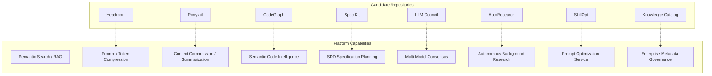

# 02. Capability Gap Analysis & Missing Platform Services

## 1. Candidate Repository Capability Overlay

We map the proposed capabilities from the 8 repositories against the existing stubs and features of the UAWOS workstation.

---

## 2. Platform Capability Gaps & Redundancies

Below is a diagnostic assessment of the exact gaps between the target state and the current workstation.

### A. Missing Capabilities (Gaps Filled)
- **Token Optimization (Prompt Compression)**: Currently, the workstation sends massive raw prompts and system contexts to LiteLLM, resulting in high VRAM/token ingestion overhead. **Headroom** fills this gap by introducing AST-based code compression and keyphrase pruning.
- **Context Summarization**: Long agent chats grow linearly, leading to context window exhaustion. **Ponytail** fills this gap by providing automatic, native-driven conversation summarization to condense history before inference.
- **Developer Intelligence**: Code navigation is limited to basic regular expressions and directory walks. **CodeGraph** resolves this by building a local pre-indexed AST code dependency database in SQLite.
- **Structured Planning & SDD**: Specification generation, ADR writing, and project planning are ad-hoc. **Spec Kit** fills this by standardizing Spec-Driven Development (SDD) via structured PRD/ADR generation CLI tools.
- **Multi-Model Consensus**: UAWOS only runs single-model inference or basic fallback logic. **LLM Council** provides a structured debate framework (Generate -> Review -> Synthesize) to minimize hallucinations in critical code or design reviews.
- **Autonomous Research**: The workstation has no mechanism for running background research tasks or generating architectural reports. **AutoResearch** introduces a background research loop (Edit -> Run -> Evaluate) to write summaries directly to the knowledge layer.
- **Prompt Optimization**: No tool systematically refines prompts. **SkillOpt** optimizes system prompt instructions as trainable parameters through automated validation loops.

### B. Duplicated or Redundant Capabilities (Avoided Redundancies)
- **Metadata Governance vs. Local Markdown**: The **Google Knowledge Catalog (OKF)** provides metadata search and lineage, which duplicates the lightweight file registry (`artifact-registry.ts`) and custom markdown notes. Because UAWOS is a local-first single-user workstation, OKF's database structure is redundant.
- **CodeGraph vs. Git/Filesystem**: CodeGraph has tools for viewing git files. This duplicates the active `filesystem` and `git` MCP context servers. **Recommendation**: We restrict CodeGraph strictly to AST dependency queries, disabling Git/Filesystem overrides.
- **Spec Kit vs. Prompt Registry**: Spec Kit contains prompt templates that duplicate the central prompt configurations in AegisOS. **Recommendation**: Expose Spec Kit strictly as a background service via CLI wrappers, and manage prompts centrally.
- **SkillOpt vs. Model Execution**: SkillOpt contains logic for invoking model inference. This duplicates LiteLLM. **Recommendation**: Interface SkillOpt to execute its validation calls strictly through the LiteLLM router proxy endpoint (`:4000`).

---

## 3. Mandatory Missing Platform Services (ADR Targets)

To transition UAWOS from a set of disjointed CLI utilities into a cohesive AI Operating System, the following core platform services must be introduced as infrastructure services.

| Proposed Service | Primary Architectural Responsibility | Deployment Strategy |
|---|---|---|
| **Workflow Engine** | Coordinates multi-agent DAG execution and handles state persistence, retries, and step-backwards recovery. | Orchestrated through a lightweight Node/TypeScript engine within AegisOS. |
| **Event Bus** | Decouples services using an asynchronous publish/subscribe model (e.g., triggering search indexing on file updates). | Implemented using a local Redis Pub/Sub instance or a custom TypeScript EventListener loop. |
| **Model Registry** | Centralizes model definitions, quantization paths, VRAM size demands, and hardware profiles. | Extends the static `ModelManifest.json` into a queryable REST endpoint. |
| **Prompt Versioning** | Tracks system prompt modifications, rollbacks, and variant performance history using git-backed storage. | Integrated into the local AegisOS gateway configuration system. |
| **Agent Versioning** | Tracks changes in agent code, system instructions, and tool schemas. | Tied to semantic tags in the workspace repository. |
| **Evaluation Pipeline** | Runs regression tests, accuracy benchmarks, and safety checks on models and prompts. | Initiated on-demand via automation scripts or pre-commit hooks. |
| **Experiment Tracking** | Records hyperparameter variations, prompt modifications, and target performance metrics. | Local log-based storage synced to the RAG knowledge folder. |
| **Policy Engine** | Restricts model actions, monitors dangerous shell scripts, and enforces privacy standards. | Implemented as a middleware proxy layer in LiteLLM and AegisOS. |
| **Deployment Manager** | Orchestrates service starting, stopping, configuration generation, and service account sandboxing. | Built as an elevated PowerShell core manager wrapping NSSM and Docker commands. |
| **Feature Flags / Canary** | Safely updates model alias pointers (e.g., shifting `gemma` alias from 9B to 31B) to test output shifts. | Managed dynamically through the LiteLLM config routing tables. |
