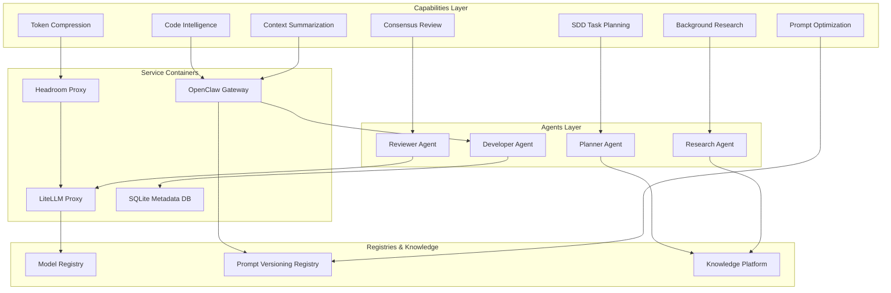
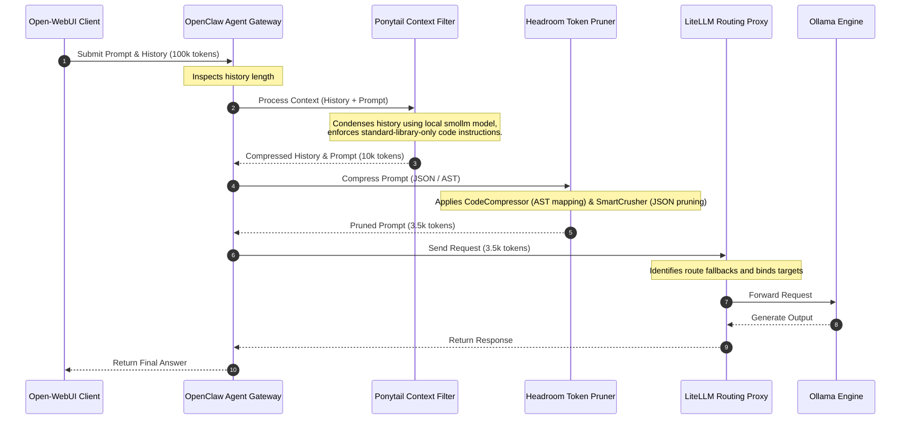
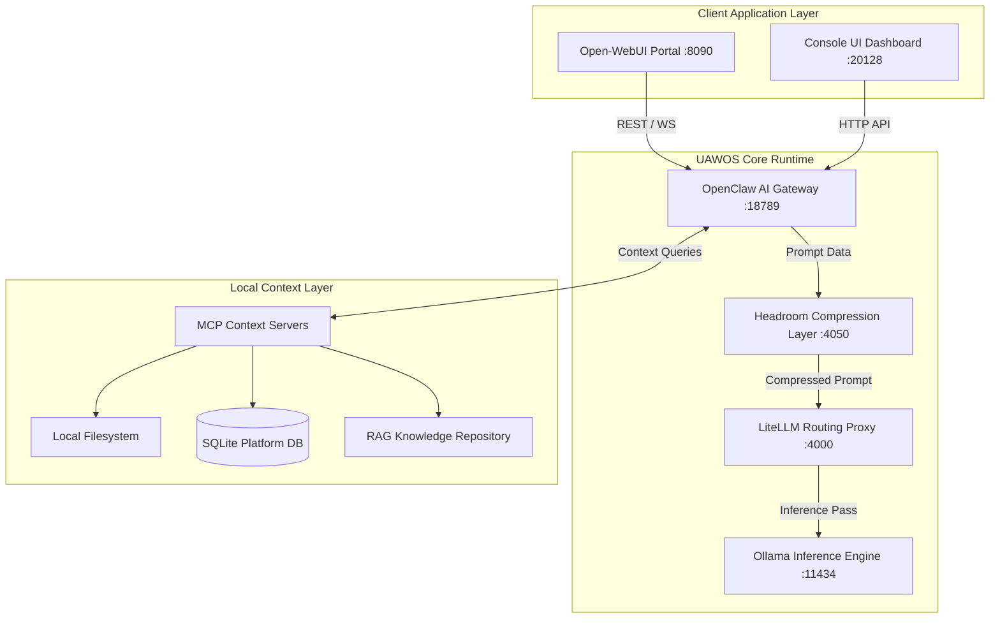

# 04. Capability Mapping & Integration Strategy

## 1. Capability Mapping Architecture

We map candidate capabilities into the target UAWOS architecture. Capabilities are mapped to system containers, agents, registries, and knowledge stores rather than raw repositories.

---

## 2. In-Context Inference Pipeline

Context optimization occurs sequentially. Before prompts reach LiteLLM, they must go through context compression and token pruning stages.

---

## 3. Updated C4 Level 2 Container Diagram

The target architecture introduces the `Headroom Proxy` and decouples background agents:

---

## 4. Loose-Coupling Interface Rules

To maintain high architectural governance, components must communicate strictly through services. Direct integration between individual modules is prohibited:

- **AutoResearch Output Mapping**:
  `AutoResearch` -> `Knowledge Platform (Markdown Files)` -> `RAG MCP Server` -> `OpenClaw` -> `Developer Agent`.
  *NOT*: `AutoResearch` -> `Developer Agent` (bypassing registries).

- **Spec Kit Planning Mapping**:
  `Spec Kit` -> `Planning Service (CLI API)` -> `Planner Agent` -> `OpenClaw` -> `Developer Agent`.
  *NOT*: `Spec Kit` -> `Developer Agent`.

- **SkillOpt Prompt Mapping**:
  `SkillOpt` -> `Prompt Registry` -> `OpenClaw Config` -> `Model call`.
  *NOT*: `SkillOpt` -> `LiteLLM` (direct template modification).
