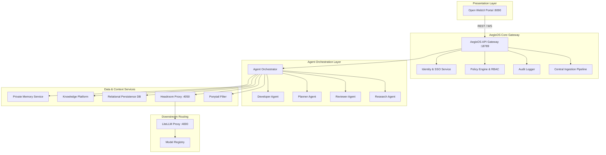
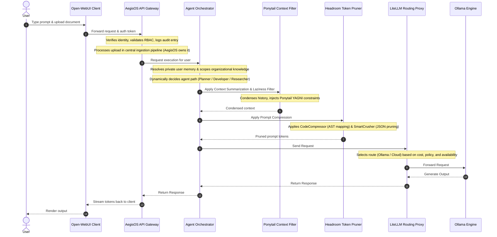
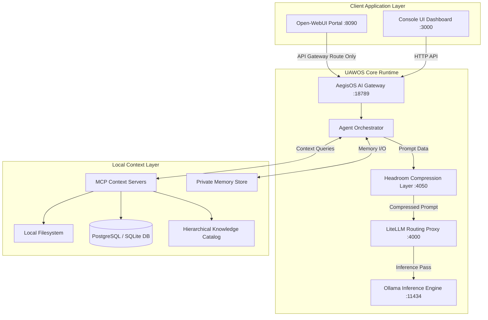

# 04. Capability Mapping & Integration Strategy

## 1. Capability Mapping Architecture

We map candidate capabilities into the target UAWOS architecture. Open WebUI is positioned strictly as a stateless presentation client (Operator Experience Layer). All core capabilities, agent orchestrations, memory stores, and policies are mapped to AegisOS services.

---

## 2. In-Context Inference Pipeline

Context optimization occurs sequentially. In this architecture, all user inputs and file uploads are received by the AegisOS API Gateway first, which resolves identity, policies, and file ingestion before dispatching to agents. The agents condense context and prune tokens before sending them downstream to LiteLLM.

---

## 3. Updated C4 Level 2 Container Diagram

The target architecture decouples the stateless Open WebUI portal, making it run as a thin client pointing only to the AegisOS gateway on port `:18789`.

---

## 4. Loose-Coupling Interface Rules

To maintain high architectural governance, components must communicate strictly through services. Direct integration between individual modules is prohibited:

- **Upload Ingestion Mapping**:
  `Open WebUI Upload` -> `AegisOS Ingestion API` -> `Hierarchical Knowledge Catalog (Organized Scopes)` -> `Agent Orchestrator`.
  *PROHIBITED*: `Open WebUI` -> Direct mounting of local upload directories as RAG context.
  
- **Identity & Authentication Mapping**:
  `Open WebUI User` -> `AegisOS Auth (JWT/SSO)` -> `Individual Audit Trail & Resource Quotas`.
  *PROHIBITED*: Direct use of a single shared admin account on the workstation for multiple users.

- **Agent Invocation Mapping**:
  `Open WebUI` -> `AegisOS Gateway Request` -> `AegisOS Agent Selection (Planner/Dev/Reviewer)`.
  *PROHIBITED*: Open WebUI directly managing model profiles or calling LiteLLM endpoints bypassing AegisOS logic.

- **Plugins and Tools Mapping**:
  `User Command / Tool Request` -> `AegisOS Capability Registry` -> `Audited Capabilities Execution`.
  *PROHIBITED*: Open WebUI running tool integrations or code execution environments locally.
