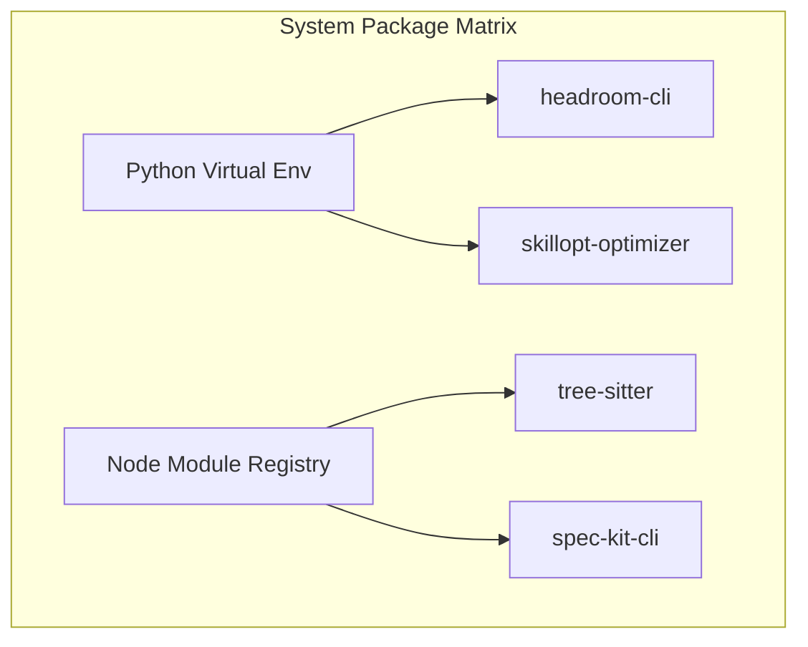

# 05. Risk Assessment & Dependency Impact Analysis

Integrating capabilities into a local-first platform introduces risks related to latency, VRAM consumption, file manipulation safety, and resource scheduling.

---

## 1. System Risks & Mitigation Strategies

| Risk Identifier | Risk Description | Severity | Likelihood | Impact Area | Mitigation Control Strategy |
|---|---|---|---|---|---|
| **RSK-01** | **VRAM Ingestion Crash**: Running multi-model debate loops (`LLM Council`) or background research (`AutoResearch`) concurrently with coding tasks exceeds GPU limits, causing Out-Of-Memory (OOM) failures. | Critical | Medium | Compute | Limit LLM Council execution to CPU-fallback models (`smollm:135m` or `gemma2:9b`) or offload them to auxiliary Tailscale nodes. |
| **RSK-02** | **Latency Pipeline Bloat**: Adding `Ponytail` and `Headroom` inline filters increases token pre-processing latency, delaying response times. | High | High | UX | Execute Ponytail summarization out-of-band (asynchronously) during client idle periods, caching summarized states. |
| **RSK-03** | **Sandbox Ingress**: `AutoResearch` or agent tasks run generated code locally. If not sandboxed, malicious code could run under elevated system accounts. | Critical | Medium | Security | Bind SCM services to the restricted local user `AI_Service_User`. Require explicit manual approval before executing shell tools. |
| **RSK-04** | **Config Drift**: Auto-optimizing prompts via `SkillOpt` overwrites production configurations, breaking core capabilities. | High | Low | Integrity | SkillOpt changes must write to draft files (`configs/prompts/*.draft.yaml`) rather than production files. Commit them only via git PRs. |

---

## 2. Infrastructure Overhead Analysis

### A. VRAM & Memory Footprint
- **Ollama Engine**: Currently reserves up to 90% VRAM (NVIDIA RTX 5080, 16GB GDDR7).
- **CodeGraph**: Exposes no VRAM overhead. Uses host CPU and disk to read/write SQLite metadata.
- **Headroom**: Python footprint uses less than 150MB of system RAM.
- **Ponytail**: Summarization utilizes ~91MB VRAM when targeting `smollm:135m` for context reduction.
- **LLM Council**: Requires keeping multiple model weights loaded. **Constraint**: Restrict LLM Council to run models sequentially, or offload them using LiteLLM fallback chains to avoid concurrent VRAM allocations.

### B. Network & Security Boundaries
- **Localhost Isolation**: The `Headroom Proxy` binds exclusively to `127.0.0.1:4050`. This prevents external access.
- **Service Account Restriction**: NSSM service scripts are modified to run under `AI_Service_User` with permissions restricted exclusively to `$PlatformRoot`.
- **Tailscale Encryption**: Communication between distributed council nodes is routed over Tailscale VPN, ensuring traffic is encrypted end-to-end.

---

## 3. Dependency Impact Analysis

Integrating these tools introduces Node and Python package requirements. The table below lists these packages:

| Package / Library | Repository | Required Scope | Architectural Reason | Security Impact |
|---|---|---|---|---|
| `tree-sitter` | CodeGraph | Local NPM dependency | AST parsing of developer codebase. | Low. Runs locally. |
| `sqlite3` | CodeGraph | Local NPM dependency | Storing index graphs. | Low. Database is stored locally. |
| `headroom` | Headroom | Local Python Pip library | Performs prompt compression algorithms. | Low. Runs locally in virtualenv. |
| `skillopt` | SkillOpt | Local Python Pip library | Optimizes templates. | Medium. Interacts with OpenAI/LiteLLM APIs. |
