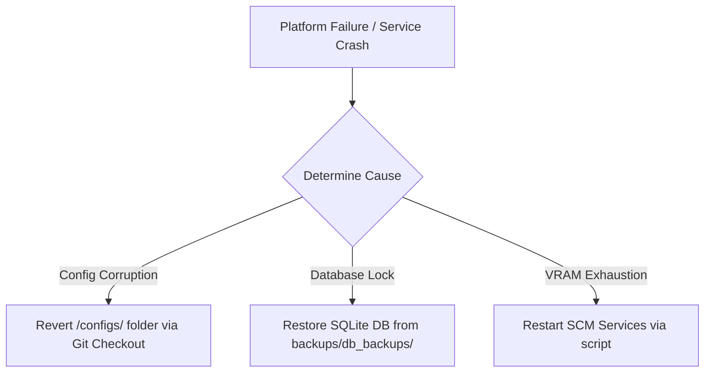

# 07. Rollback Strategy & Operational Runbook

This document defines disaster recovery procedures, rollback guidelines, and service runbooks to manage the evolved platform state safely.

---

## 1. Rollback & Disaster Recovery Strategy

Every capability integrated must be reversible without duplicating services, files, or custom databases.

### A. Phase Rollback Execution Plan
If a component (e.g., Headroom Proxy) fails or degrades response times:
1. **Disable Proxy Hook**: Modify the AegisOS configuration (`configs/aegisos/aegisos.json`) to route traffic directly to LiteLLM (`:4000`) instead of the Headroom compression proxy (`:4050`).
2. **Revert SCM Services**: Reset the SCM configuration to bypass the failed service.
3. **Registry Clean**: Remove the service entry from `ModelManifest.json` and registry caches.

### B. Disaster Recovery Pipeline



1. **Config Corruption**: Run `git checkout -- configs/` to restore previous configuration files.
2. **Database Lock**: Restore SQLite and configuration files from the weekly backup folder `$PlatformRoot\backups\db_backups\`.
3. **VRAM Exhaustion / Model Freeze**: Run the service recovery commands below.

---

## 2. Operational Runbook

Managing the execution state of Ollama, LiteLLM, AegisOS, and the Headroom proxy.

### A. Service Management Commands (Elevated Powershell)

#### 1. Check Service Status
```powershell
Get-Service -Name "Ollama", "LiteLLMService", "AegisOSService", "HeadroomProxyService" | Format-Table -AutoSize
```

#### 2. Restart inference stack
```powershell
# Stop services
Stop-Service -Name "AegisOSService" -Force
Stop-Service -Name "HeadroomProxyService" -Force
Stop-Service -Name "LiteLLMService" -Force
Stop-Service -Name "Ollama" -Force

# Start services sequentially (Dependencies first)
Start-Service -Name "Ollama"
Start-Service -Name "LiteLLMService"
Start-Service -Name "HeadroomProxyService"
Start-Service -Name "AegisOSService"
```

### B. Port Allocation Verification
Verify that ports are bound and listening on localhost:
```powershell
Get-NetTCPConnection -LocalPort 11434, 4000, 4050, 18789 -ErrorAction SilentlyContinue | Format-Table LocalAddress, LocalPort, State
```

---

## 3. Log Troubleshooting & Rotation

All logs are written to `$PlatformRoot\logs\`:
- **Ollama Logs**: `$PlatformRoot\logs\ollama.log`
- **LiteLLM Routing Logs**: `$PlatformRoot\logs\litellm_proxy.log`
- **Headroom Proxy Logs**: `$PlatformRoot\logs\headroom.log`
- **AegisOS Gateway Logs**: `$PlatformRoot\logs\aegisos.log`

Use the following command to tail logs in real-time:
```powershell
Get-Content -Path "D:\AIPlatform\logs\headroom.log" -Tail 50 -Wait
```
