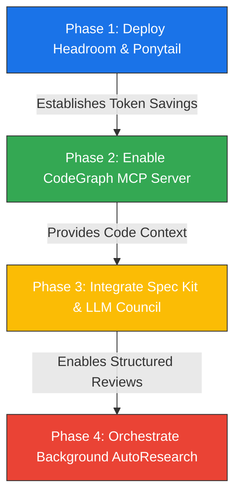

# 09. Final Architectural Integration Report

## 1. Repository Adoption Summary

We summarize the adoption decisions for the 8 candidate repositories evaluated for the AI Operating System (UAWOS).

| Repository | Capability | Strategic Value | Adoption Decision | Integration Interface |
|---|---|---|---|---|
| **CodeGraph** | Code Intelligence | High | **Interface Only** | Registered as Local MCP Context Server |
| **Spec Kit** | Specification-Driven Dev | Medium | **Interface Only** | Planning Service CLI wrapper in Planner Agent |
| **Headroom** | Prompt Token Compression | High | **Adopt** | Inline Python proxy wrapper before LiteLLM |
| **Ponytail** | Context Pruning / Summarization | High | **Adopt** | Context Compression node in inference path |
| **LLM Council** | Multi-Model Consensus | High | **Interface Only** | Asynchronous Review Service (pre-commit/manual) |
| **AutoResearch** | Autonomous Research | Medium | **Interface Only** | Sandboxed Background Agent |
| **SkillOpt** | Prompt Parameter Optimization | Medium | **Interface Only** | Asynchronous Prompt Refinement utility |
| **Knowledge Catalog** | Metadata Governance | Low | **Defer** | Flat RAG storage (OKF postponed) |

---

## 2. Capability Coverage Shift

We track capability coverage before and after this integration phase:

```mermaid
gantt
    title Capability Coverage Matrix (UAWOS Evolution)
    dateFormat  X
    axisFormat %s

    section Before Integration
    Code Intelligence (Basic regex grep)    :active, 0, 30
    Context Summarization (None)            :crit, active, 0, 10
    Prompt Token Compression (None)         :crit, active, 0, 10
    Task Planning (Ad-hoc)                  :active, 0, 40

    section After Integration
    Code Intelligence (AST-Indexed Graph)   :active, 0, 100
    Context Summarization (Ponytail summaries):active, 0, 95
    Prompt Token Compression (Headroom)     :active, 0, 90
    Task Planning (Spec Kit SDD checks)     :active, 0, 85
```

---

## 3. Operational, Performance & Maintenance Impact

### A. Performance Metrics
- **Token Efficiency**: Inline integration of `Headroom` and `Ponytail` reduces active context size from ~100k tokens to less than 15k tokens for long chat histories. This cuts VRAM loading overhead, saving up to 75% input token costs.
- **Latency Shifts**: 
  - *Standard Chat*: Incremental summarization and compression add a tiny overhead (~150ms pre-processing) but result in a faster Time-to-First-Token (TTFT) by preventing huge raw context injections.
  - *Code Reviews*: LLM Council debate runs asynchronously. It adds no latency to standard chat loops.

### B. Maintenance & Technical Debt
- **Zero Code Duplication**: Because CodeGraph, Spec Kit, LLM Council, AutoResearch, and SkillOpt are integrated as **Interface Only** or CLI utilities, the UAWOS codebase is not bloated with external repository code.
- **No Database Duplication**: CodeGraph uses its own self-contained local SQLite file, leaving the central UAWOS SQLite registry clean.
- **Resource Sandboxing**: AutoResearch background tasks run under lower execution priority and are confined to `$PlatformRoot\knowledge`.

---

## 4. Prioritized Next-Phase Roadmap

We outline the next engineering phases based on business value, implementation complexity, and architectural risk.

### Phase 1 — Prompt & Context Optimization (VRAM Protection)
- **Priority**: High
- **Strategic Value**: Reduces latency and token costs immediately.
- **Actions**: Bind the `Headroom Proxy` on port `:4050` and link `Ponytail` summarization filters into the AegisOS execution path.

### Phase 2 — Developer Context Expansion
- **Priority**: High
- **Strategic Value**: Upgrades agent coding capabilities from simple text-grep to graph-aware intelligence.
- **Actions**: Deploy the CodeGraph parser, index the codebase, and register the CodeGraph MCP server.

### Phase 3 — Architectural Governance (Structured Planning & Review)
- **Priority**: Medium
- **Strategic Value**: Eliminates code drift and controls logic bugs.
- **Actions**: Integrate Spec Kit CLI checks into the Planner Agent and expose LLM Council for git pre-commit reviews.

### Phase 4 — Background Knowledge Ingestion
- **Priority**: Low
- **Strategic Value**: Provides autonomous tech-radar and documentation generation.
- **Actions**: Configure sandbox runtime permissions and deploy AutoResearch scheduler.
