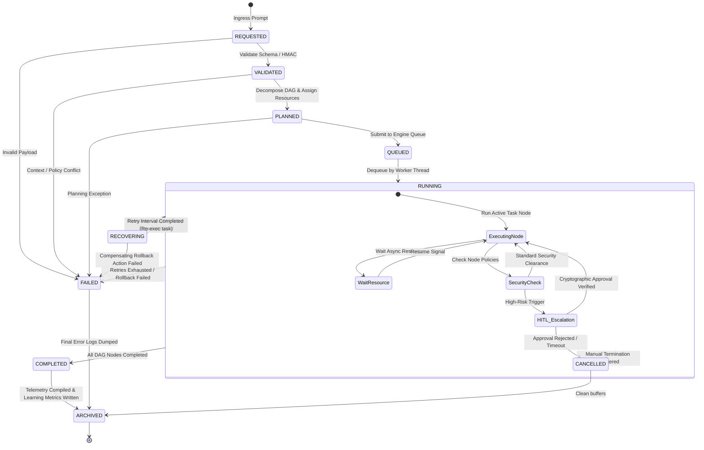
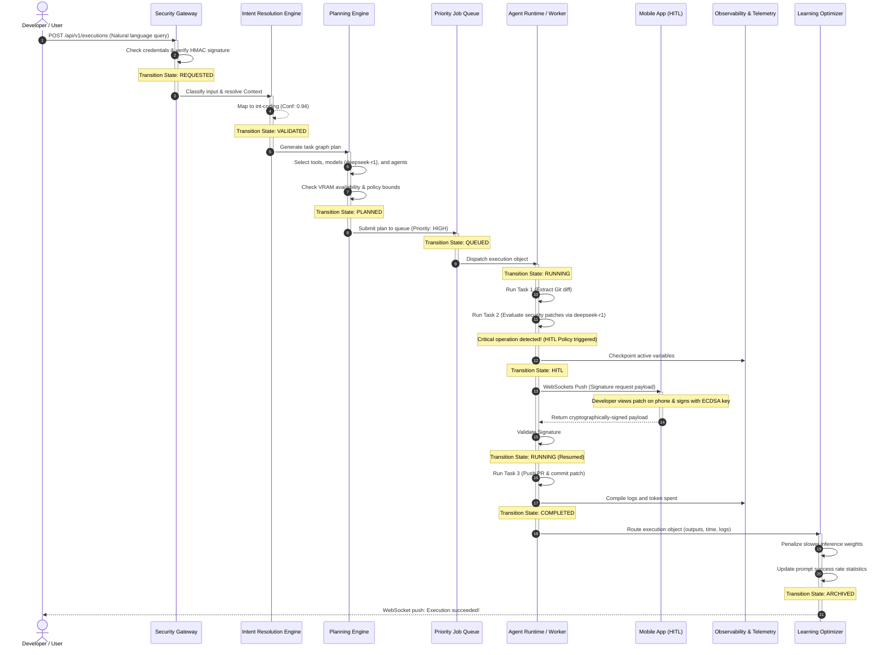

# AegisOS Universal Execution Contract
**Canonical Transaction Schema & Lifecycle Management Specification (WP-00B)**

This document defines the architectural specification for the **Universal Execution Contract** of the AegisOS platform. Serving as the single transactional schema across every subsystem (Intent Engine, Capability Router, Planner, Workflow Engine, Agent Runtime, Knowledge, Prompts, Tools, Artifacts, Scheduler, Notifications, Observability, Mobile, and Gateway), this contract encapsulates the complete execution lifecycle.

No subsystem shall define its own execution payload. Every layer extends this contract rather than replacing it.

---

## 1. Architectural Philosophy & Objectives

The Universal Execution Contract provides a unified, telemetry-rich, cryptographically verifiable, and recovery-capable execution context. Its core tenets are:

* **Single Source of Truth**: Eliminates disparate execution states. The same execution object is passed, augmented, and serialized.
* **Context Preservation**: Retains the correlation trail, user parameters, workspace status, and project configuration across complex transitions.
* **Resilience by Design**: Incorporates Saga checkpointing metadata, retry states, and fallback actions directly in the object model.
* **Auditability & Traceability**: Provides a cryptographic audit log and detailed security credentials embedded inside the transaction.

```
┌──────────────┐      ┌─────────────┐      ┌───────────────┐      ┌───────────────┐      ┌─────────────┐
│ Intent Engine│ ───> │   Planner   │ ───> │ Cap. Router   │ ───> │Agent / Workfl.│ ───> │ Learning DB │
└──────────────┘      └─────────────┘      └───────────────┘      └───────────────┘      └─────────────┘
       │                     │                     │                      │                     │
       ▼                     ▼                     ▼                      ▼                     ▼
 ┌────────────────────────────────────────────────────────────────────────────────────────────────────┐
 │                                   UNIVERSAL EXECUTION CONTRACT                                     │
 └────────────────────────────────────────────────────────────────────────────────────────────────────┘
```

---

## 2. Object Model Specification

The following schema maps all necessary fields for the execution object.

### 2.1 Core Identity & Relationships
* **`executionId`** (`UUIDv4`): Unique primary identifier for this execution.
* **`correlationId`** (`UUIDv4`): Identifies the parent transaction chain across asynchronous boundaries (e.g., initial user prompt).
* **`parentExecutionId`** (`UUIDv4 | null`): Self-referential key identifying the triggering parent execution.
* **`childExecutions`** (`UUIDv4[]`): List of triggered sub-execution identifiers.

### 2.2 Context Metadata
* **`userContext`**: Context of the initiating user.
  * `userId` (`string`): Unique user identifier.
  * `role` (`'admin' | 'developer' | 'read-only'`): Role determining RBAC capabilities.
  * `deviceId` (`string`): Target hardware device (e.g., paired mobile phone for approvals).
  * `permissions` (`string[]`): Granular capabilities granted (e.g., `workspace:write`, `system:reboot`).
* **`workspaceContext`**: Directory states.
  * `workspacePath` (`string`): Absolute path of the target workspace on the local host.
  * `branch` (`string`): Current active Git branch.
  * `activeFiles` (`string[]`): Open file buffers in the user's workspace at trigger time.
* **`projectContext`**: High-level configuration.
  * `projectId` (`string`): Project identifier.
  * `configHash` (`string`): SHA-256 hash of the workspace configurations.
  * `adrVersion` (`string`): Version key of the project Architecture Decision Records.

### 2.3 Planning & Capabilities
* **`intent`**: Details of classified intent.
  * `intentId` (`string`): Resolved intent key (e.g., `int-coding`, `int-troubleshoot`).
  * `confidence` (`number`): Score between `0.00` and `1.00`.
  * `rawPrompt` (`string`): Original prompt submitted by the user.
* **`capability`**: The primary capability mapping.
  * `capabilityId` (`string`): Identifier from the Capability Registry (e.g., `cap-workflow-exec`).
  * `displayName` (`string`): Visual label.
  * `requiredTools` (`string[]`): Tools requested by the capability.
* **`executionPlan`**: The generated Directed Acyclic Graph (DAG).
  * `planId` (`string`): Plan identifier.
  * `tasks` (`TaskNode[]`): Graph nodes defining steps, dependencies, tool arguments, and models.
  * `edges` (`TaskEdge[]`): Dependency links between tasks.
  * `fallbackStrategy` (`'rollback' | 'ignore' | 'retry'`): Compensating actions on failure.
* **`workflowReference`**: Links to the engine.
  * `workflowId` (`string`): Workflow template identifier.
  * `runId` (`string | null`): Running instance ID inside the Workflow Engine.

### 2.4 Resource Assignments
* **`agentAssignments`**: Map of agents assigned to tasks.
  * List of `{ taskId: string, agentId: string, role: string, systemPrompt: string }`.
* **`modelAssignments`**: LLMs allocated by the capability router.
  * List of `{ taskId: string, provider: string, modelId: string, fallbackModelId: string, temperature: number }`.
* **`toolAssignments`**: Active tools bound to specific tasks.
  * List of `{ taskId: string, serverName: string, toolName: string, args: object }`.
* **`knowledgeReferences`**: Vector database parameters.
  * List of `{ documentId: string, sourceCollection: string, queryScore: number }`.
* **`promptReferences`**: Prompts retrieved.
  * List of `{ promptId: string, version: string, renderedParameters: object }`.

### 2.5 Execution Management & Control
* **`policies`**: Rules governing operations.
  * `hitlRequired` (`boolean`): Flags whether manual cryptographic approval is required.
  * `timeoutSeconds` (`number`): Hard boundary for execution time.
  * `rateLimits` (`object`): Bounds on tool/model API hits.
* **`constraints`**: Hardware/operational boundaries.
  * `vramMinGb` (`number`): GPU VRAM requirements.
  * `batteryThreshold` (`number`): Pause execution if battery falls below this percentage.
  * `maxCostUsd` (`number`): Financial ceiling.
* **`priority`** (`'low' | 'medium' | 'high' | 'critical'`): Job queue scheduling tier.
* **`deadlines`**: Time boundaries.
  * `notBefore` (`ISO8601`): Execution deferred starting time.
  * `expiration` (`ISO8601`): Task SLA expiry time.
* **`retryStrategy`**: Failover logic.
  * `maxRetries` (`number`): Retry limit.
  * `backoffRate` (`number`): Exponential multiplier.
  * `delaySeconds` (`number`): Base interval between retries.
* **`humanApproval`**: Mobile security validation.
  * `approverId` (`string | null`): Paired mobile device signature owner.
  * `signature` (`string | null`): Cryptographic ECDSA signature verification.
  * `decision` (`'approved' | 'rejected' | null`): HITL response status.
  * `timestamp` (`ISO8601 | null`): Time of user signature confirmation.

### 2.6 Outputs & Delivery
* **`artifacts`**: Outputs produced.
  * List of `{ artifactId: string, filePath: string, sizeBytes: number, hashSha256: string, mimeType: string }`.
* **`notifications`**: Routing targets.
  * List of `{ notificationId: string, channel: 'mobile-push' | 'desktop-toast' | 'websocket', targetAddress: string, status: 'queued' | 'sent' | 'failed' }`.

### 2.7 Observability & Telemetry
* **`telemetry`**: Active tracing references.
  * `traceId` (`string`): W3C Distributed Trace identifier.
  * `spanId` (`string`): Parent Span identifier.
  * `logs` (`TelemetryLogLine[]`): Chronological execution logs.
* **`costMetrics`**: Financial cost logging.
  * `estimatedCostUsd` (`number`): Initial planning estimation.
  * `actualCostUsd` (`number`): Realized cost.
  * `tokensSpent` (`{ promptTokens: number, completionTokens: number, totalTokens: number }`): LLM usage metrics.
* **`executionMetrics`**: Performance values.
  * `queueWaitMs` (`number`): Wait duration.
  * `executionDurationMs` (`number`): Active processing time.
  * `stepTimes` (`Record<string, number>`): Individual Task node durations.
* **`auditTrail`** / **`timeline`**: Absolute timeline.
  * List of `{ id: string, executionId: string, event: string, timestamp: ISO8601, durationMs?: number, actor: string, source: string, metadata?: Record<string, any> }`. Supported events: `Created`, `Validated`, `Planned`, `Queued`, `Started`, `Workflow Selected`, `Agent Assigned`, `Model Selected`, `Tool Invoked`, `Knowledge Retrieved`, `Checkpoint`, `Waiting`, `HITL Requested`, `HITL Approved`, `Retry`, `Recovered`, `Artifact Generated`, `Completed`, `Failed`, `Cancelled`, `Archived`.

### 2.8 Security & Optimization
* **`securityMetadata`**: Integrity assurance.
  * `hmac` (`string`): SHA-256 hash of the payload keys verified by API Gateway.
  * `signatureAlgorithm` (`string`): Cryptographic algorithm (e.g., `hmac-sha256`, `secp256k1`).
  * `sandboxLevel` (`'read-only' | 'restricted' | 'unrestricted'`): Isolation boundaries for process runtimes.
* **`learningMetadata`**: Continuous optimization.
  * `reinforcementScore` (`number | null`): User score rating (-1 to +1).
  * `routingPerformanceWeightAdjust` (`number`): Calculated feedback offset.
  * `errorLabels` (`string[]`): Standardized error classes for system model tuning.

---

## 3. Execution Schema Definitions

### 3.1 JSON Schema (v1.0.0)

```json
{
  "$schema": "http://json-schema.org/draft-07/schema#",
  "title": "AegisOSUniversalExecutionContract",
  "type": "object",
  "required": [
    "executionId",
    "correlationId",
    "status",
    "userContext",
    "workspaceContext",
    "projectContext",
    "intent",
    "capability",
    "executionPlan",
    "policies",
    "constraints",
    "priority",
    "retryStrategy",
    "securityMetadata"
  ],
  "properties": {
    "executionId": { "type": "string", "format": "uuid" },
    "correlationId": { "type": "string", "format": "uuid" },
    "parentExecutionId": { "type": ["string", "null"], "format": "uuid" },
    "childExecutions": {
      "type": "array",
      "items": { "type": "string", "format": "uuid" }
    },
    "status": {
      "type": "string",
      "enum": [
        "REQUESTED",
        "VALIDATED",
        "PLANNED",
        "QUEUED",
        "RUNNING",
        "WAITING",
        "HITL",
        "RECOVERING",
        "COMPLETED",
        "ARCHIVED",
        "FAILED",
        "CANCELLED"
      ]
    },
    "userContext": {
      "type": "object",
      "required": ["userId", "role", "deviceId"],
      "properties": {
        "userId": { "type": "string" },
        "role": { "type": "string", "enum": ["admin", "developer", "read-only"] },
        "deviceId": { "type": "string" },
        "permissions": {
          "type": "array",
          "items": { "type": "string" }
        }
      }
    },
    "workspaceContext": {
      "type": "object",
      "required": ["workspacePath", "branch"],
      "properties": {
        "workspacePath": { "type": "string" },
        "branch": { "type": "string" },
        "activeFiles": {
          "type": "array",
          "items": { "type": "string" }
        }
      }
    },
    "projectContext": {
      "type": "object",
      "required": ["projectId", "configHash"],
      "properties": {
        "projectId": { "type": "string" },
        "configHash": { "type": "string" },
        "adrVersion": { "type": "string" }
      }
    },
    "intent": {
      "type": "object",
      "required": ["intentId", "confidence", "rawPrompt"],
      "properties": {
        "intentId": { "type": "string" },
        "confidence": { "type": "number", "minimum": 0, "maximum": 1 },
        "rawPrompt": { "type": "string" }
      }
    },
    "capability": {
      "type": "object",
      "required": ["capabilityId", "displayName"],
      "properties": {
        "capabilityId": { "type": "string" },
        "displayName": { "type": "string" },
        "requiredTools": {
          "type": "array",
          "items": { "type": "string" }
        }
      }
    },
    "executionPlan": {
      "type": "object",
      "required": ["planId", "tasks", "edges", "fallbackStrategy"],
      "properties": {
        "planId": { "type": "string" },
        "tasks": {
          "type": "array",
          "items": {
            "type": "object",
            "required": ["taskId", "capabilityId", "status"],
            "properties": {
              "taskId": { "type": "string" },
              "capabilityId": { "type": "string" },
              "status": { "type": "string" },
              "dependsOn": { "type": "array", "items": { "type": "string" } },
              "toolArgs": { "type": "object" },
              "assignedModel": { "type": "string" },
              "assignedAgent": { "type": "string" }
            }
          }
        },
        "edges": {
          "type": "array",
          "items": {
            "type": "object",
            "required": ["from", "to"],
            "properties": {
              "from": { "type": "string" },
              "to": { "type": "string" }
            }
          }
        },
        "fallbackStrategy": { "type": "string", "enum": ["rollback", "ignore", "retry"] }
      }
    },
    "workflowReference": {
      "type": ["object", "null"],
      "properties": {
        "workflowId": { "type": "string" },
        "runId": { "type": ["string", "null"] }
      }
    },
    "agentAssignments": {
      "type": "array",
      "items": {
        "type": "object",
        "required": ["taskId", "agentId", "role"],
        "properties": {
          "taskId": { "type": "string" },
          "agentId": { "type": "string" },
          "role": { "type": "string" },
          "systemPrompt": { "type": "string" }
        }
      }
    },
    "modelAssignments": {
      "type": "array",
      "items": {
        "type": "object",
        "required": ["taskId", "provider", "modelId"],
        "properties": {
          "taskId": { "type": "string" },
          "provider": { "type": "string" },
          "modelId": { "type": "string" },
          "fallbackModelId": { "type": "string" },
          "temperature": { "type": "number" }
        }
      }
    },
    "toolAssignments": {
      "type": "array",
      "items": {
        "type": "object",
        "required": ["taskId", "serverName", "toolName", "args"],
        "properties": {
          "taskId": { "type": "string" },
          "serverName": { "type": "string" },
          "toolName": { "type": "string" },
          "args": { "type": "object" }
        }
      }
    },
    "knowledgeReferences": {
      "type": "array",
      "items": {
        "type": "object",
        "required": ["documentId", "sourceCollection"],
        "properties": {
          "documentId": { "type": "string" },
          "sourceCollection": { "type": "string" },
          "queryScore": { "type": "number" }
        }
      }
    },
    "promptReferences": {
      "type": "array",
      "items": {
        "type": "object",
        "required": ["promptId", "version"],
        "properties": {
          "promptId": { "type": "string" },
          "version": { "type": "string" },
          "renderedParameters": { "type": "object" }
        }
      }
    },
    "policies": {
      "type": "object",
      "required": ["hitlRequired", "timeoutSeconds"],
      "properties": {
        "hitlRequired": { "type": "boolean" },
        "timeoutSeconds": { "type": "integer", "minimum": 1 },
        "rateLimits": { "type": "object" }
      }
    },
    "constraints": {
      "type": "object",
      "properties": {
        "vramMinGb": { "type": "number" },
        "batteryThreshold": { "type": "number", "minimum": 0, "maximum": 100 },
        "maxCostUsd": { "type": "number" }
      }
    },
    "priority": { "type": "string", "enum": ["low", "medium", "high", "critical"] },
    "deadlines": {
      "type": "object",
      "properties": {
        "notBefore": { "type": "string", "format": "date-time" },
        "expiration": { "type": "string", "format": "date-time" }
      }
    },
    "retryStrategy": {
      "type": "object",
      "required": ["maxRetries", "backoffRate", "delaySeconds"],
      "properties": {
        "maxRetries": { "type": "integer", "minimum": 0 },
        "backoffRate": { "type": "number", "minimum": 1 },
        "delaySeconds": { "type": "integer", "minimum": 0 }
      }
    },
    "humanApproval": {
      "type": ["object", "null"],
      "properties": {
        "approverId": { "type": ["string", "null"] },
        "signature": { "type": ["string", "null"] },
        "decision": { "type": ["string", "null"], "enum": ["approved", "rejected"] },
        "timestamp": { "type": ["string", "null"], "format": "date-time" }
      }
    },
    "artifacts": {
      "type": "array",
      "items": {
        "type": "object",
        "required": ["artifactId", "filePath", "sizeBytes", "hashSha256"],
        "properties": {
          "artifactId": { "type": "string" },
          "filePath": { "type": "string" },
          "sizeBytes": { "type": "integer" },
          "hashSha256": { "type": "string" },
          "mimeType": { "type": "string" }
        }
      }
    },
    "notifications": {
      "type": "array",
      "items": {
        "type": "object",
        "required": ["notificationId", "channel", "targetAddress", "status"],
        "properties": {
          "notificationId": { "type": "string" },
          "channel": { "type": "string", "enum": ["mobile-push", "desktop-toast", "websocket"] },
          "targetAddress": { "type": "string" },
          "status": { "type": "string", "enum": ["queued", "sent", "failed"] }
        }
      }
    },
    "telemetry": {
      "type": "object",
      "required": ["traceId", "spanId"],
      "properties": {
        "traceId": { "type": "string" },
        "spanId": { "type": "string" },
        "logs": {
          "type": "array",
          "items": {
            "type": "object",
            "required": ["timestamp", "level", "message"],
            "properties": {
              "timestamp": { "type": "string", "format": "date-time" },
              "level": { "type": "string", "enum": ["info", "warn", "error", "debug"] },
              "message": { "type": "string" }
            }
          }
        }
      }
    },
    "costMetrics": {
      "type": "object",
      "properties": {
        "estimatedCostUsd": { "type": "number" },
        "actualCostUsd": { "type": "number" },
        "tokensSpent": {
          "type": "object",
          "properties": {
            "promptTokens": { "type": "integer" },
            "completionTokens": { "type": "integer" },
            "totalTokens": { "type": "integer" }
          }
        }
      }
    },
    "executionMetrics": {
      "type": "object",
      "properties": {
        "queueWaitMs": { "type": "integer" },
        "executionDurationMs": { "type": "integer" },
        "stepTimes": { "type": "object", "additionalProperties": { "type": "integer" } }
      }
    },
    "auditTrail": {
      "type": "array",
      "items": {
        "type": "object",
        "required": ["timestamp", "state", "transitionReason", "actor"],
        "properties": {
          "timestamp": { "type": "string", "format": "date-time" },
          "state": { "type": "string" },
          "transitionReason": { "type": "string" },
          "actor": { "type": "string" }
        }
      }
    },
    "securityMetadata": {
      "type": "object",
      "required": ["hmac", "signatureAlgorithm", "sandboxLevel"],
      "properties": {
        "hmac": { "type": "string" },
        "signatureAlgorithm": { "type": "string" },
        "sandboxLevel": { "type": "string", "enum": ["read-only", "restricted", "unrestricted"] }
      }
    },
    "learningMetadata": {
      "type": "object",
      "properties": {
        "reinforcementScore": { "type": ["number", "null"] },
        "routingPerformanceWeightAdjust": { "type": "number" },
        "errorLabels": { "type": "array", "items": { "type": "string" } }
      }
    }
  }
}
```

### 3.2 TypeScript Interfaces

```typescript
export type ExecutionStatus =
  | 'REQUESTED'
  | 'VALIDATED'
  | 'PLANNED'
  | 'QUEUED'
  | 'RUNNING'
  | 'WAITING'
  | 'HITL'
  | 'RECOVERING'
  | 'COMPLETED'
  | 'ARCHIVED'
  | 'FAILED'
  | 'CANCELLED';

export interface UserContext {
  userId: string;
  role: 'admin' | 'developer' | 'read-only';
  deviceId: string;
  permissions: string[];
}

export interface WorkspaceContext {
  workspacePath: string;
  branch: string;
  activeFiles: string[];
}

export interface ProjectContext {
  projectId: string;
  configHash: string;
  adrVersion: string;
}

export interface IntentContext {
  intentId: string;
  confidence: number;
  rawPrompt: string;
}

export interface CapabilityContext {
  capabilityId: string;
  displayName: string;
  requiredTools: string[];
}

export interface TaskNode {
  taskId: string;
  capabilityId: string;
  status: 'PENDING' | 'RUNNING' | 'COMPLETED' | 'FAILED' | 'SKIPPED';
  dependsOn: string[];
  toolArgs?: Record<string, any>;
  assignedModel?: string;
  assignedAgent?: string;
}

export interface TaskEdge {
  from: string;
  to: string;
}

export interface ExecutionPlan {
  planId: string;
  tasks: TaskNode[];
  edges: TaskEdge[];
  fallbackStrategy: 'rollback' | 'ignore' | 'retry';
}

export interface WorkflowReference {
  workflowId: string;
  runId: string | null;
}

export interface AgentAssignment {
  taskId: string;
  agentId: string;
  role: string;
  systemPrompt: string;
}

export interface ModelAssignment {
  taskId: string;
  provider: string;
  modelId: string;
  fallbackModelId: string;
  temperature: number;
}

export interface ToolAssignment {
  taskId: string;
  serverName: string;
  toolName: string;
  args: Record<string, any>;
}

export interface KnowledgeReference {
  documentId: string;
  sourceCollection: string;
  queryScore: number;
}

export interface PromptReference {
  promptId: string;
  version: string;
  renderedParameters: Record<string, any>;
}

export interface Policies {
  hitlRequired: boolean;
  timeoutSeconds: number;
  rateLimits?: Record<string, any>;
}

export interface Constraints {
  vramMinGb?: number;
  batteryThreshold?: number;
  maxCostUsd?: number;
}

export interface RetryStrategy {
  maxRetries: number;
  backoffRate: number;
  delaySeconds: number;
}

export interface HumanApproval {
  approverId: string | null;
  signature: string | null;
  decision: 'approved' | 'rejected' | null;
  timestamp: string | null;
}

export interface Artifact {
  artifactId: string;
  filePath: string;
  sizeBytes: number;
  hashSha256: string;
  mimeType: string;
}

export interface NotificationItem {
  notificationId: string;
  channel: 'mobile-push' | 'desktop-toast' | 'websocket';
  targetAddress: string;
  status: 'queued' | 'sent' | 'failed';
}

export interface TelemetryLine {
  timestamp: string;
  level: 'info' | 'warn' | 'error' | 'debug';
  message: string;
}

export interface TelemetryContext {
  traceId: string;
  spanId: string;
  logs: TelemetryLine[];
}

export interface CostMetrics {
  estimatedCostUsd?: number;
  actualCostUsd?: number;
  tokensSpent?: {
    promptTokens: number;
    completionTokens: number;
    totalTokens: number;
  };
}

export interface ExecutionMetrics {
  queueWaitMs?: number;
  executionDurationMs?: number;
  stepTimes?: Record<string, number>;
}

export interface AuditTrailEntry {
  timestamp: string;
  state: ExecutionStatus;
  transitionReason: string;
  actor: string;
}

export interface SecurityMetadata {
  hmac: string;
  signatureAlgorithm: string;
  sandboxLevel: 'read-only' | 'restricted' | 'unrestricted';
}

export interface LearningMetadata {
  reinforcementScore: number | null;
  routingPerformanceWeightAdjust: number;
  errorLabels: string[];
}

export interface UniversalExecutionObject {
  executionId: string;
  correlationId: string;
  parentExecutionId: string | null;
  childExecutions: string[];
  status: ExecutionStatus;
  userContext: UserContext;
  workspaceContext: WorkspaceContext;
  projectContext: ProjectContext;
  intent: IntentContext;
  capability: CapabilityContext;
  executionPlan: ExecutionPlan;
  workflowReference?: WorkflowReference;
  agentAssignments: AgentAssignment[];
  modelAssignments: ModelAssignment[];
  toolAssignments: ToolAssignment[];
  knowledgeReferences: KnowledgeReference[];
  promptReferences: PromptReference[];
  policies: Policies;
  constraints: Constraints;
  priority: 'low' | 'medium' | 'high' | 'critical';
  deadlines?: {
    notBefore?: string;
    expiration?: string;
  };
  retryStrategy: RetryStrategy;
  humanApproval?: HumanApproval;
  artifacts: Artifact[];
  notifications: NotificationItem[];
  telemetry: TelemetryContext;
  costMetrics: CostMetrics;
  executionMetrics: ExecutionMetrics;
  auditTrail: AuditTrailEntry[];
  securityMetadata: SecurityMetadata;
  learningMetadata: LearningMetadata;
}
```

---

## 4. Execution State Machine & Transitions

Every invocation undergoes lifecycle steps, transitioning states under validation checks, resource reviews, and policy overrides.

### 4.1 State Machine Diagram



### 4.2 State Transition Matrix

The table below outlines the requirements for state movements:

| Origin State | Destination State | Trigger Event | Preconditions | Side Effects / Actions |
|---|---|---|---|---|
| `[*] ` | `REQUESTED` | Intent Ingress | User client issues request payload. | Generate `executionId` & `correlationId`. Write database record. |
| `REQUESTED` | `VALIDATED` | Input Validation Pass | HMAC matches payload contents; context keys exist. | Audit log entry updated. |
| `REQUESTED` | `FAILED` | Validation Fail | Malformed properties, clock skew > 300s, or HMAC mismatch. | Set error logs, emit `ExecutionFailed` event. |
| `VALIDATED` | `PLANNED` | DAG Generation Done | Planning engine maps dependencies, resolves tools, models, agents. | Write `executionPlan` details to DB. |
| `VALIDATED` | `FAILED` | Goal Resolution Error | Conflicting capabilities, confidence below threshold, unresolved tools. | Notify user, release locks. |
| `PLANNED` | `QUEUED` | Enqueued | Capacity constraints verified (VRAM check passes). | Push task to Priority Job Queue. Emit `ExecutionPlanned`. |
| `QUEUED` | `RUNNING` | Dispatch Task | Thread worker claims execution. | Set `startTime`, increment `queueWaitMs` metric. Emit `ExecutionStarted`. |
| `RUNNING` | `WAITING` | Async Await | Task triggers long sleep, external poll, or non-HITL async dependency. | Pause worker thread, dump stack state to DB checkpoint. |
| `WAITING` | `RUNNING` | Poll / Wakeup Event | Await trigger fulfilled. | Restore stack state checkpoint, allocate worker. |
| `RUNNING` | `HITL` | Policy Escalation | High-risk category triggered (e.g., Docker restart, Git force push). | Suspend thread. Send secure push request to mobile client with transaction details. |
| `HITL` | `RUNNING` | HITL Approve | Valid cryptographically-signed signature matching pairing key returned. | Write approval details (approver, signature, timestamp) to DB. Resume execution. |
| `HITL` | `CANCELLED` | HITL Reject / Timeout | User rejects command on device OR timeout limit reached. | Log rejection reason, start compensating rollback actions. |
| `RUNNING` | `RECOVERING` | Exception Raised | Node execution throws error and `retries < maxRetries`. | Log error, queue rollback, compute backoff delay. |
| `RECOVERING` | `RUNNING` | Retry Trigger | Backoff delay expires. | Increment `retryCount`, re-run node. |
| `RECOVERING` | `FAILED` | Recovery Failure | Rollback strategy throws error OR retries exhausted. | Log system degradation. Emit `ExecutionFailed`. |
| `RUNNING` | `COMPLETED` | Success End | All plan tasks successfully processed. | Generate artifacts index, write final telemetries, emit `ExecutionCompleted`. |
| `RUNNING` | `CANCELLED` | Cancel Command | User / operator sends cancellation signal. | Trigger cleanup, flag incomplete tasks. |
| `COMPLETED` | `ARCHIVED` | Archiving Loop | Wait limit met. | Aggregate cost tokens, run learning metrics update, offload to cold DB. |
| `FAILED` | `ARCHIVED` | Archiving Loop | Wait limit met. | Run learning optimizer to penalize failed model/prompts. Offload. |

---

## 5. Execution Sequence Diagram

The following diagram tracks the universal execution lifecycle across systems:



---

## 6. Execution Event Catalog

Subsystems communicate execution mutations using structured JSON payloads pushed over the system event bus.

### 6.1 `ExecutionCreated`
Emitted immediately when Gateway accepts the ingress request.
```json
{
  "eventId": "evt-77a82b01-098e-4a11-b065-ef560de8f553",
  "eventName": "ExecutionCreated",
  "timestamp": "2026-07-17T19:53:00Z",
  "executionId": "b1b11a2f-33bd-4742-9908-cc18293fa912",
  "correlationId": "5500e840-b365-412e-b6a6-444453540000",
  "payload": {
    "userId": "usr-9087-admin",
    "rawPrompt": "Audit my git history and check for leaked secrets",
    "sandboxLevel": "restricted"
  }
}
```

### 6.2 `ExecutionPlanned`
Emitted when the Planning Engine finishes DAG creation and resource assignments.
```json
{
  "eventId": "evt-77a82b02-098e-4a11-b065-ef560de8f553",
  "eventName": "ExecutionPlanned",
  "timestamp": "2026-07-17T19:53:05Z",
  "executionId": "b1b11a2f-33bd-4742-9908-cc18293fa912",
  "correlationId": "5500e840-b365-412e-b6a6-444453540000",
  "payload": {
    "planId": "plan-code-scan-908",
    "taskCount": 3,
    "assignedModels": ["deepseek-r1:32b", "qwen2.5:14b"],
    "hitlRequired": true
  }
}
```

### 6.3 `ExecutionStarted`
Emitted when the worker thread pulls the execution from the queue and triggers Task 1.
```json
{
  "eventId": "evt-77a82b03-098e-4a11-b065-ef560de8f553",
  "eventName": "ExecutionStarted",
  "timestamp": "2026-07-17T19:53:06Z",
  "executionId": "b1b11a2f-33bd-4742-9908-cc18293fa912",
  "correlationId": "5500e840-b365-412e-b6a6-444453540000",
  "payload": {
    "priority": "high",
    "workerNodeId": "worker-pool-cpu-01"
  }
}
```

### 6.4 `ExecutionProgress`
Emitted as each DAG node changes status.
```json
{
  "eventId": "evt-77a82b04-098e-4a11-b065-ef560de8f553",
  "eventName": "ExecutionProgress",
  "timestamp": "2026-07-17T19:53:12Z",
  "executionId": "b1b11a2f-33bd-4742-9908-cc18293fa912",
  "correlationId": "5500e840-b365-412e-b6a6-444453540000",
  "payload": {
    "completedTaskId": "task-01-diff",
    "nextTaskId": "task-02-audit",
    "percentageComplete": 33.3
  }
}
```

### 6.5 `ExecutionCheckpoint`
Emitted when a Saga checkpoint state is saved.
```json
{
  "eventId": "evt-77a82b05-098e-4a11-b065-ef560de8f553",
  "eventName": "ExecutionCheckpoint",
  "timestamp": "2026-07-17T19:53:15Z",
  "executionId": "b1b11a2f-33bd-4742-9908-cc18293fa912",
  "correlationId": "5500e840-b365-412e-b6a6-444453540000",
  "payload": {
    "lastCompletedTask": "task-01-diff",
    "checkpointFile": "/artifacts_storage/checkpoints/b1b11a2f_task01.json"
  }
}
```

### 6.6 `ExecutionPaused`
Emitted when execution halts due to user commands or system resources.
```json
{
  "eventId": "evt-77a82b06-098e-4a11-b065-ef560de8f553",
  "eventName": "ExecutionPaused",
  "timestamp": "2026-07-17T19:53:16Z",
  "executionId": "b1b11a2f-33bd-4742-9908-cc18293fa912",
  "correlationId": "5500e840-b365-412e-b6a6-444453540000",
  "payload": {
    "reason": "VRAM_LIMIT_EXCEEDED",
    "currentVramUsedBytes": 16106127360
  }
}
```

### 6.7 `ExecutionResumed`
Emitted when a paused job is restored.
```json
{
  "eventId": "evt-77a82b07-098e-4a11-b065-ef560de8f553",
  "eventName": "ExecutionResumed",
  "timestamp": "2026-07-17T19:53:20Z",
  "executionId": "b1b11a2f-33bd-4742-9908-cc18293fa912",
  "correlationId": "5500e840-b365-412e-b6a6-444453540000",
  "payload": {
    "resumeTrigger": "RESOURCE_AVAILABLE"
  }
}
```

### 6.8 `ExecutionWaiting`
Emitted when execution is waiting on a non-approval external trigger.
```json
{
  "eventId": "evt-77a82b08-098e-4a11-b065-ef560de8f553",
  "eventName": "ExecutionWaiting",
  "timestamp": "2026-07-17T19:53:25Z",
  "executionId": "b1b11a2f-33bd-4742-9908-cc18293fa912",
  "correlationId": "5500e840-b365-412e-b6a6-444453540000",
  "payload": {
    "waitingOn": "PR_OPEN_STATUS",
    "expectedTimeout": "2026-07-17T20:53:25Z"
  }
}
```

### 6.9 `ExecutionCompleted`
Emitted upon successful finalization.
```json
{
  "eventId": "evt-77a82b09-098e-4a11-b065-ef560de8f553",
  "eventName": "ExecutionCompleted",
  "timestamp": "2026-07-17T19:53:35Z",
  "executionId": "b1b11a2f-33bd-4742-9908-cc18293fa912",
  "correlationId": "5500e840-b365-412e-b6a6-444453540000",
  "payload": {
    "durationMs": 35000,
    "artifactCount": 1,
    "costUsd": 0.0042
  }
}
```

### 6.10 `ExecutionFailed`
Emitted upon termination via error.
```json
{
  "eventId": "evt-77a82b10-098e-4a11-b065-ef560de8f553",
  "eventName": "ExecutionFailed",
  "timestamp": "2026-07-17T19:53:40Z",
  "executionId": "b1b11a2f-33bd-4742-9908-cc18293fa912",
  "correlationId": "5500e840-b365-412e-b6a6-444453540000",
  "payload": {
    "failingTaskId": "task-03-approval",
    "errorCode": "HITL_TIMEOUT",
    "errorMsg": "Cryptographic approval timed out after 300 seconds."
  }
}
```

### 6.11 `ExecutionCancelled`
Emitted if cancelled by the user.
```json
{
  "eventId": "evt-77a82b11-098e-4a11-b065-ef560de8f553",
  "eventName": "ExecutionCancelled",
  "timestamp": "2026-07-17T19:53:45Z",
  "executionId": "b1b11a2f-33bd-4742-9908-cc18293fa912",
  "correlationId": "5500e840-b365-412e-b6a6-444453540000",
  "payload": {
    "actor": "user",
    "reason": "Prompt was submitted with typos"
  }
}
```

### 6.12 `ExecutionLearned`
Emitted after writing performance adjustments.
```json
{
  "eventId": "evt-77a82b12-098e-4a11-b065-ef560de8f553",
  "eventName": "ExecutionLearned",
  "timestamp": "2026-07-17T19:53:50Z",
  "executionId": "b1b11a2f-33bd-4742-9908-cc18293fa912",
  "correlationId": "5500e840-b365-412e-b6a6-444453540000",
  "payload": {
    "modelAdjusted": "deepseek-r1:32b",
    "scoreDelta": -0.05,
    "routingPenaltyApplied": true
  }
}
```

---

## 7. Execution API Contract

Every gateway and subsystem exposes standard paths and WebSocket interfaces.

### 7.1 REST Gateway (Ingress & Control Plane)

#### 1. Ingress Request
* **Endpoint**: `POST /api/v1/executions`
* **Headers**:
  * `Content-Type: application/json`
  * `X-AegisOS-HMAC: <sha256-signature>`
  * `X-AegisOS-Timestamp: <unix-timestamp>`
* **Payload**:
```json
{
  "correlationId": "5500e840-b365-412e-b6a6-444453540000",
  "rawPrompt": "Deploy standard Postgres container",
  "priority": "medium",
  "sandboxLevel": "restricted"
}
```
* **Response (`201 Created`)**:
```json
{
  "executionId": "b1b11a2f-33bd-4742-9908-cc18293fa912",
  "status": "REQUESTED",
  "correlationId": "5500e840-b365-412e-b6a6-444453540000",
  "auditLink": "/api/v1/executions/b1b11a2f-33bd-4742-9908-cc18293fa912"
}
```

#### 2. Get Execution Object (Full Contract Dump)
* **Endpoint**: `GET /api/v1/executions/{executionId}`
* **Response (`200 OK`)**: Returns the full JSON schema payload detailed in Section 3.1.

#### 3. Update Status (Transition State)
* **Endpoint**: `PATCH /api/v1/executions/{executionId}/status`
* **Payload**:
```json
{
  "status": "CANCELLED",
  "reason": "Cancelled by operator override",
  "actor": "admin"
}
```
* **Response (`200 OK`)**:
```json
{
  "executionId": "b1b11a2f-33bd-4742-9908-cc18293fa912",
  "status": "CANCELLED",
  "updatedAt": "2026-07-17T19:54:02Z"
}
```

### 7.2 WebSocket / Stream Contract

* **Endpoint**: `WS /api/v1/ws/executions`
* **Protocols**: `json-rpc-2.0`

Clients subscribe to progress updates or push HITL decisions.

#### 1. Subscribe to Status Changes
* **Request (Client → Host)**:
```json
{
  "jsonrpc": "2.0",
  "method": "subscribe",
  "params": {
    "executionId": "b1b11a2f-33bd-4742-9908-cc18293fa912"
  },
  "id": 1
}
```
* **Response (Host → Client)**:
```json
{
  "jsonrpc": "2.0",
  "result": {
    "subscriptionId": "sub-9087-abc"
  },
  "id": 1
}
```

#### 2. Progress Broadcast Notification (Host → Client)
```json
{
  "jsonrpc": "2.0",
  "method": "onExecutionChange",
  "params": {
    "executionId": "b1b11a2f-33bd-4742-9908-cc18293fa912",
    "status": "RUNNING",
    "progressPercent": 66.7,
    "activeTask": "task-02-audit"
  }
}
```

#### 3. HITL Mobile Push Request (Host → Mobile Client)
```json
{
  "jsonrpc": "2.0",
  "method": "onHumanApprovalRequired",
  "params": {
    "executionId": "b1b11a2f-33bd-4742-9908-cc18293fa912",
    "taskId": "task-03-approval",
    "intent": "int-coding",
    "targetAction": "git push origin main --force",
    "payloadToSign": "b1b11a2f-33bd-4742-9908-cc18293fa912:git_push:restricted"
  }
}
```

#### 4. HITL Approval Submit (Mobile Client → Host)
```json
{
  "jsonrpc": "2.0",
  "method": "submitApproval",
  "params": {
    "executionId": "b1b11a2f-33bd-4742-9908-cc18293fa912",
    "taskId": "task-03-approval",
    "approverId": "usr-device-sec-99",
    "decision": "approved",
    "signature": "3045022100e47f7a8...e44f80c6a85ff6e87"
  },
  "id": 4
}
```

---

## 8. Relational & Cache Storage Mappings

The Execution Contract utilizes PostgreSQL/SQLite for relations, and Redis for high-throughput messaging.

### 8.1 Database Mapping Schema (Prisma/SQL Structure)

```prisma
// Prisma Schema Representation for AegisOS Execution Database

enum Status {
  REQUESTED
  VALIDATED
  PLANNED
  QUEUED
  RUNNING
  WAITING
  HITL
  RECOVERING
  COMPLETED
  ARCHIVED
  FAILED
  CANCELLED
}

enum Role {
  admin
  developer
  read_only
}

model Execution {
  id                   String            @id @db.Uuid
  correlationId        String            @db.Uuid
  parentExecutionId    String?           @db.Uuid
  status               Status            @default(REQUESTED)
  
  // JSON Blobs mapping sub-context structures natively
  userContext          Json              // Includes userId, role, deviceId, permissions
  workspaceContext     Json              // Includes workspacePath, branch, activeFiles
  projectContext       Json              // Includes projectId, configHash, adrVersion
  intent               Json              // Includes intentId, confidence, rawPrompt
  capability           Json              // Includes capabilityId, displayName, requiredTools
  
  // Execution Plan DAG Definition
  planId               String
  executionPlan        Json              // Task nodes, edges, fallback strategy
  
  // Workflows & Resource Assignments
  workflowId           String?
  workflowRunId        String?
  agentAssignments     Json              // Array of task assignments
  modelAssignments     Json              // Array of LLM selections
  toolAssignments      Json              // Array of active tool configs
  knowledgeReferences  Json              // Array of retrieved docs
  promptReferences     Json              // Array of resolved prompt records
  
  // Execution parameters
  policies             Json              // hitlRequired, timeoutSeconds, rateLimits
  constraints          Json              // vramMinGb, batteryThreshold, maxCostUsd
  priority             String            @db.VarChar(20)
  notBefore            DateTime?
  expiration           DateTime?
  
  // Retry & Saga Recovery Status
  maxRetries           Int
  backoffRate          Float
  delaySeconds         Int
  retryCount           Int               @default(0)
  
  // Human Approval Parameters
  approverId           String?
  signature            String?           @db.Text
  approvalDecision     String?
  approvedAt           DateTime?
  
  // Observability & Telemetry
  traceId              String            @db.VarChar(64)
  spanId               String            @db.VarChar(64)
  logs                 Json              // Log lines array
  
  // Metrics & Learning parameters
  estimatedCostUsd     Decimal?          @db.Decimal(10, 4)
  actualCostUsd        Decimal?          @db.Decimal(10, 4)
  tokensSpent          Json?             // promptTokens, completionTokens, totalTokens
  queueWaitMs          Int?
  executionDurationMs  Int?
  stepTimes            Json?             // Key-value task times
  reinforcementScore   Float?
  weightAdjustment     Float?
  errorLabels          String[]
  
  // Audit Trail & Metadata
  auditTrail           Json              // Transition arrays
  hmac                 String            @db.VarChar(64)
  signatureAlgorithm   String            @db.VarChar(32)
  sandboxLevel         String            @db.VarChar(32)
  
  createdAt            DateTime          @default(now())
  updatedAt            DateTime          @updatedAt

  // Self-referential relationships
  parent               Execution?        @relation("ParentChildren", fields: [parentExecutionId], references: [id])
  children             Execution[]       @relation("ParentChildren")

  @@index([correlationId])
  @@index([status])
}
```

### 8.2 Redis Hash Key Layout

For caching execution state, real-time message brokering, and job scheduling, AegisOS uses the following key structure:

```
# Core execution state hash (10 minute TTL on active keys, deleted on Archive)
aegisos:executions:state:{executionId}
  ├─ field: status
  ├─ field: priority
  ├─ field: traceId
  ├─ field: correlationId
  └─ field: hitlRequired

# Active Queue structure (ZSET sorted by priority and deadline timestamp)
aegisos:executions:queue
  └─ member: {executionId} (score: UNIX_TIMESTAMP)

# Event Bus Pub/Sub Channels
aegisos:executions:events:all
aegisos:executions:events:{executionId}
```

---

## 9. Security Model & Signature Handshake

The security of the Universal Execution Contract rests on payload integrity validation and verification of privileged operations.

### 9.1 HMAC Verification (API Ingress)

When any client posts an execution query, Gateway computes a SHA-256 HMAC of the payload using the client's shared workspace secret:

$$\text{HMAC} = \text{HMAC-SHA256}(\text{SharedSecret}, \text{CorrelationID} \mathbin{\Vert} \text{RawPrompt} \mathbin{\Vert} \text{Timestamp})$$

If the computed HMAC does not match `X-AegisOS-HMAC` header or the timestamp deviates by $>300$ seconds, the request is immediately rejected to prevent replays.

### 9.2 HITL Cryptographic Handshake (ECDSA Signature)

For operations flagged as high-risk, the following workflow is executed:

```
┌──────────────┐         ┌───────────────┐         ┌──────────────┐         ┌──────────────┐
│  Worker Node │         │  API Gateway  │         │ Mobile Client│         │ Admin User   │
└──────────────┘         └───────────────┘         └──────────────┘         └──────────────┘
       │                         │                         │                        │
       │ Trigger HITL Policy     │                         │                        │
       │────────────────────────>│                         │                        │
       │                         │ WebSocket Push Event    │                        │
       │                         │────────────────────────>│                        │
       │                         │                         │ Render Diff Box        │
       │                         │                         │───────────────────────>│
       │                         │                         │                        │
       │                         │                         │ signs SHA256(Payload)  │
       │                         │                         │<───────────────────────│
       │                         │                         │ (ECDSA Key)            │
       │                         │ submitApproval()        │                        │
       │                         │<────────────────────────│                        │
       │ Validates signature     │                         │                        │
       │<────────────────────────│                         │                        │
       │                         │                         │                        │
```

1. **Challenge Construction**: The worker builds the challenge string:
   $$\text{Challenge} = \text{executionId} \mathbin{\Vert} \text{taskId} \mathbin{\Vert} \text{targetAction} \mathbin{\Vert} \text{nonce}$$
2. **Device Handshake**: Gateway pushes the challenge to the registered mobile device.
3. **ECDSA Signature**: The client application signs the challenge using the private key stored inside the device's Secure Enclave:
   $$\text{Signature} = \text{Sign}_{\text{ECDSA}}(\text{PrivateKey}_{\text{secp256k1}}, \text{SHA256}(\text{Challenge}))$$
4. **Platform Verification**: The host parses the signature response, queries the database for the user's public key (`usr-device-sec-99`), and validates:
   $$\text{Valid} = \text{Verify}_{\text{ECDSA}}(\text{PublicKey}_{\text{secp256k1}}, \text{SHA256}(\text{Challenge}), \text{Signature})$$
   If valid, execution is unpaused.

---

## 10. Versioning & Schema Evolution

To prevent API breakages across subsystem upgrades, the contract enforces:

1. **Semantic Versioning**: The schema maintains semantic versions (e.g., `v1.0.0`). Non-breaking adjustments (new nullable properties) increment the minor version. Removing or changing existing property definitions increments the major version.
2. **Schema Upgrade Protocol**:
   * **Host Gateway Layer**: Accepts older payloads and maps missing values using defaults defined in the capability registry.
   * **Subsystem Adapter Layer**: Runtimes must reject payloads with higher major versions.
3. **Database Migration Strategy**:
   * Active executions are kept in standard JSON structures inside PostgreSQL/SQLite.
   * Schema modifications require Prisma data migration scripts that update active JSON properties to the newer format before completing the migration transaction.

---

## 11. Custom Extension Guidelines

Subsystem developers can attach metadata attributes to the contract without altering the core schema definitions by using namespaces.

### 11.1 Metadata Namespace Extension Rules
* Custom fields must reside inside namespace keys in the `userContext` or `projectContext` blocks.
* Namespaces must be prefixed with the registering plugin's ID: `ext_{plugin_name}` (e.g. `ext_github_pr_checker`).
* The system validation engine ignores unknown properties inside plugin namespaces, allowing decoupled payload updates.

### 11.2 Example Extension Payload

```json
{
  "executionId": "b1b11a2f-33bd-4742-9908-cc18293fa912",
  "projectContext": {
    "projectId": "proj-auth-9",
    "configHash": "a908f908e08ef098acde09f0aef",
    "ext_github_pr_checker": {
      "targetPullRequestId": 42,
      "baseCommitSha": "commit-abc12345efef",
      "requiredReviewersCount": 2
    }
  }
}
```

---

## 12. Execution Software Development Kit (SDK)

Every subsystem incorporates the standard classes to serialize, sign, validate, and execute state changes.

### 12.1 TypeScript SDK Integration

```typescript
import { createHmac } from 'crypto';
import { 
  UniversalExecutionObject, 
  ExecutionStatus 
} from './interfaces';

export class UniversalExecution {
  private data: UniversalExecutionObject;

  constructor(payload: UniversalExecutionObject) {
    this.data = payload;
  }

  /**
   * Validate schema constraints and HMAC signatures of the execution payload.
   */
  public validate(sharedSecret: string): boolean {
    if (!this.data.executionId || !this.data.correlationId) {
      throw new Error("Validation Error: Missing execution identifiers.");
    }
    
    // Validate HMAC Integrity
    const computedHmac = createHmac('sha256', sharedSecret)
      .update(`${this.data.correlationId}:${this.data.intent.rawPrompt}`)
      .digest('hex');

    return computedHmac === this.data.securityMetadata.hmac;
  }

  /**
   * Safe status transitions with audit logs.
   */
  public transitionTo(
    nextState: ExecutionStatus, 
    reason: string, 
    actor: string
  ): void {
    const validTransitions: Record<ExecutionStatus, ExecutionStatus[]> = {
      'REQUESTED': ['VALIDATED', 'FAILED'],
      'VALIDATED': ['PLANNED', 'FAILED'],
      'PLANNED': ['QUEUED', 'FAILED'],
      'QUEUED': ['RUNNING'],
      'RUNNING': ['WAITING', 'HITL', 'COMPLETED', 'RECOVERING', 'FAILED', 'CANCELLED'],
      'WAITING': ['RUNNING'],
      'HITL': ['RUNNING', 'CANCELLED'],
      'RECOVERING': ['RUNNING', 'FAILED'],
      'COMPLETED': ['ARCHIVED'],
      'FAILED': ['ARCHIVED'],
      'CANCELLED': ['ARCHIVED'],
      'ARCHIVED': []
    };

    const allowed = validTransitions[this.data.status];
    if (!allowed || !allowed.includes(nextState)) {
      throw new Error(`Invalid state transition from ${this.data.status} to ${nextState}`);
    }

    // Append Audit Trail
    this.data.auditTrail.push({
      timestamp: new Date().toISOString(),
      state: nextState,
      transitionReason: reason,
      actor: actor
    });

    this.data.status = nextState;
  }

  /**
   * Check if HITL policy requires cryptographic approval.
   */
  public requiresHITLApproval(): boolean {
    return this.data.policies.hitlRequired && !this.data.humanApproval?.signature;
  }

  /**
   * Serialize payload to string for transmission/caching.
   */
  public toJSON(): string {
    return JSON.stringify(this.data);
  }
}
```

### 12.2 Python SDK Integration

```python
import hmac
import hashlib
from typing import Dict, Any, List
from pydantic import BaseModel, Field

class UserContextModel(BaseModel):
    userId: str
    role: str
    deviceId: str
    permissions: List[str]

class IntentModel(BaseModel):
    intentId: str
    confidence: float
    rawPrompt: str

class SecurityMetadataModel(BaseModel):
    hmac: str
    signatureAlgorithm: str
    sandboxLevel: str

class UniversalExecutionContract(BaseModel):
    executionId: str
    correlationId: str
    status: str
    userContext: UserContextModel
    intent: IntentModel
    securityMetadata: SecurityMetadataModel
    auditTrail: List[Dict[str, Any]] = Field(default_factory=list)

    def validate_payload(self, shared_secret: str) -> bool:
        """
        Verify security HMAC boundaries of the execution structure.
        """
        message = f"{self.correlationId}:{self.intent.rawPrompt}".encode('utf-8')
        computed_hmac = hmac.new(
            shared_secret.encode('utf-8'),
            message,
            hashlib.sha256
        ).hexdigest()
        
        return hmac.compare_digest(computed_hmac, self.securityMetadata.hmac)

    def append_audit_log(self, new_state: str, reason: str, actor: str) -> None:
        """
        Append a trace event to the audit trail list.
        """
        self.audit_trail.append({
            "timestamp": "2026-07-17T19:53:00Z",  # Mock ISO time
            "state": new_state,
            "transitionReason": reason,
            "actor": actor
        })
        self.status = new_state
```

---

> [!NOTE]
> The parameters mapped in this Universal Execution Contract specification represent a unified, shared payload context. Subsystems conform to this structure to maintain coordination, telemetry transparency, and crash-resilient executions across AegisOS.
