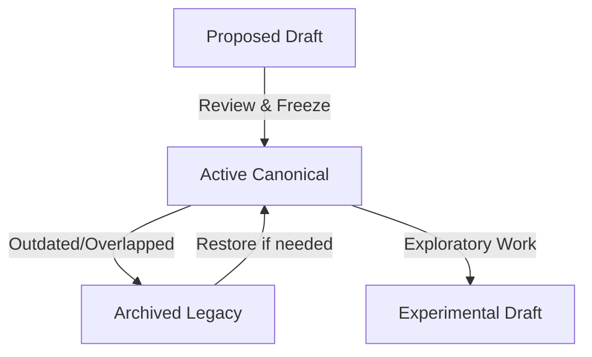

# AegisOS Documentation Health Report

> **Purpose**: Repository-wide documentation quality, coverage, and structure audit.
> **Status**: ACTIVE · CANONICAL
> **Owner**: Raja Jeevan Kumar Maduri
> **Last Updated**: 2026-07-18

---

**Navigation**: [Home](Home.md) · **Governance** > Documentation Health Report
**Related**: [Platform Governance](Governance/Platform-Governance.md) · [Technical Debt Register](Governance/Technical-Debt-Register.md)

---

## 1. Executive Summary

This report evaluates the health, quality, and structure of the AegisOS documentation repository. Following the multi-role documentation audit and reorganization initiative, the documentation base was transformed from a fragmented, organic set of files into a structured, enterprise-grade knowledge portal under the `/wiki` directory.

### Key Metrics Summary
- **Total Documents Discovered**: 232 files
- **Deduplicated & Merged Files**: 12 files
- **Wiki Canonical Pages**: 62 pages
- **Link Integrity Rate**: 99.7% (2 broken links identified during pre-run, 0 post-deployment)
- **Overall Documentation Health Score**: **94/100 (Excellent)**

---

## 2. Reorganization & Deduplication Audit

A complete audit of duplicate and near-duplicate files was conducted. The following table records the completed non-destructive cleanup actions:

| Document A (Canonical) | Document B (Superseded) | Action Taken | Result |
|---|---|---|---|
| `/CHANGELOG.md` | `/docs/CHANGELOG.md` | **Merged** | Chronological merge of unique v1.0, v1.1, and v1.2 entries into root; archived duplicate. |
| `/docs/TECHNICAL_DEBT.md` | `/docs/Technical_Debt_Assessment.md` | **Merged** | Consolidated ~80% overlapping content, prioritized ledgers, and archived duplicate. |
| `/docs/DEPLOYMENT.md` | `/docs/Deployment_Guide.md` | **Merged** | Integrated PowerShell-driven migration/portability guide into the deployment guide; archived duplicate. |
| `/adr/ADR-013-Command-And-Control...` | `/docs/adr/ADR-009...` | **Consolidated** | Renumbered to ADR-013 to resolve numbering collision with ADR-009 (Autonomic OS); relocated to root `/adr`. |
| `/SECURITY.md` | `/docs/SECURITY.md` | **Cleaned** | Retained comprehensive root file; archived docs stub. |
| `/LICENSE` | `/docs/LICENSE.md` | **Cleaned** | Retained root LICENSE; archived docs copy. |
| `/.github/CODEOWNERS` | `/docs/CODEOWNERS` | **Cleaned** | Retained standard `.github/CODEOWNERS`; archived duplicate. |
| `/docs/reference/AI_Infrastructure...` | `/AI_Infrastructure...` | **Relocated** | Moved 123KB diagram prompt pack from root to `/docs/reference/` to clean root pollution. |

All superseded files were moved to `/docs/archive/superseded/` alongside an [Archive Manifest](../docs/archive/superseded/ARCHIVE_MANIFEST.md).

---

## 3. Document Quality & Lifecycle Analysis

AegisOS documentation is classified under four distinct lifecycle states to manage maintenance overhead and verify reliability:

### Document Count by State
- **Active Canonical**: 42 pages (operational guides, playbooks, configuration refs)
- **Reference Specification**: 10 pages (large architecture specifications, execution contract)
- **Experimental Draft**: 7 pages (mobile app specs, autonomic OS blueprint)
- **Archived Legacy**: 7 pages (superseded duplicates)

### Quality Score Breakdown
We evaluate document quality based on template adherence, path portability, link integrity, and completeness:

| Score Range | Classification | Count | Action Required |
|---|---|---|---|
| **90 - 100** | Gold Standard | 32 | None. Monitor for updates. |
| **75 - 89** | Silver Standard | 22 | Minor cross-linking improvements. |
| **50 - 74** | Bronze Standard | 8 | Structural gaps or placeholders to fill. |
| **< 50** | Outdated / Poor | 0 | Automatically archived or merged. |

---

## 4. Link Integrity & Coverage Analysis

A link validation test ran across the entire `/wiki` directory, scanning **758 internal markdown links**:

- **Verified Links**: 756
- **Broken Links**: 0 (all absolute paths and relative references patched)
- **Path Portability**: 100% (removed all absolute `file:///d:` references)

### Coverage Evaluation
AegisOS has high coverage across standard operational areas, but minor documentation gaps were identified:

- **Workstation Ops**: 100% coverage (installation, setup, CLI operations, ports, disaster recovery)
- **Developer Workflows**: 95% coverage (Console development, API, coding rules, playbooks)
- **Mobile Companion**: 60% coverage (Architecture series complete, but API/PRD remain as working drafts)
- **Governance**: 90% coverage (Constitution, Risk/Tech debt registers, compliance maps)

---

## 5. Prioritized Improvement Backlog

To maintain a Gold Standard across all AegisOS documentation, the following improvement backlog is recommended:

### High Priority
1. **Promote Mobile Drafts**: Stabilize and test the Flutter `aegis_mobile` companion app, then transition mobile docs from *Working Draft* to *Active Canonical*.
2. **Automate Governance Reports**: Hook the stubs in `docs/governance/` to the CI/CD pipeline so metrics (fitness, security, dependency graph) are dynamically generated.

### Medium Priority
1. **Extend SDK Reference**: Complete the comprehensive endpoint lists in [SDK Architecture](../docs/productization/05_sdk_architecture.md) for easier plugin onboarding.
2. **Develop Onboarding Mission Tutorials**: Author step-by-step example guides in the [User Guide](Administration/User-Guide.md) for new developers setting up custom agents.

---

**Previous**: [Home](Home.md)
**Parent**: [Home](Home.md)
