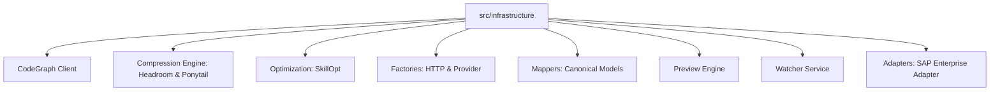

# Infrastructure Layer Overview

> **Layer**: AegisOS Infrastructure Services  
> **Status**: ACTIVE · CANONICAL  
> **Location**: `src/infrastructure`  
> **Owner**: AegisOS Platform Infrastructure & Core Engineering  

---

## 1. Overview

The **Infrastructure Layer** provides low-level technical capabilities, database client wrappers, code intelligence indexing, token compression, enterprise connectors, resilience patterns, and system optimization services.

---

## 2. Infrastructure Subsystems Matrix

### Module Descriptions

| Submodule | Key Files | Purpose & Capabilities |
|---|---|---|
| **`codegraph`** | `codegraph-client.ts` | Provides single-call CodeGraph AST exploration, symbol call paths, and verbatim source extraction. |
| **`compression`** | `headroom.ts`, `ponytail.ts` | **Headroom**: Context token reduction via output token minimization. **Ponytail**: Over-engineering audit and simplification adapter. |
| **`optimization`** | `skillopt-service.ts` | Optimizes tool selection and prompt strategy paths for minimal token usage and maximum execution speed. |
| **`factories`** | `http-client-factory.ts`, `provider-factory.ts` | Centralized creation of resilient HTTP clients with built-in retries, timeouts, and circuit breaker wrappers. |
| **`mappers`** | `canonical-models.ts`, `mapper.ts` | Maps raw external API payloads (Ollama, SAP, LiteLLM, Entra ID) into unified internal canonical domain models. |
| **`preview`** | `preview-engine.ts` | Generates live UI sandboxes and HTML/CSS component preview instances. |
| **`watcher`** | `watcher-service.ts` | Monitored filesystem and configuration file change detection service. |
| **`adapters/sap`** | `SapEnterpriseAdapter.ts` | Enterprise connector for SAP ERP / S/4HANA OData & RFC integration. |

---

## 3. Resilience & Observability Standards

All infrastructure modules inherit:
- Automated error wrapping (`try/catch` with structured logging).
- Circuit breaker integration via `AIRuntimeKernel`.
- Native instrumentation metrics exposed to the `PIK` resource analyzer.
