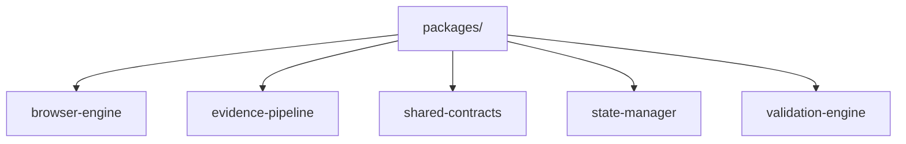

# Monorepo Packages

> **Subsystem**: Standalone Shared Monorepo Packages  
> **Status**: ACTIVE · CANONICAL  
> **Location**: `packages/`  
> **Owner**: AegisOS Core Engineering  

---

## 1. Overview

AegisOS maintains 5 decoupled monorepo packages under the `/packages` directory to isolate core domain logic, web browsing automation, validation engines, and contract definitions.

---

## 2. Monorepo Package Directory



### Package Summary Matrix

| Package | Key Source Files | Description & Scope |
|---|---|---|
| **`browser-engine`** | `src/actionExecutor.ts`<br>`src/elementExtractor.ts` | Headless browser interaction engine for automated web DOM navigation, element extraction, clicking, typing, and visual screenshot capture. |
| **`evidence-pipeline`** | `src/collector.ts` | Evidence collection pipeline for compliance audits, security scanning, and step-by-step verification logging. |
| **`shared-contracts`** | `src/index.ts` | Universal Zod and TypeScript contract definitions shared between Console frontend, backend API, worker nodes, and mobile app. |
| **`state-manager`** | `src/domNormalizer.ts`<br>`src/graphStore.ts` | DOM state normalization and graph-based state storage engine for interactive Web UI sessions. |
| **`validation-engine`** | `src/validator.ts` | High-performance schema validation engine for data pipelines and inter-service payloads. |

---

## 3. Dependency Graph & Usage

```json
{
  "dependencies": {
    "@aegisos/browser-engine": "workspace:*",
    "@aegisos/evidence-pipeline": "workspace:*",
    "@aegisos/shared-contracts": "workspace:*",
    "@aegisos/state-manager": "workspace:*",
    "@aegisos/validation-engine": "workspace:*"
  }
}
```
