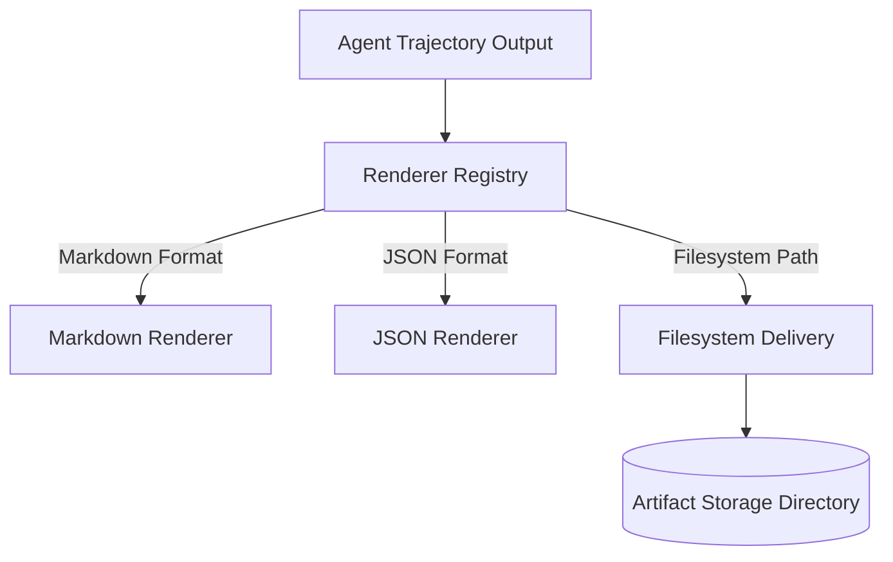

# Artifacts & Widgets Subsystem

> **Subsystem**: Artifacts Delivery & Console Widget Registry  
> **Status**: ACTIVE · CANONICAL  
> **Location**: `src/platform/artifacts`, `src/platform/widgets`  
> **Owner**: AegisOS UI & Artifact Rendering Team  

---

## 1. Overview

The **Artifacts & Widgets Subsystem** powers the generation, rendering, filesystem delivery, and interactive UI component registration for agent-produced artifacts and dashboard widgets.

---

## 2. Artifact Delivery & Rendering (`src/platform/artifacts`)

Artifacts represent persistent generated outputs (documents, markdown plans, code diffs, JSON data schema exports, charts) produced during agent execution trajectories.

### Components & Renderers

| Module | File Path | Functional Role |
|---|---|---|
| `RendererRegistry` | `renderer-registry.ts` | Discovers and registers custom content renderers based on MIME type / artifact schema. |
| `MarkdownRenderer` | `markdown-renderer.ts` | Renders GFM, Mermaid diagrams, diff blocks, and GitHub alerts. |
| `JsonRenderer` | `json-renderer.ts` | Formats and validates structured JSON output payloads. |
| `FilesystemDelivery` | `filesystem-delivery.ts` | Manages atomic write operations and retention policies in the local artifacts directory. |

---

## 3. Widget Registry (`src/platform/widgets`)

The `WidgetRegistry` (`WidgetRegistry.ts`) enables dynamic dashboard widget registration for the Next.js Console frontend.

* **Dynamic Layouts**: Allows operators and extensions to register custom metrics widgets, GPU load graphs, and active agent execution monitors.
* **Component Contracts**: Enforces strict TypeScript prop schemas (`types.ts`) for widget data binding and live updates.
