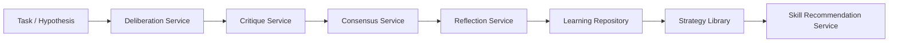

# Collective Intelligence Subsystem (CIL)

> **Subsystem**: Collective Intelligence Layer (CIL)  
> **Status**: ACTIVE · CANONICAL  
> **Location**: `src/platform/collective-intelligence`  
> **Owner**: AegisOS Multi-Agent Reasoning & Alignment Team  

---

## 1. Overview

The **Collective Intelligence Layer (CIL)** enables multi-agent deliberation, peer critique, consensus voting, self-reflection, and adaptive strategy recommendation across LLM instances. CIL prevents hallucination, improves complex problem-solving accuracy, and ensures high-confidence decisions for mission-critical operations.

---

## 2. Core Services & Components

### Subsystem Components

| Service Class | File Path | Functional Responsibility |
|---|---|---|
| `DeliberationService` | `DeliberationService.ts` | Coordinates multi-model discussion rounds, structuring arguments and counter-arguments. |
| `CritiqueService` | `CritiqueService.ts` | Evaluates proposed code, plans, or answers for security flaws, logical fallacies, and YAGNI violations. |
| `ConsensusService` | `ConsensusService.ts` | Implements weighted voting, ranking, and confidence aggregation across multiple AI models. |
| `ReflectionService` | `ReflectionService.ts` | Conducts post-execution root-cause analysis on failed or suboptimal agent actions. |
| `LearningRepository` | `LearningRepository.ts` | Persists successful problem-solving trajectories and verified code patterns. |
| `StrategyLibrary` | `StrategyLibrary.ts` | Manages reusable reasoning templates, prompt strategies, and execution playbooks. |
| `SkillRecommendationService` | `SkillRecommendationService.ts` | Recommends optimal tools and skills for a given domain based on historical performance. |

---

## 3. Deliberation & Consensus Workflow

1. **Multi-Model Prompting**: The engine sends the request to diverse LLMs (e.g. Ollama Llama-3, Qwen-2.5, DeepSeek).
2. **Peer Review**: `CritiqueService` runs cross-critiques where each model reviews peer outputs.
3. **Consensus Vote**: `ConsensusService` calculates output agreement score. If confidence is >95%, output is selected.
4. **Knowledge Indexing**: Successful strategies are stored in `LearningRepository` for future speedup.
