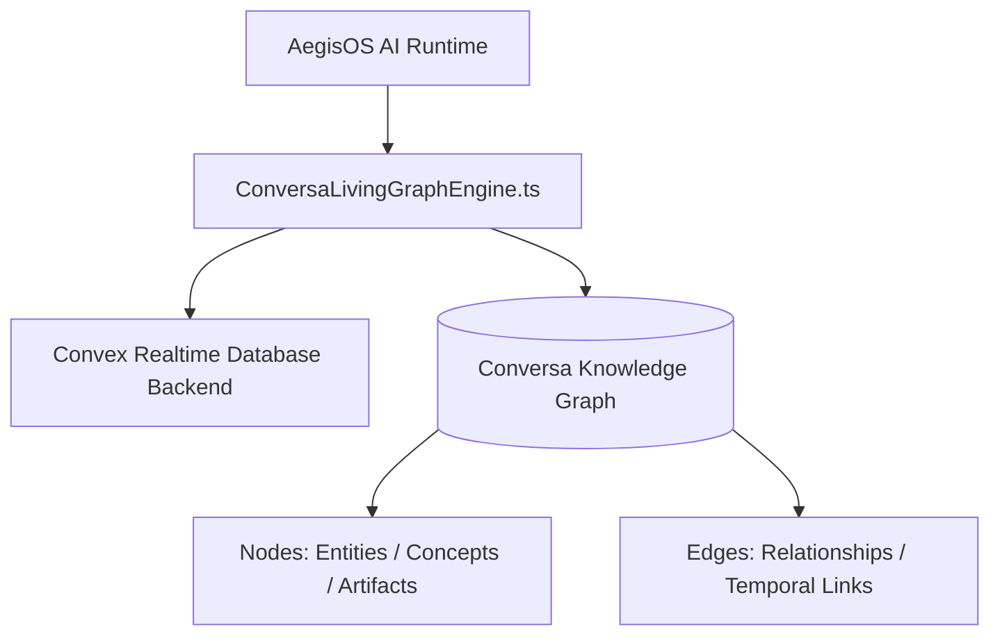

# Conversa Living Graph Subsystem

> **Subsystem**: Conversa Living Graph Engine & Repository Integration  
> **Status**: ACTIVE · CANONICAL  
> **Location**: `src/platform/conversa`, `conversa_repo`  
> **Owner**: AegisOS Knowledge Graph & Real-Time Intelligence Team  

---

## 1. Overview

The **Conversa Living Graph Subsystem** connects AegisOS to the Conversa knowledge graph engine (`conversa_repo`), enabling dynamic real-time contextual memory, node-edge graph traversals, and adaptive conversation state tracking.

---

## 2. Architecture & Engine Integration

### Core Components

* **Conversa Living Graph Engine** (`src/platform/conversa/ConversaLivingGraphEngine.ts`): The primary TypeScript bridge class connecting AegisOS agent trajectories with the Conversa graph state.
* **Conversa Repository** (`conversa_repo/`): Sub-repository providing Convex reactive backend functions, evaluation test suites (`evaluation/`), internationalization messages (`messages/`), and graph schema definitions.

---

## 3. Capabilities

1. **Reactive Node Updates**: As agents discover code symbols, documentation, or user preferences, `ConversaLivingGraphEngine` inserts graph nodes in real time.
2. **Context Subgraph Retrieval**: Allows LLMs to query subgraphs relevant to the current cursor position or active user prompt.
3. **Graph Evaluation**: Includes benchmark scripts in `conversa_repo/evaluation` to measure node retrieval precision and graph traversal latency.
