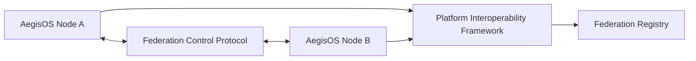

# Federation Subsystem

> **Subsystem**: Workstation Federation & Platform Interoperability Framework  
> **Status**: ACTIVE · CANONICAL  
> **Location**: `src/platform/federation`  
> **Owner**: AegisOS Distributed Architecture & Mesh Mesh Team  

---

## 1. Overview

The **Federation Subsystem** enables multi-node mesh networking, cross-workstation agent migration, distributed task execution, and federated resource discovery across isolated AegisOS instances.

---

## 2. Core Protocol & Framework

### Components

| Module | File Path | Core Function |
|---|---|---|
| `FederationControlProtocol` | `FederationControlProtocol.ts` | Handles node handshake, mutual TLS authentication, ping/pong heartbeat, and session key exchange over mesh VPN (Tailscale). |
| `FederationRegistry` | `FederationRegistry.ts` | Tracks online federated peer nodes, shared model capacities, and active worker node assignments. |
| `PlatformInteroperabilityFramework` | `PlatformInteroperabilityFramework.ts` | Provides standardized RPC and event serialization protocols for cross-node capability invocation. |

---

## 3. Distributed Execution Capabilities

* **Compute Offloading**: Workstations with low VRAM can automatically offload heavy model inference tasks to federated peer nodes with dedicated GPUs.
* **State Synchronization**: Agent context state and shared cognitive memory can be securely synchronized across nodes using mTLS and encrypted RPC.
