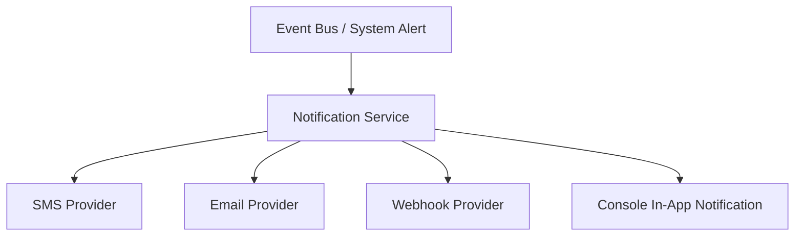
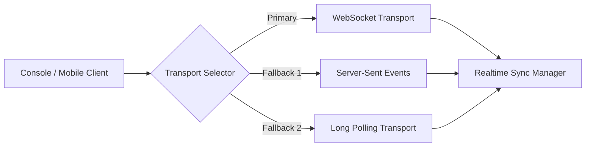

# Notifications & Realtime Subsystem

> **Subsystem**: Notifications & Realtime Synchronization  
> **Status**: ACTIVE · CANONICAL  
> **Location**: `src/platform/notifications`, `src/platform/realtime`  
> **Owner**: AegisOS Operator Experience & Realtime Infra Team  

---

## 1. Overview

The **Notifications & Realtime Subsystem** handles event broadcasting, operator alerts, state synchronization, and live telemetry transport across the Console dashboard, mobile companion app, and background daemons.

---

## 2. Notification Service (`src/platform/notifications`)

The `NotificationService` manages multi-channel alert delivery with fallback handling and channel routing.

### Supported Providers & Contracts

* **SMS Notification Provider** (`SmsNotificationProvider.ts`): Delivers urgent operational alerts via SMS gateways.
* **Notification Service Routing** (`NotificationService.ts`): Filters notifications by severity (`INFO`, `WARNING`, `CRITICAL`), user preferences, and rate limits.

---

## 3. Realtime Synchronization Manager (`src/platform/realtime`)

The Realtime subsystem provides low-latency, bidirectional state updates between the server engine and client UI.

### Transport Matrix

| Transport Provider | File Path | Usage & Characteristics |
|---|---|---|
| `WebSocketServer` / `WebSocketTransport` | `WebSocketServer.ts`, `providers/WebSocketTransport.ts` | Primary high-performance, full-duplex binary/JSON transport. |
| `SSETransport` | `providers/SSETransport.ts` | Unidirectional HTTP streaming fallback for restricted firewalls. |
| `PollingTransport` | `providers/PollingTransport.ts` | Adaptive HTTP polling fallback for offline-first or degraded networks. |
| `RealtimeSyncManager` | `RealtimeSyncManager.ts` | Coordinates state diffing, subscription management, and automatic transport reconnection. |
