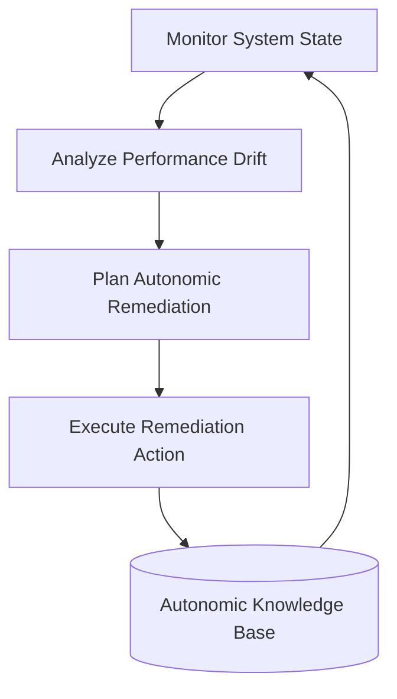
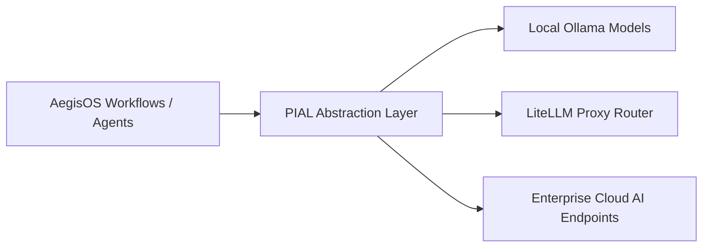

# OAP, PVP & PIAL Core Engines

> **Subsystems**: Open Autonomic Protocol (OAP), Platform Verification Protocol (PVP), Platform Intelligence Abstraction Layer (PIAL)  
> **Status**: ACTIVE · CANONICAL  
> **Location**: `src/platform/oap`, `src/platform/pvp`, `src/platform/pial`  
> **Owner**: AegisOS Autonomic Protocol & Core Engineering  

---

## 1. Overview

The **OAP**, **PVP**, and **PIAL** engines form the protocol baseline for autonomic workstation self-management, cryptographic action verification, and provider-agnostic AI intelligence abstraction.

---

## 2. Open Autonomic Protocol (OAP) (`src/platform/oap`)

The **OAP Engine** (`oap-engine.ts`) implements the MAPE-K (Monitor, Analyze, Plan, Execute, Knowledge) autonomic feedback loop for AegisOS services.

* **Self-Healing**: Automatically restarts stalled background daemons or recycles GPU memory when thresholds are breached.
* **Self-Optimization**: Tunes model context compression ratios dynamically based on query complexity.

---

## 3. Platform Verification Protocol (PVP) (`src/platform/pvp`)

The **PVP Engine** (`pvp-engine.ts`) provides zero-trust execution verification and cryptographic proof generation for high-impact system commands.

* **Command Proofs**: Generates cryptographic attestations for state changes.
* **Pre-Execution Check**: Verifies signatures and approval policy tokens prior to executing system actions.
* **Audit Trail**: Logs tamper-evident verification tokens to the immutable audit stream.

---

## 4. Platform Intelligence Abstraction Layer (PIAL) (`src/platform/pial`)

The **PIAL** (`index.ts`) abstracts disparate LLM inference engines (Ollama, LiteLLM, vLLM, Cloud AI APIs) behind a unified, provider-agnostic interface.

* **Standardized Request/Response**: Normalizes multi-provider token streaming, tool call schemas, and structured JSON outputs.
* **Dynamic Failover**: Automatically reroutes requests to local fallback models if remote endpoints time out or fail rate limits.
