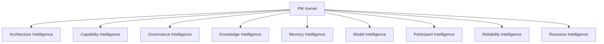

# Platform Integration Kernel (PIK)

> **Subsystem**: Platform Integration Kernel (PIK)  
> **Status**: ACTIVE · CANONICAL  
> **Location**: `src/platform/pik`  
> **Owner**: AegisOS Core Engineering  

---

## 1. Overview

The **Platform Integration Kernel (PIK)** is the central intelligence inspection and analysis engine of AegisOS. PIK aggregates operational metrics, architectural metadata, model performance, governance posture, and resource consumption across the entire workstation ecosystem.

It provides a unified telemetry and diagnostic interface used by the Console, execution controllers, and autonomic optimization loops.

---

## 2. Core Analyzers

PIK exposes 9 specialized Intelligence Analyzers built on top of a shared `BaseAnalyzer` abstraction:



### Intelligence Analyzer Matrix

| Analyzer | Core Responsibilities | Primary Data Sources |
|---|---|---|
| **Architecture Intelligence** | Analyzes system coupling, module dependencies, circular references, and architectural drift. | Workspace CodeGraph, AST parser, dependency map. |
| **Capability Intelligence** | Tracks capability registration, execution latency, error rates, and skill availability. | Capability Registry, execution logs, skill-lock definitions. |
| **Governance Intelligence** | Evaluates compliance policies, threat boundaries, STRIDE coverage, and HITL gate compliance. | Governance rules, audit logs, policy enforcement engine. |
| **Knowledge Intelligence** | Audits knowledge graph indexing, document chunking efficiency, vector embeddings, and retrieval accuracy. | Conversa Living Graph, document processing pipelines. |
| **Memory Intelligence** | Monitors shared cognitive memory, context window compression efficiency, and retention lifecycles. | Headroom compressor, Ponytail adapters, context window telemetry. |
| **Model Intelligence** | Tracks local LLM inference performance (Ollama/LiteLLM), token throughput, latency per prompt, and model degradation. | ModelProxy, LiteLLM metrics endpoint, Ollama runner. |
| **Participant Intelligence** | Validates digital worker profiles, participant descriptor integrity, and multi-agent synergy. | Participant Registry, Descriptor Composition Engine. |
| **Reliability Intelligence** | Monitors circuit breaker states, fallback rates, retry metrics, and service availability. | AIRuntimeKernel, system doctor, health probes. |
| **Resource Intelligence** | Tracks CPU, GPU VRAM usage, disk I/O, memory allocations, and network bindings. | System process monitors, NVML / GPU telemetry. |

---

## 3. Integration & Usage

PIK analyzers feed directly into the **Autonomic Transformation Engine** and the **Console Administration Dashboard** (`src/app/admin`), enabling real-time workspace self-healing and operational governance.

```typescript
import { ArchitectureIntelligence, ModelIntelligence } from '@/platform/pik';

const archAnalyzer = new ArchitectureIntelligence();
const archReport = await archAnalyzer.analyzeWorkspace();

const modelAnalyzer = new ModelIntelligence();
const modelHealth = await modelAnalyzer.getInferenceMetrics();
```
