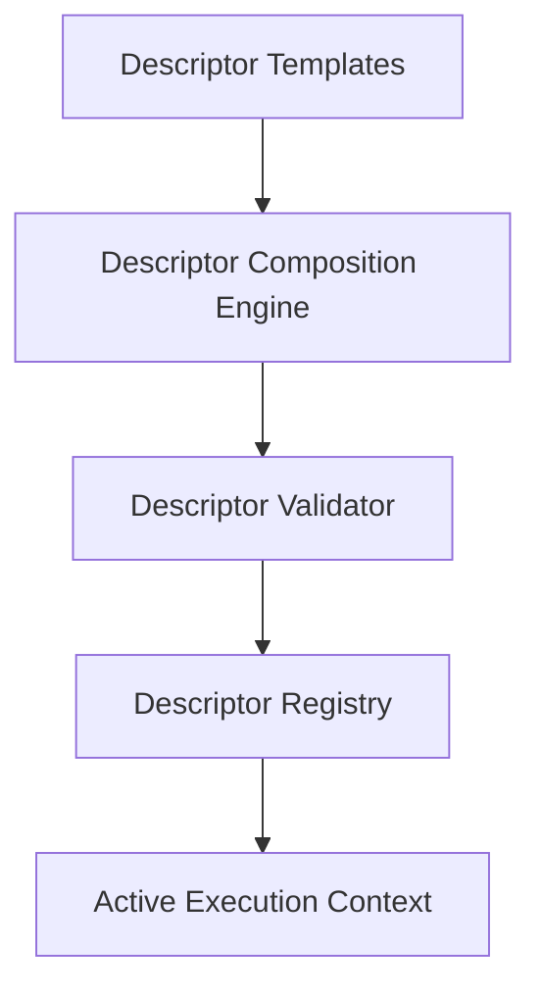

# Participants & Permissions Subsystem

> **Subsystem**: Participant Descriptors & Role-Based Permission Control  
> **Status**: ACTIVE · CANONICAL  
> **Location**: `src/platform/participants`, `src/platform/permissions`  
> **Owner**: AegisOS Security & Identity Governance Team  

---

## 1. Overview

The **Participants & Permissions Subsystem** handles identity composition, role definition, capability descriptor validation, and fine-grained access authorization for human users, services, and digital worker agents.

---

## 2. Participant Descriptor Subsystem (`src/platform/participants`)

Participant Descriptors define the operational envelope, capabilities, access scopes, and constraints of every agent or service participating in the AegisOS ecosystem.

### Components

* **Descriptor Composition Engine** (`runtime/DescriptorCompositionEngine.ts`): Synthesizes composite agent descriptors by combining base templates with runtime overrides.
* **Descriptor Validator** (`runtime/DescriptorValidator.ts`): Enforces structural schema validity, permission constraints, and credential bounds.
* **Descriptor Registry** (`registry/DescriptorRegistry.ts`): In-memory and persistent store of all active participant descriptors.
* **Descriptor Templates** (`registry/templates.ts`): Built-in templates for standard agent roles (Developer Agent, Security Auditor, Operations Sentinel).

---

## 3. Permission Service (`src/platform/permissions`)

The `PermissionService` (`PermissionService.ts`) evaluates access control policies using Role-Based Access Control (RBAC) and Attribute-Based Access Control (ABAC).

* **Least Privilege**: All participant actions default to DENY unless explicitly granted.
* **Scope Evaluation**: Evaluates action permissions against target resources, operational modes, and environment profiles (`development`, `personal`, `enterprise`, `offline`).
