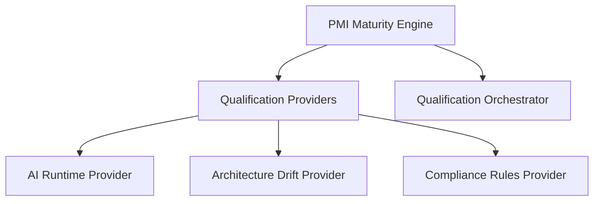

# Qualification & Benchmarking Subsystem

> **Subsystem**: Qualification & Autonomous Capability Benchmarking (ACB)  
> **Status**: ACTIVE · CANONICAL  
> **Location**: `src/platform/qualification`, `src/platform/benchmarking`  
> **Owner**: AegisOS Quality & Release Governance Team  

---

## 1. Overview

The **Qualification & Benchmarking Subsystem** continuously tests, evaluates, and certifies the quality, reliability, and capability maturity of the AegisOS platform and its integrated AI models.

It provides automated quality gates (PMI - Platform Maturity Index), benchmark packs (ACB - Autonomous Capability Benchmarking), and UCD (Universal Capability Descriptor) contract enforcement.

---

## 2. Qualification Engine (`src/platform/qualification`)

### Core Components

* **Universal Capability Descriptor (UCD)** (`contracts/ucd.ts`): Standardized schema contract defining capability inputs, outputs, preconditions, and postconditions.
* **PMI Maturity Engine** (`maturity/pmi-engine.ts`): Computes the overall Platform Maturity Index based on stability metrics, test coverage, and security compliance.
* **Qualification Providers**:
  - `ai-runtime.ts`: Validates model latency, throughput, and error rates.
  - `architecture-drift.ts`: Scans codebase for architectural violations against `docs/ENGINEERING_CONSTITUTION.md`.
  - `compliance-rules.ts`: Verifies adherence to enterprise governance policies.

---

## 3. Autonomous Capability Benchmarking (ACB) (`src/platform/benchmarking`)

The ACB framework runs automated benchmark suites against AI reasoning providers:

| Benchmark Module | File Path | Description |
|---|---|---|
| `ACB Engine` | `acb.ts` | Main execution harness for capability benchmark suites. |
| `Agent Benchmark Pack` | `packs/agent.pack.ts` | Evaluates multi-agent coordination, goal completion rate, and tool invocation accuracy. |
| `Capability Benchmark Pack` | `packs/capability.pack.ts` | Measures execution latency, memory footprint, and CPU/GPU usage per capability. |
| `MockReasoningProvider` | `MockReasoningProvider.ts` | High-speed deterministic mock provider for CI/CD test automation. |

---

## 4. CI/CD Quality Gates

Prior to any production release or pull request merge, the Qualification suite executes to confirm:
1. PMI score >= 90%
2. Zero architectural drift violations
3. ACB regression tests pass with <2% variance from baseline
