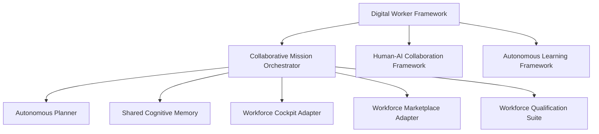

# Workforce Subsystem

> **Subsystem**: Workforce Subsystem  
> **Status**: ACTIVE · CANONICAL  
> **Location**: `src/platform/workforce`  
> **Owner**: AegisOS Multi-Agent & Autonomous Workforce Team  

---

## 1. Overview

The **Workforce Subsystem** is AegisOS's autonomous multi-agent orchestration framework. It manages digital workers, collaborative missions, human-in-the-loop (HITL) interactive boundaries, organization-level intelligence, and shared cognitive memory.

---

## 2. Component Architecture

### Key Framework Components

| Component | Class Name | Primary Responsibility |
|---|---|---|
| **Digital Worker Framework** | `DigitalWorkerFramework` | Defines, instantiates, and manages digital worker runtimes and agent capabilities. |
| **Collaborative Mission Orchestrator** | `CollaborativeMissionOrchestrator` | Coordinates multi-agent team missions, task decomposition, dependency resolution, and execution synchronization. |
| **Autonomous Planner** | `AutonomousPlanner` | Generates goal-oriented step-by-step execution plans with verification checkpoints. |
| **Shared Cognitive Memory** | `SharedCognitiveMemory` | Provides inter-agent memory persistence, shared state vector context, and cross-mission knowledge retention. |
| **Human-AI Collaboration Framework** | `HumanAICollaborationFramework` | Enforces explicit HITL approval gates, interactive interviews, and prompt-level user interventions. |
| **Autonomous Learning Framework** | `AutonomousLearningFramework` | Enables continuous learning from mission outcomes, updating agent strategy libraries dynamically. |
| **Organization Intelligence** | `OrganizationIntelligence` | Maps enterprise hierarchy, team roles, permission boundaries, and resource quotas. |
| **Workforce Cockpit Adapter** | `WorkforceCockpitAdapter` | Telemetry interface for visual mission tracking in the Next.js Console. |
| **Workforce Marketplace Adapter** | `WorkforceMarketplaceAdapter` | Enables discovery and installation of community and custom agent skill packs. |
| **Workforce Qualification Suite** | `WorkforceQualificationSuite` | Evaluates agent readiness, mission success benchmarks, and safety compliance prior to deployment. |

---

## 3. Mission Execution Lifecycle

1. **Goal Submission**: User or scheduled trigger defines high-level outcome.
2. **Decomposition**: `AutonomousPlanner` breaks goal into verifiable steps.
3. **Team Assembly**: `CollaborativeMissionOrchestrator` selects digital workers via `DigitalWorkerFramework`.
4. **Execution & Shared Memory**: Agents execute tasks while streaming context to `SharedCognitiveMemory`.
5. **HITL Review (if required)**: `HumanAICollaborationFramework` pauses execution for user confirmation.
6. **Post-Mission Reflection**: `AutonomousLearningFramework` archives learnings for future optimization.
